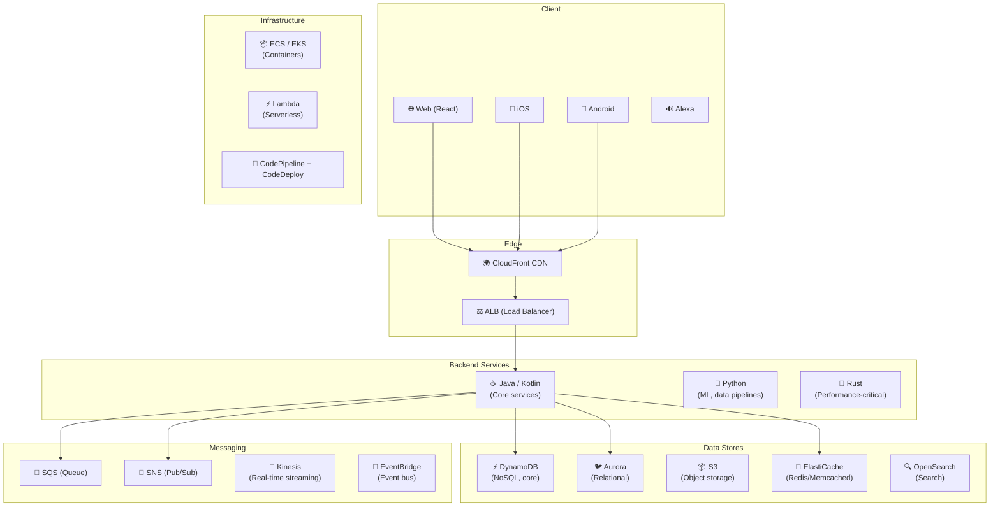
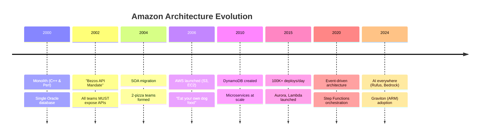
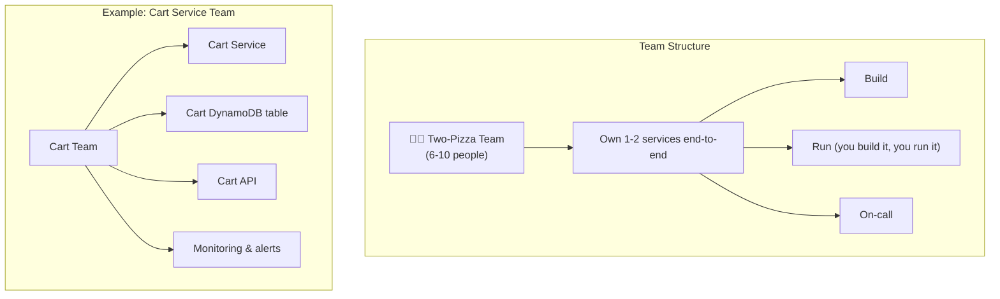
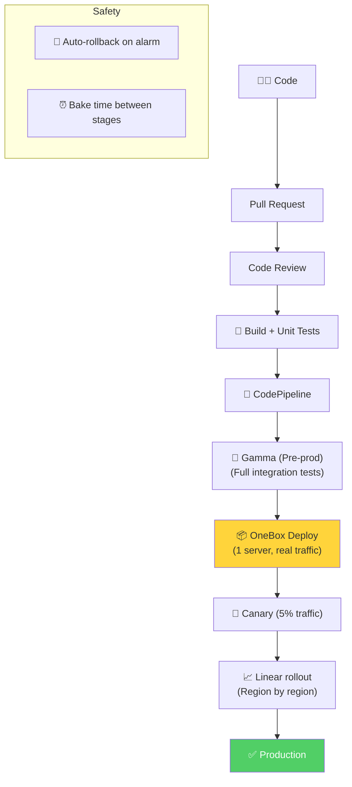

# Amazon - Deployment & Architecture

> Amazon phục vụ **310M+ customers**, **12M+ sản phẩm**, **1.6M+ packages/ngày** — pioneer SOA & cloud.

---

## 1. Quy Mô

| Metric | Giá trị |
|---|---|
| Active customers | 310M+ |
| Products | 12M+ (Amazon only), 350M+ (marketplace) |
| Packages/day | 1.6M+ |
| Prime Day peak | 150M+ DynamoDB req/s |
| Fulfillment centers | 175+ globally |
| AWS revenue | $90B+ (2024) |
| Deployments/day | 100,000+ (across all services) |

---

## 2. Technology Stack

---

## 3. Architecture Evolution

### The Bezos API Mandate (2002)

> "All teams will henceforth expose their data and functionality through service interfaces. Teams must communicate through these interfaces. There will be no other form of interprocess communication. Anyone who doesn't do this will be fired." — Jeff Bezos

**Impact:** Biến Amazon từ monolith thành SOA → trở thành nền tảng cho AWS.

---

## 4. Two-Pizza Team Organization

---

## 5. Deployment — 100K+ Deploys/Day

---

## Mapping → NestJS

| Amazon | NestJS Implementation |
|---|---|
| **SOA / Microservices** | `@nestjs/microservices` |
| **DynamoDB** | `@aws-sdk/client-dynamodb` / TypeORM |
| **SQS/SNS** | `@nestjs/microservices` + `@aws-sdk/client-sqs` |
| **ElastiCache** | `@nestjs/cache-manager` + ioredis |
| **EventBridge** | Custom event bus / `@nestjs/event-emitter` |
| **Lambda** | NestJS on Lambda (`@nestjs/platform-express`) |
| **CodePipeline** | GitHub Actions + ArgoCD |
| **Two-pizza teams** | NestJS module per domain |
