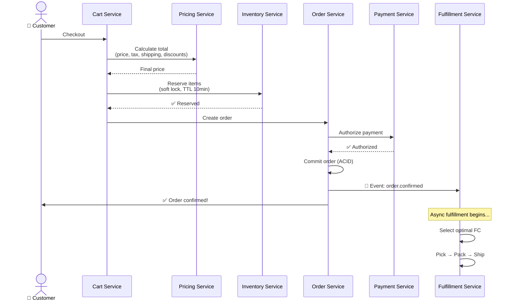
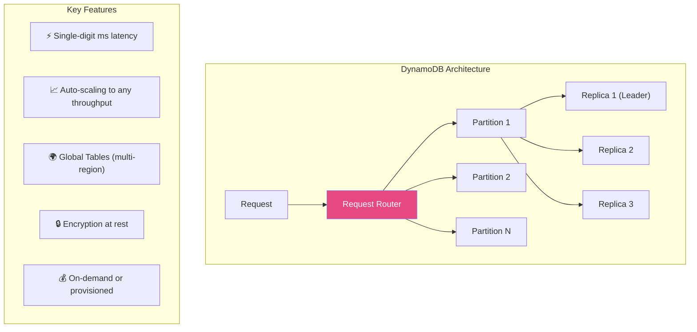
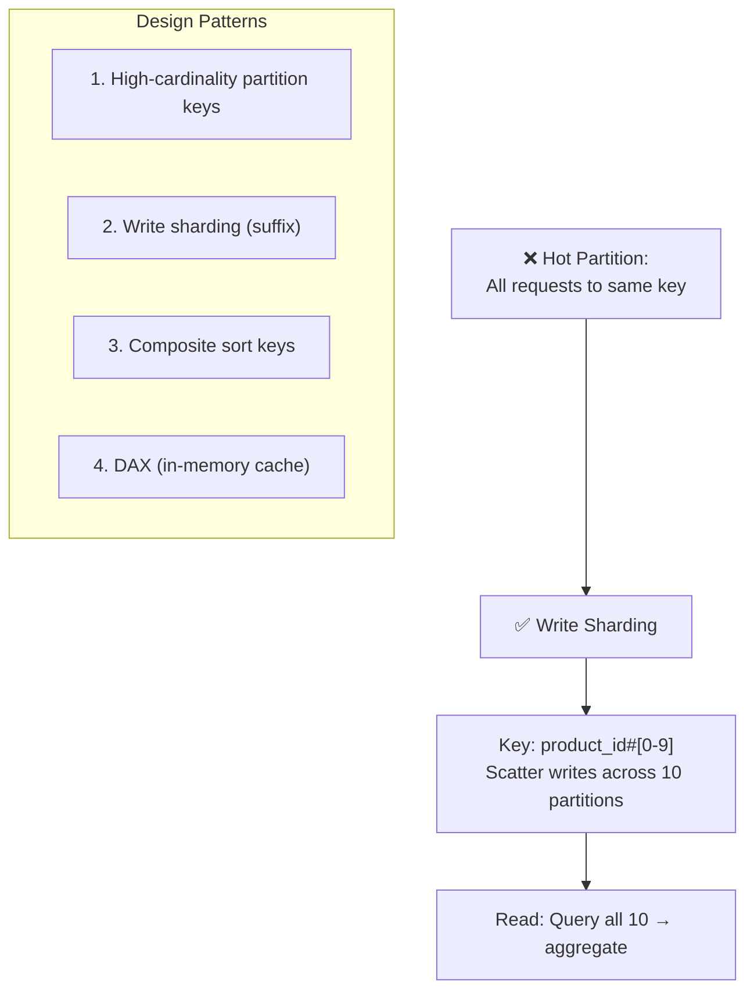
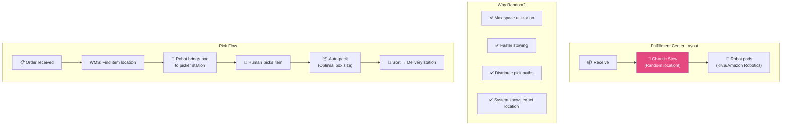
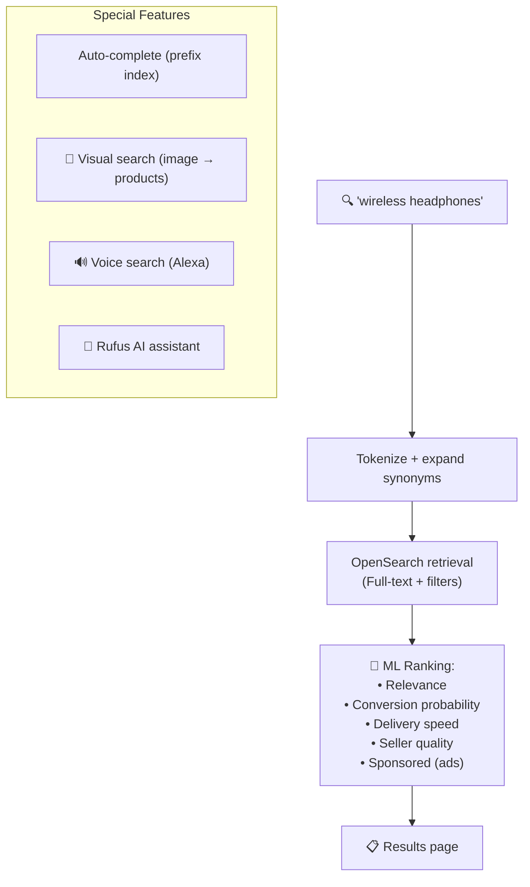
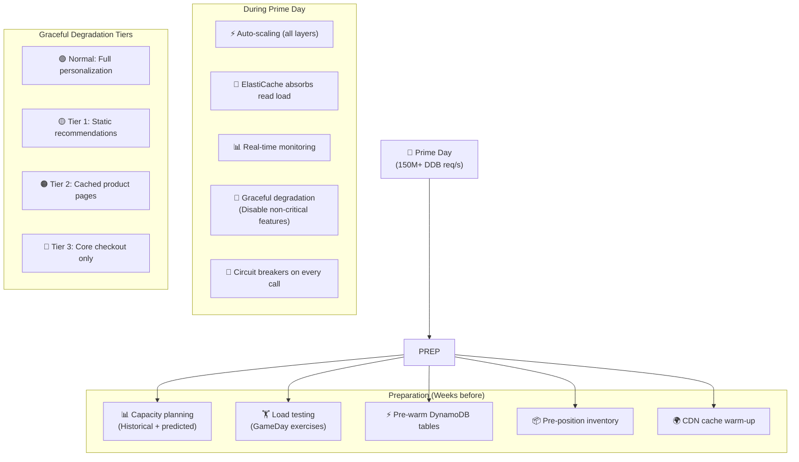
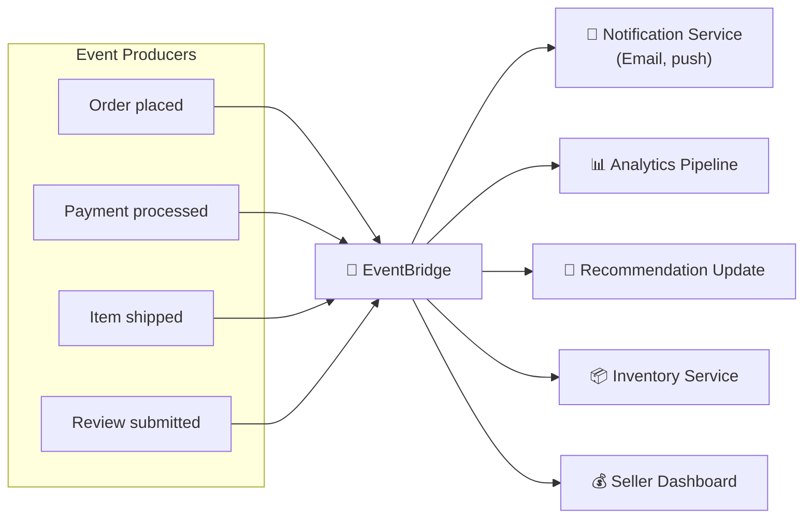

# Amazon - Xử Lý Đồng Thời Cao & E-Commerce

> 150M+ DynamoDB req/s vào Prime Day, 100K+ deploys/ngày, 1.6M+ packages/ngày.

---

## 1. Checkout Flow — Distributed Transaction

---

## 2. DynamoDB — Heart of Amazon

### Hot Partition Prevention

---

## 3. Inventory Management — Chaotic Storage

---

## 4. Search & Product Discovery

---

## 5. Prime Day — Handling 100x Traffic

---

## 6. Event-Driven Architecture

---

## Mapping → NestJS

| Pattern | Amazon | NestJS Implementation |
|---|---|---|
| **Distributed checkout** | Saga pattern | `nestjs-saga` / custom orchestrator |
| **Inventory reserve** | Soft lock + TTL | Redis `SETNX` with TTL |
| **DynamoDB** | Auto-scaling NoSQL | `@aws-sdk/client-dynamodb` / MongoDB |
| **Write sharding** | Suffix partition key | Application-level sharding |
| **Chaotic storage** | WMS tracking | PostgreSQL + location table |
| **Event-driven** | EventBridge | `@nestjs/event-emitter` + Kafka |
| **Search** | OpenSearch | `@nestjs/elasticsearch` |
| **Caching** | ElastiCache | `@nestjs/cache-manager` + Redis |
