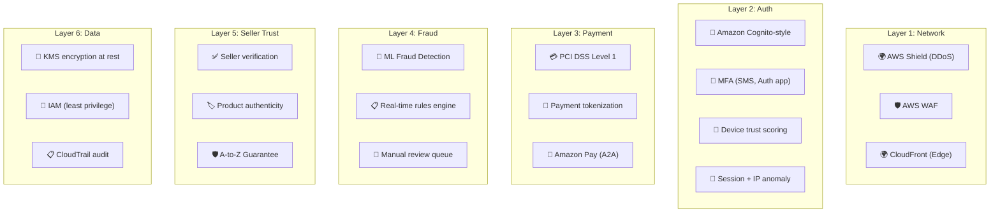
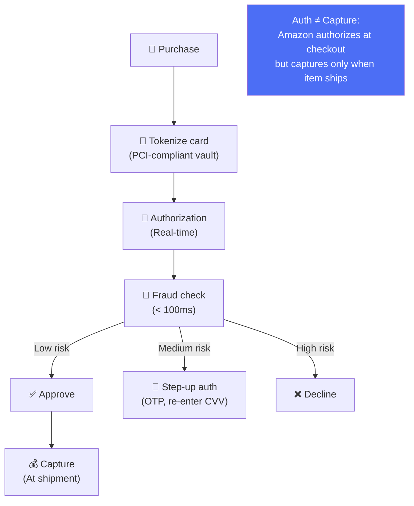
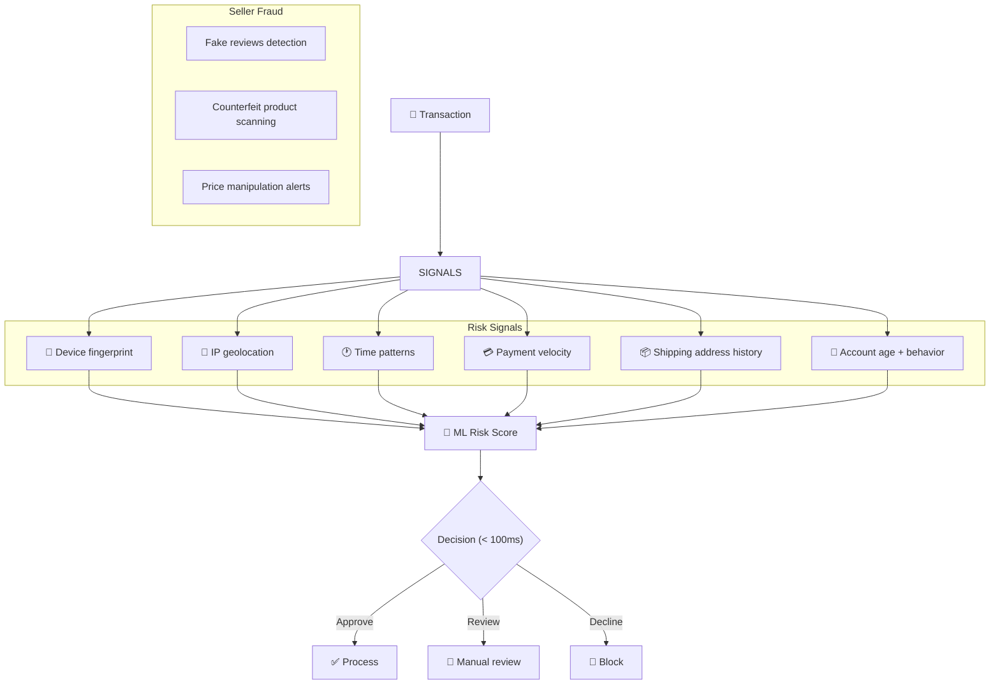
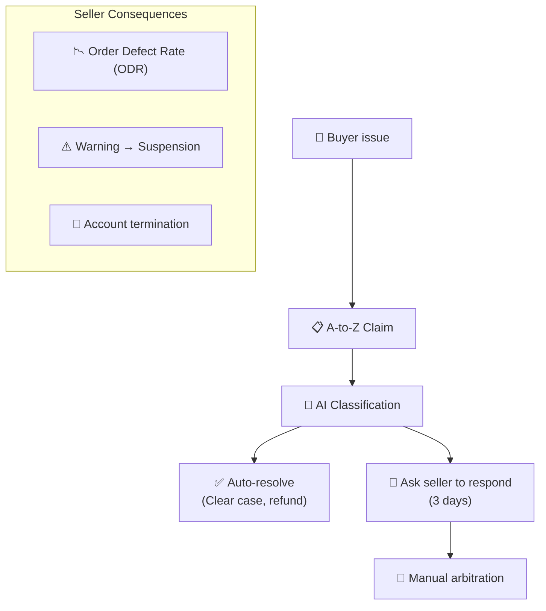

# Amazon - Security Analysis

> Amazon bảo vệ 310M+ accounts, hàng tỷ giao dịch/năm, PCI DSS Level 1.

---

## Tổng Quan

---

## 1. Payment Security

---

## 2. Fraud Detection

---

## 3. Marketplace Trust — A-to-Z Guarantee

---

## 4. Data Protection & Compliance

| Category | Implementation |
|---|---|
| **Encryption at rest** | KMS-managed keys (AES-256) |
| **Encryption in transit** | TLS 1.2+ everywhere |
| **Access control** | IAM + least privilege |
| **Audit** | CloudTrail (all API calls logged) |
| **Compliance** | PCI DSS, SOC 2, GDPR, HIPAA |
| **Data isolation** | VPC + security groups |
| **Secret management** | AWS Secrets Manager (auto-rotate) |
| **Key rotation** | Automatic via KMS |

---

## 5. So Sánh Security: Amazon vs Others

| Layer | Amazon | Uber | Netflix | YouTube |
|---|---|---|---|---|
| **Focus** | Payment + marketplace trust | Payment + safety | Content protection | Copyright |
| **Unique** | A-to-Z Guarantee | Mastermind rules | DRM watermark | Content ID |
| **Fraud** | ML + rules (< 100ms) | RADAR anomaly | N/A | View fraud |
| **Compliance** | PCI DSS L1 | PCI DSS | SOC 2 | Google internal |
| **Auth capture** | Split (auth ≠ capture) | Immediate | Subscription | N/A |
| **Cloud** | Own (AWS) | GCP | AWS | Google Cloud |

---

## Mapping → NestJS

| Pattern | Amazon | NestJS Implementation |
|---|---|---|
| **PCI tokenization** | Custom vault | Stripe Elements (never touch cards) |
| **Auth/capture split** | Authorize now, capture later | Stripe `auth → capture` flow |
| **Fraud ML** | Real-time scoring | Stripe Radar / custom ML via gRPC |
| **A-to-Z claims** | Auto-resolve + manual | State machine + BullMQ workers |
| **KMS encryption** | AWS KMS | `@aws-sdk/client-kms` / `crypto` |
| **IAM** | Least privilege | NestJS Guards + CASL `@casl/ability` |
| **Audit trail** | CloudTrail | TypeORM audit columns + event log table |
