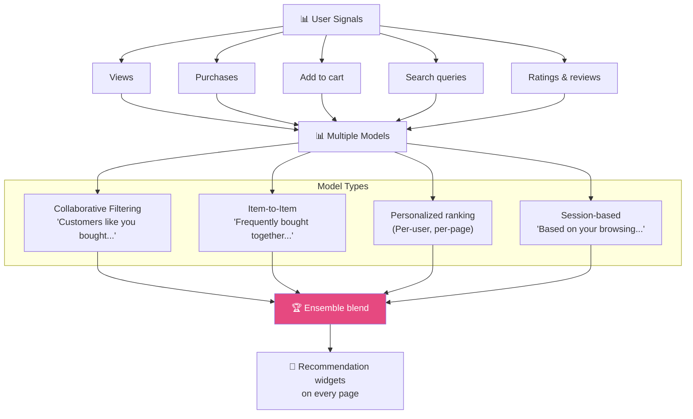
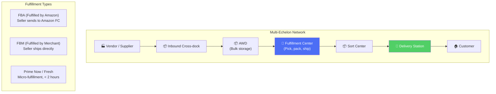
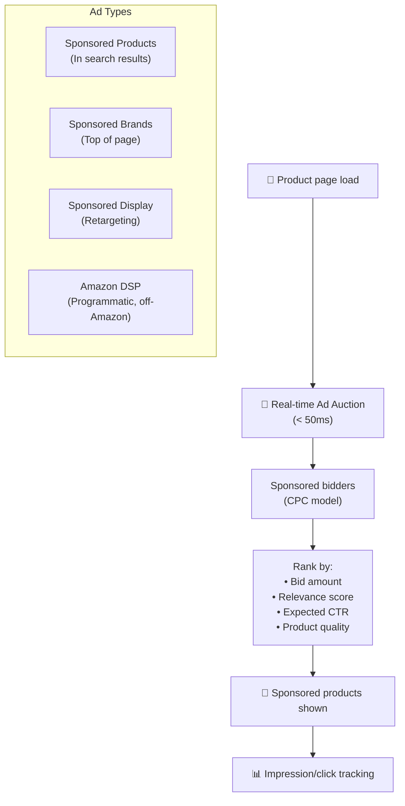
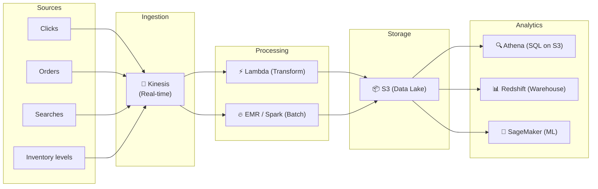
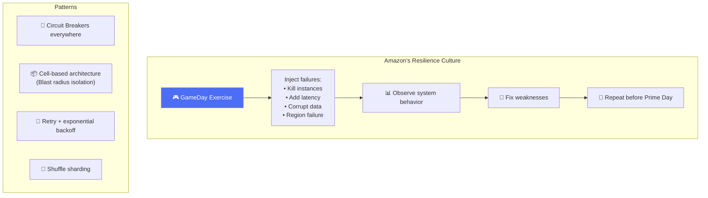

# Amazon - Subsystems Analysis

> Recommendation, Fulfillment, Alexa, Advertising, Data Pipeline, Reliability.

---

## 1. Recommendation Engine ("Customers who bought...")

**Item-to-Item Collaborative Filtering** — Amazon's original breakthrough (1998 paper): precompute item pairs → fast lookup at serving time → scales to millions of products.

---

## 2. Fulfillment Network

---

## 3. Amazon Advertising Platform

---

## 4. Data Pipeline

---

## 5. Reliability — GameDays

**Cell-based architecture:** Amazon isolates failures by grouping customers into cells. If Cell A fails, Cell B/C/D unaffected → limits blast radius.

---

## 6. So Sánh Tổng Hợp: 7 Systems

| Dimension | Amazon | Uber | YouTube | Netflix | Instagram | Twitter | WhatsApp |
|---|---|---|---|---|---|---|---|
| **Primary** | E-commerce | Ride-hailing | Video UGC | Streaming | Photo social | Microblog | Messaging |
| **Language** | Java/Kotlin | Go/Java | Python/C++ | Java | Python | Scala/Java | Erlang |
| **Architecture** | SOA → µservices | DOMA | Google infra | Microservices | Monolith+svc | JVM µsvc | Erlang cluster |
| **Database** | DynamoDB+Aurora | MySQL+Cass | Vitess+Bigtable | Cass+Aurora | PostgreSQL | Manhattan | Mnesia+MySQL |
| **Key pattern** | Event-driven | Geospatial | Video pipeline | Chaos eng | Fan-out | Push/pull | Store-forward |
| **Open source** | AWS services | H3, Jaeger | Vitess, VP9 | Netflix OSS | Fewer | Zipkin | Fewer |
| **Unique** | Bezos Mandate | H3 hex grid | Content ID | Open Connect | TAO graph | Snowflake | E2EE at 2B |

---

## Amazon Unique Innovations

| Innovation | Impact |
|---|---|
| **Bezos API Mandate** | Forced SOA → birthed AWS ($90B+ revenue) |
| **Two-Pizza Teams** | Influenced org design at Google, Spotify, etc. |
| **DynamoDB** | Industry-standard serverless NoSQL |
| **Item-to-Item CF** | Original recommendation algorithm (1998) |
| **Chaotic Storage** | Counterintuitive but optimal warehouse design |
| **GameDays** | Proactive resilience testing → industry standard |
| **Cell-based Arch** | Blast radius isolation pattern |

---

## Mapping → NestJS

| Subsystem | Amazon | NestJS Implementation |
|---|---|---|
| **Recommendation** | Item-to-Item CF | Redis sorted sets + precomputed pairs |
| **Fulfillment** | Multi-echelon WMS | State machine + BullMQ + PostgreSQL |
| **Advertising** | Real-time auction | Redis + sorted set (bid ranking) |
| **Data pipeline** | Kinesis → Lambda | Kafka → `@nestjs/microservices` consumers |
| **Search** | OpenSearch | `@nestjs/elasticsearch` |
| **Cell architecture** | Blast radius isolation | K8s namespace per cell + traffic routing |
| **GameDays** | Chaos injection | `chaos-mesh` (K8s) / custom fault injector |
