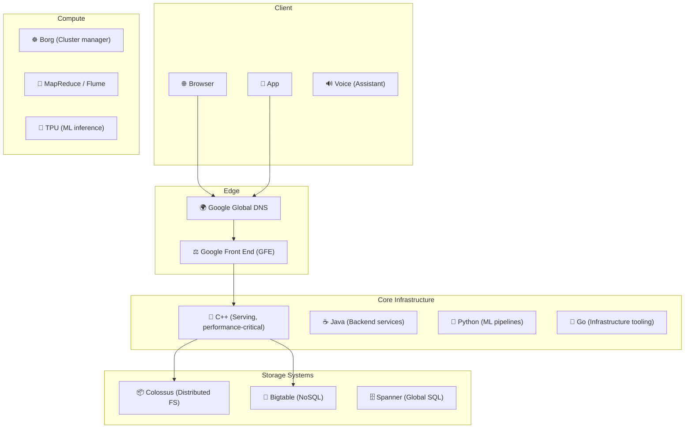
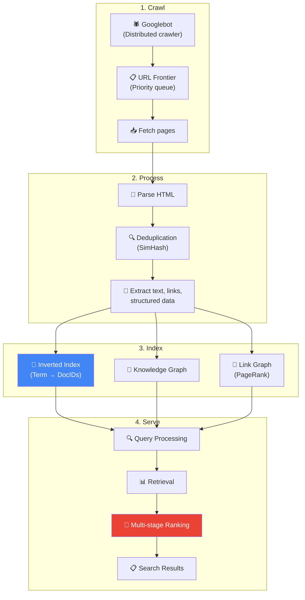
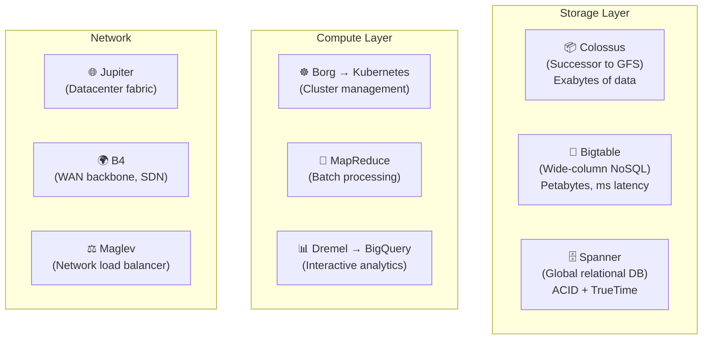

# Google Search - Deployment & Architecture

> Google xử lý **8.5B+ searches/ngày**, index **hundreds of billions** web pages, < 200ms response.

---

## 1. Quy Mô

| Metric | Giá trị |
|---|---|
| Searches/day | 8.5B+ (~100K/second) |
| Indexed pages | Hundreds of billions |
| Crawled pages/day | Billions |
| Response time | < 200ms (usually < 500ms) |
| Data centers | 30+ globally |
| Revenue (Ads) | $300B+/year |

---

## 2. Technology Stack



---

## 3. System Architecture Overview



---

## 4. Foundational Infrastructure



### TrueTime — Spanner's Secret Weapon

```
TrueTime API:
  tt.now()  → [earliest, latest]  (bounded uncertainty)
  
Uses atomic clocks + GPS receivers in every datacenter
→ Global clock sync within ~7ms uncertainty
→ Enables globally consistent transactions WITHOUT distributed locks
```

---

## 5. Deployment Scale

| Component | Scale |
|---|---|
| **Borg jobs** | Millions of tasks across clusters |
| **GFE (Frontend)** | Handles billions of requests/day |
| **Index shards** | Thousands of shards, replicated globally |
| **Colossus** | Exabytes of storage |
| **TPUs** | Thousands for ML inference |
| **B4 backbone** | Petabits/s capacity |

---

## Mapping → NestJS

| Google | NestJS Implementation |
|---|---|
| **Colossus/GFS** | S3 / MinIO (object storage) |
| **Bigtable** | Cassandra / ScyllaDB |
| **Spanner** | CockroachDB / PostgreSQL |
| **Borg** | Kubernetes (GKE/EKS) |
| **MapReduce** | Kafka + BullMQ workers |
| **GFE** | Nginx + `@nestjs/platform-express` |
| **TPU inference** | TensorFlow Serving via gRPC |
