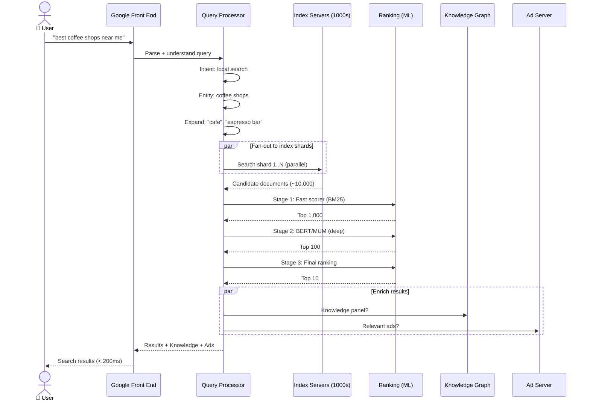
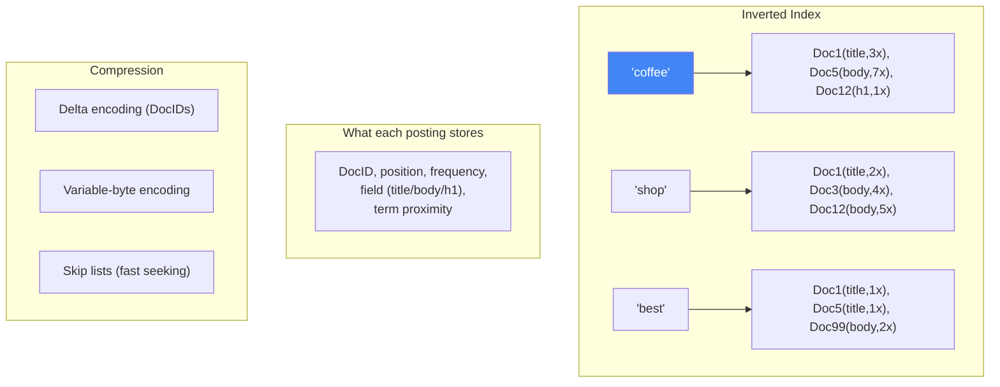
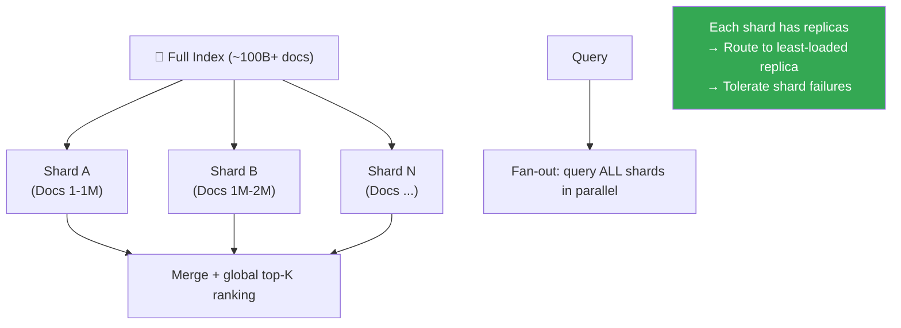
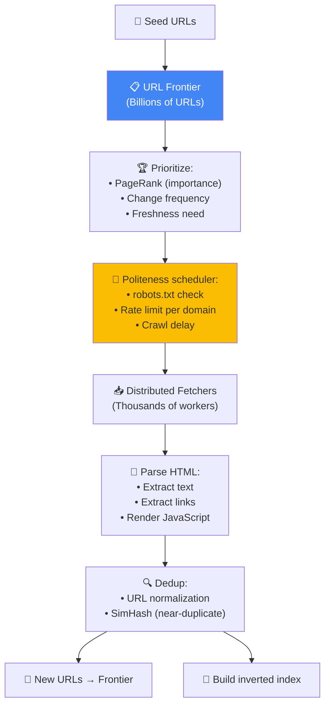
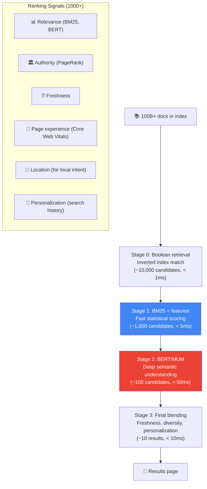
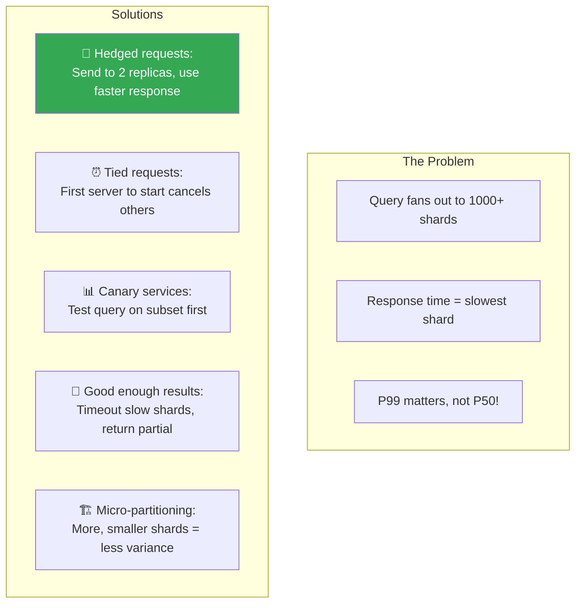

# Google Search - Xử Lý Đồng Thời Cao & Search Pipeline

> 8.5B searches/ngày, < 200ms, fan-out to thousands of index shards.

---

## 1. Search Pipeline — End to End

---

## 2. Inverted Index — Core Data Structure

### Index Sharding

---

## 3. Crawler Architecture — Googlebot

---

## 4. Multi-Stage Ranking Cascade

---

## 5. Latency Engineering — "Tail at Scale"

---

## 6. So Sánh Search Patterns

| Pattern | Google Search | YouTube | Amazon | Spotify |
|---|---|---|---|---|
| **Index type** | Inverted index | Inverted + metadata | OpenSearch | Elasticsearch |
| **Ranking** | PageRank + BERT | Watch time + CTR | Conversion + relevance | Popularity + taste |
| **Corpus size** | 100B+ pages | 1B+ videos | 350M+ products | 100M+ tracks |
| **Latency target** | < 200ms | < 500ms | < 200ms | < 200ms |
| **Unique** | Knowledge Graph | Video transcripts | Sponsored rankings | Audio CNN features |

---

## Mapping → NestJS

| Pattern | Google | NestJS Implementation |
|---|---|---|
| **Inverted index** | Custom built | Elasticsearch / OpenSearch |
| **Fan-out query** | Parallel shard queries | `Promise.allSettled()` + timeout |
| **Multi-stage ranking** | BM25 → BERT | ES score + custom re-ranker |
| **Hedged requests** | 2 replicas, fastest wins | `Promise.race()` with 2 calls |
| **Web crawler** | Googlebot | `crawlee` + BullMQ scheduler |
| **URL frontier** | Priority queue | Redis sorted set (ZADD/ZPOPMIN) |
| **Deduplication** | SimHash | `simhash-js` npm |
