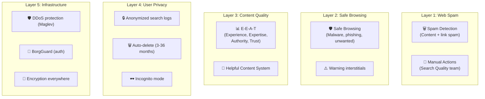
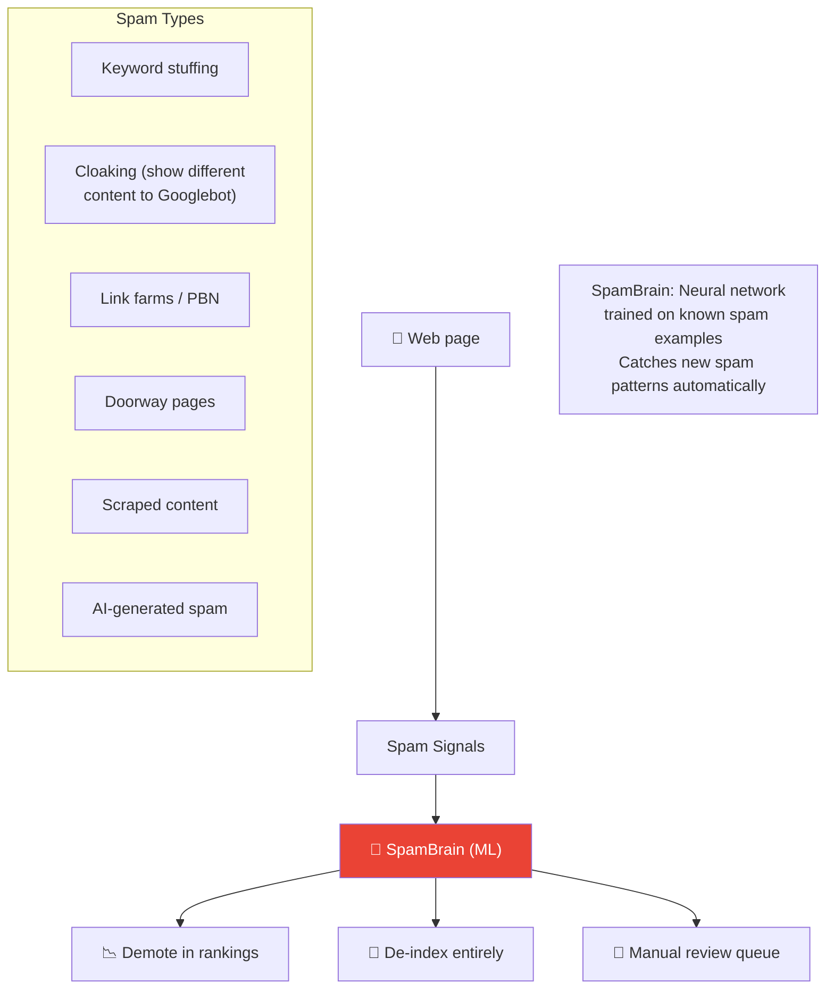
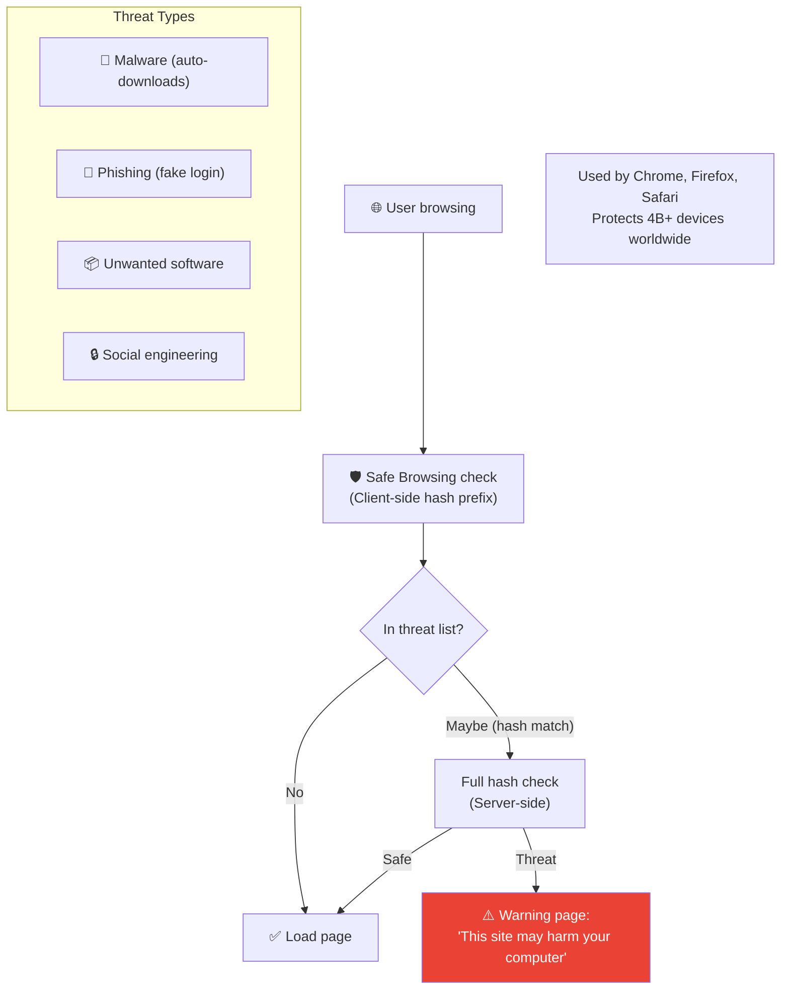

# Google Search - Security Analysis

> Google Search chống lại spam, SEO manipulation, malware distribution, và bảo vệ user privacy.

---

## Tổng Quan



---

## 1. Web Spam Detection



---

## 2. Google Safe Browsing



### Privacy-Preserving Lookup

```
1. Client hashes URL → SHA256
2. Sends first 4 bytes (prefix) to Google
3. Google returns all matching full hashes
4. Client checks locally → Google NEVER sees full URL
```

---

## 3. E-E-A-T & Content Quality

| Signal | Meaning | Example |
|---|---|---|
| **Experience** | First-hand experience | Product review from actual user |
| **Expertise** | Subject knowledge | Medical article by a doctor |
| **Authoritativeness** | Recognized authority | .gov or .edu domains |
| **Trustworthiness** | Reliable, honest | Secure site, accurate info |

---

## 4. So Sánh Security

| Layer | Google Search | YouTube | Stripe | Amazon |
|---|---|---|---|---|
| **Focus** | Web spam, malware | Copyright, harmful content | Payment fraud | Marketplace fraud |
| **Detection** | SpamBrain ML | Content ID | Radar ML | A-to-Z |
| **Unique** | Safe Browsing (4B devices) | CSAM detection | Cross-merchant intel | Chaotic storage |
| **Privacy** | Prefix hash lookup | Age verification | PCI tokenization | KMS encryption |

---

## Mapping → NestJS

| Pattern | Google | NestJS Implementation |
|---|---|---|
| **Safe Browsing** | Hash-prefix API | Google Safe Browsing API v4 |
| **Spam detection** | SpamBrain ML | Custom rules + ML microservice |
| **E-E-A-T scoring** | Quality rater + ML | Domain trust table + scoring |
| **Content quality** | Helpful Content System | Text analysis + readability score |
| **Rate limiting** | Maglev | `@nestjs/throttler` |
