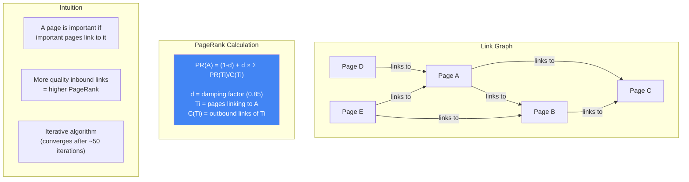
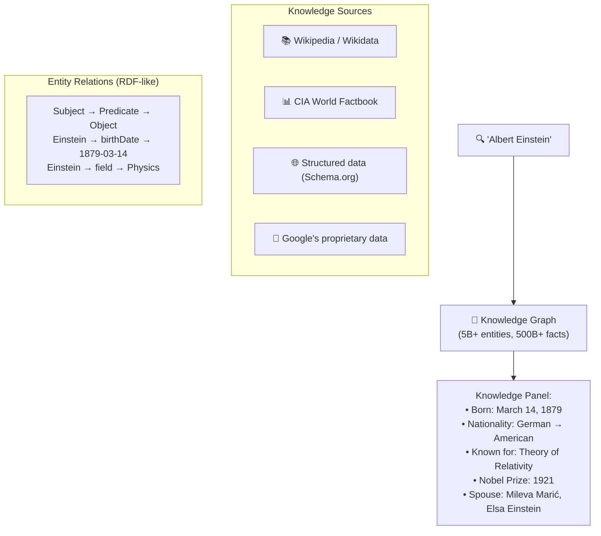
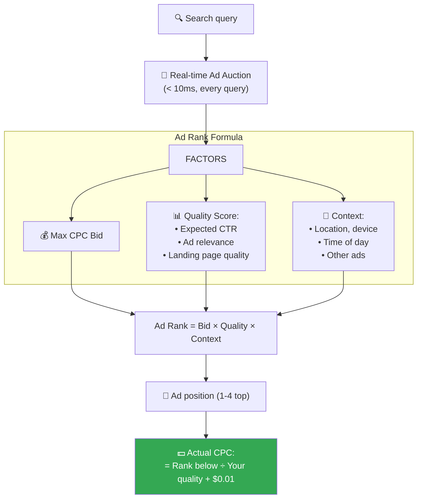
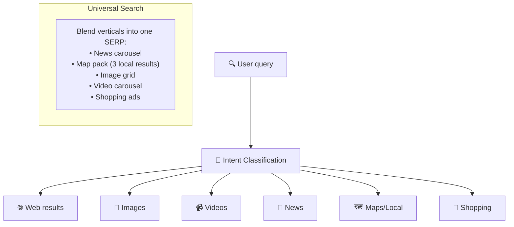
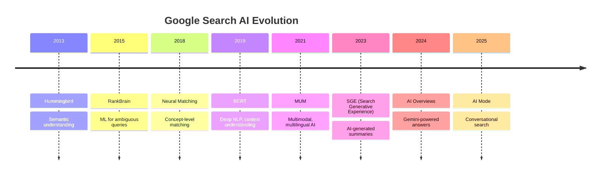

# Google Search - Subsystems Analysis

> Knowledge Graph, Ads, Verticals, AI Evolution, PageRank.

---

## 1. PageRank — The Original Innovation

---

## 2. Knowledge Graph

---

## 3. Google Ads — The Business Engine

**Second-price auction:** You pay just enough to beat the next advertiser → incentivizes truthful bidding.

---

## 4. Search Verticals

---

## 5. AI Evolution in Search

---

## 6. So Sánh Tổng Hợp: All 11 Systems

| Dimension | Google Search | Spotify | Stripe | Amazon | Uber | YouTube | Netflix | Instagram | Twitter | WhatsApp | URL Short |
|---|---|---|---|---|---|---|---|---|---|---|---|
| **Core** | Information retrieval | Audio streaming | Payments | E-commerce | Rides | Video | Streaming | Photo social | Microblog | Messaging | Redirect |
| **Scale** | 8.5B queries/d | 600M MAU | $1T/y vol | 310M users | 130M users | 2B MAU | 260M subs | 2B MAU | 550M MAU | 2B MAU | 28B clicks/m |
| **Key DS** | Inverted index | Audio CNN emb. | Double-entry | DynamoDB | H3 hex grid | Vitess | Cassandra | TAO graph | Snowflake | Mnesia | Base62 |
| **Open** | MapReduce, K8s | Backstage | SDKs | AWS | H3, Jaeger | Vitess | Netflix OSS | Fewer | Zipkin | Fewer | N/A |

---

## Google Search Unique Innovations

| Innovation | Impact |
|---|---|
| **PageRank** | Graph-based authority → transformed web search |
| **MapReduce** | Distributed batch processing → industry standard |
| **GFS / Colossus** | Distributed FS → inspired HDFS |
| **Bigtable** | Wide-column NoSQL → inspired HBase, Cassandra |
| **Spanner + TrueTime** | Globally consistent DB with atomic clocks |
| **Borg → Kubernetes** | Container orchestration → industry standard |
| **BERT / MUM** | Deep NLP for search → transformed NLP field |
| **Safe Browsing** | Privacy-preserving malware detection → 4B devices |

---

## Mapping → NestJS

| Subsystem | Google | NestJS Implementation |
|---|---|---|
| **Inverted index** | Custom | Elasticsearch + `@nestjs/elasticsearch` |
| **Knowledge Graph** | Custom graph DB | Neo4j + `neo4j-driver` |
| **Ad auction** | Real-time bidding | Custom auction service + Redis |
| **Verticals** | Intent → route | NestJS microservices per vertical |
| **AI ranking** | BERT/MUM | TensorFlow.js / OpenAI API |
| **Crawler** | Googlebot | `crawlee` + BullMQ |
| **PageRank** | Iterative graph algo | Batch job on graph DB |
