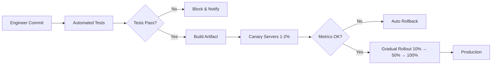
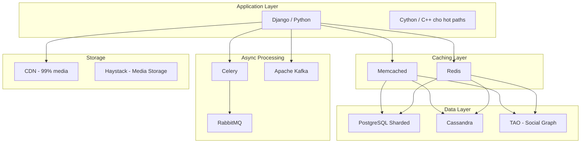
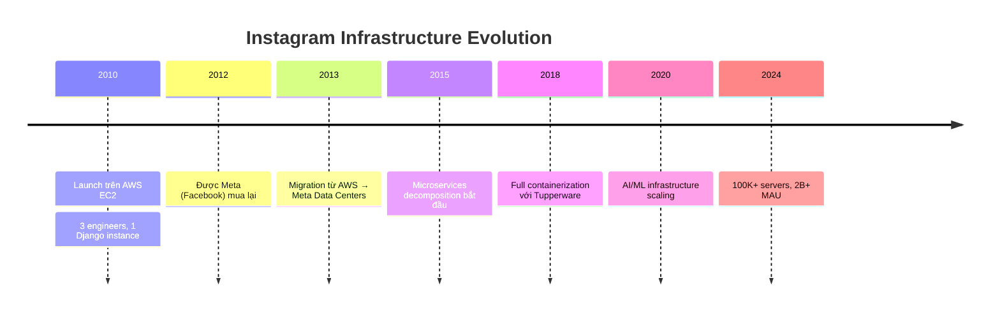
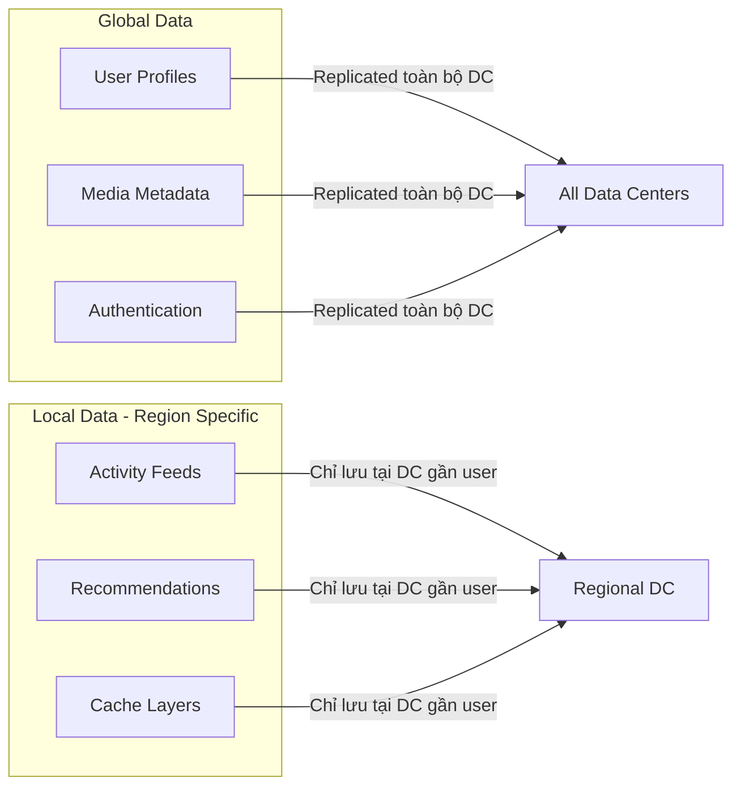
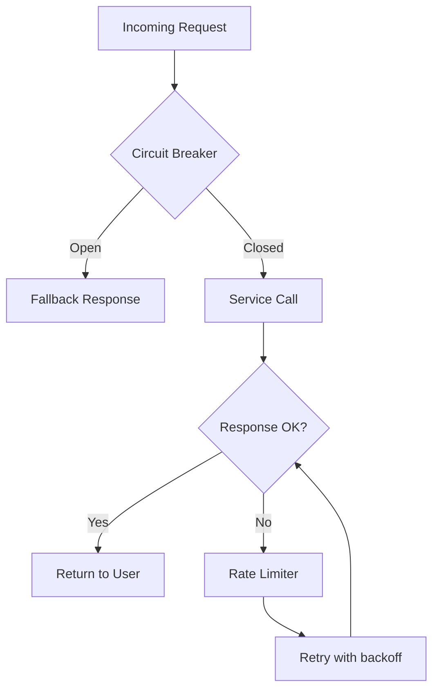

# Hệ Thống Triển Khai Của Instagram

> Tài liệu nghiên cứu chi tiết về cách Instagram triển khai code, quản lý hạ tầng và phục vụ 2+ tỷ người dùng hàng tháng.

---

## 1. Tổng Quan

Instagram sử dụng mô hình **Continuous Deployment (CD)** với tần suất triển khai **30–50+ lần/ngày**. Mỗi commit vào master branch tự động đi qua pipeline: build → test → canary → rollout toàn bộ.

### Quy mô hệ thống
| Metric | Giá trị |
|---|---|
| Monthly Active Users | 2+ tỷ |
| Servers | 100,000+ globally |
| Data stored | 400+ petabytes |
| Photos/Videos tổng | 200+ tỷ |
| Daily uploads | 500+ triệu |
| Daily likes | 4+ tỷ |
| Feed load time | 400–800ms |

---

## 2. Deployment Pipeline (CI/CD)

### 2.1 Các giai đoạn triển khai

| Giai đoạn | Mô tả |
|---|---|
| **Commit** | Engineer push code lên master branch |
| **Automated Testing** | Unit, integration, end-to-end tests chạy tự động |
| **Build** | Tạo build artifact từ code đã pass tests |
| **Canary Deploy** | Deploy lên 1-2% server fleet để giám sát |
| **Health Check** | Monitor error rates, CPU, memory, latency |
| **Gradual Rollout** | Tăng dần % servers: 10% → 50% → 100% |
| **Full Production** | Rollout hoàn tất cho toàn bộ fleet |

### 2.2 Nguyên tắc cốt lõi

- **Small-batch releases**: Mỗi lần deploy ít thay đổi → dễ tìm nguyên nhân khi lỗi
- **Automated rollback**: Hệ thống tự rollback khi phát hiện regression
- **Feature Toggles**: Deploy code nhưng giữ feature ẩn bằng feature flags
- **Zero-downtime migrations**: Dual-writing cho DB schema changes

### 2.3 Công cụ nội bộ

- **Sauron**: Dashboard giám sát deployment status, commit history, mapping issue → commit cụ thể
- **Deployment Orchestration**: Hệ thống nội bộ quản lý logic chọn commit từ queue, tốc độ rollout, health checks
- **Tupperware**: Container orchestration platform của Meta (tương tự Kubernetes)

---

## 3. Technology Stack

### 3.1 Chi tiết từng layer

#### Application Logic
- **Django (Python)**: Core monolith ban đầu, dần tách thành microservices
- **Cython / C++**: Tối ưu các hot paths (tính toán nặng, serialization)

#### Database
- **PostgreSQL**: Dữ liệu chính (user profiles, relationships, metadata)
  - Sharding theo `user_id` → dữ liệu của 1 user nằm trên 1 shard
  - Leader-Follower replication: writes → leader, reads → replicas
  - Denormalization cho các queries phức tạp
- **Cassandra**: Dữ liệu write-heavy, time-series (activity feeds, notifications)
  - Tunable consistency → chấp nhận eventual consistency cho feeds
  - Geo-distributed clusters

#### Caching
- **Memcached**: Cache hot data, chống thundering herd bằng leasing
- **Redis**: Cache + data structures, task queue backend

#### Async Processing
- **Celery + RabbitMQ**: Background tasks (video transcoding, notifications, email)
- **Apache Kafka**: Event streaming, real-time features

---

## 4. Kiến Trúc Hạ Tầng

### 4.1 Lịch sử phát triển

### 4.2 Chiến lược scaling

| Strategy | Mô tả |
|---|---|
| **Horizontal Scaling** | Thêm servers thay vì nâng cấu hình server |
| **Database Sharding** | Phân tán PostgreSQL theo `user_id` |
| **CDN** | 99% media served từ CDN gần user nhất |
| **Geo-Distribution** | Data centers phân bố toàn cầu, route user tới cluster gần nhất |
| **Microservices** | Authentication, Feed, Recommendations... scale độc lập |
| **Aggressive Caching** | Multi-layer: CDN → Memcached → Redis → DB |

### 4.3 Phân loại dữ liệu

- **Global Data**: Replicated across tất cả data centers (user profiles, auth)
- **Local Data**: Confined tại region cụ thể (feeds, recommendations)

---

## 5. Monitoring & Reliability

### 5.1 Giám sát

- **Real-time metrics**: Error rates, CPU, memory, latency per server
- **Commit tracing**: Map issues → specific commit gây ra
- **Alerting pipeline**: Auto-alert khi metrics vượt threshold

### 5.2 Fault tolerance

- **Circuit Breakers**: Ngăn cascading failures giữa services
- **Rate Limiting**: Bảo vệ services khỏi traffic spikes
- **Auto-rollback**: Revert code khi phát hiện regression
- **Graceful Degradation**: Tắt features không critical khi hệ thống quá tải

---

## 6. Bài Học Áp Dụng Cho Hệ Thống Của Bạn

> [!TIP]
> Những pattern có thể áp dụng cho NestJS microservice system:

| Pattern | Instagram | Áp dụng cho NestJS |
|---|---|---|
| **Canary Deploy** | 1-2% servers trước | Kubernetes canary với Istio/Linkerd |
| **Feature Flags** | Toggle features on/off | `@nestjs/config` + LaunchDarkly/Unleash |
| **Automated Rollback** | Metric-based auto revert | Kubernetes rolling update + health checks |
| **Database Sharding** | PostgreSQL by user_id | TypeORM custom repository + pgpool |
| **Async Processing** | Celery + RabbitMQ | Bull/BullMQ + Redis (đã có) |
| **Event Streaming** | Apache Kafka | `@nestjs/microservices` + Kafka (đã có) |
| **Circuit Breaker** | Custom implementation | `opossum` hoặc `@nestjs/terminus` |
| **Multi-layer Cache** | CDN → Memcached → Redis | CDN → Redis → DB (cache-aside pattern) |

---

## 7. Tham Khảo

- [Instagram Engineering Blog](https://instagram-engineering.com/)
- [ByteByteGo - Instagram Architecture](https://bytebytego.com/)
- [SystemDesign.one - Instagram](https://systemdesign.one/)
- [InfoQ - Instagram Deployment](https://infoq.com/)
