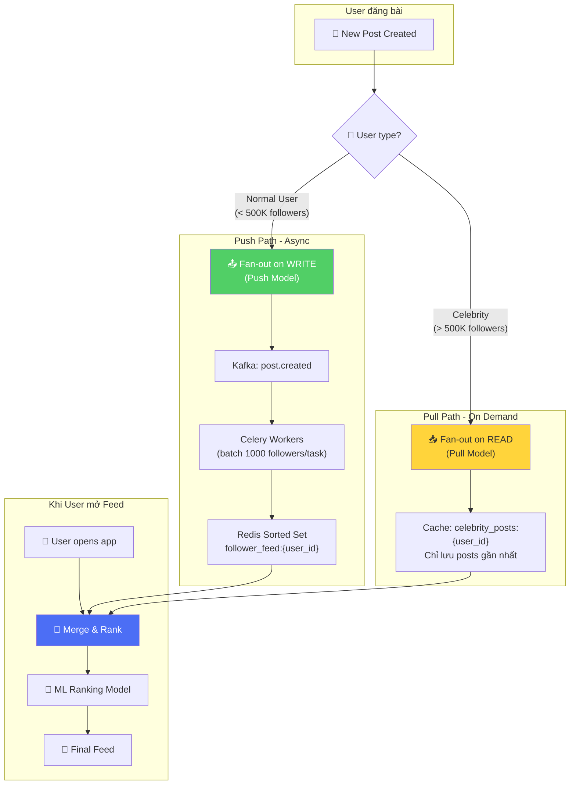
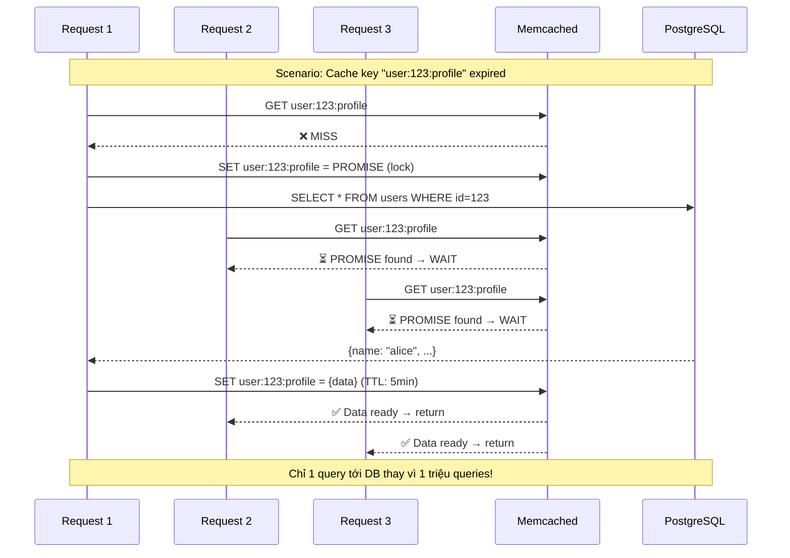
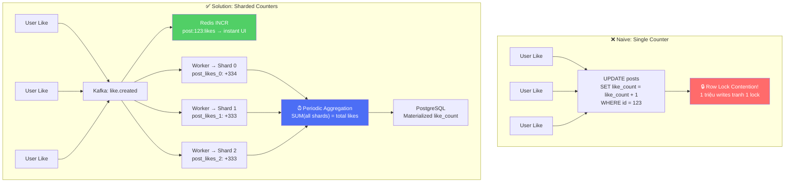
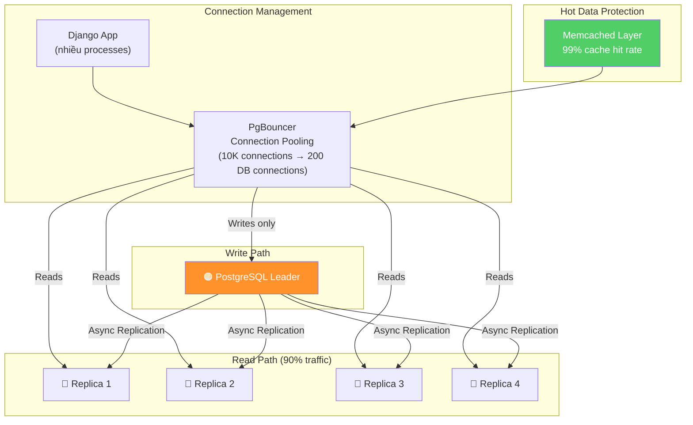
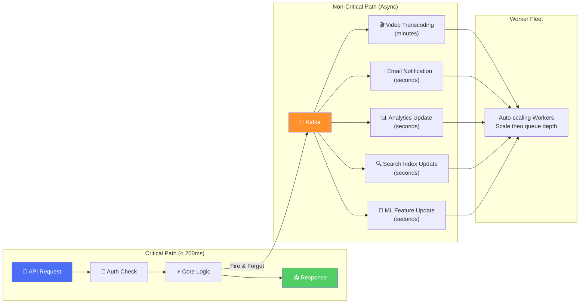
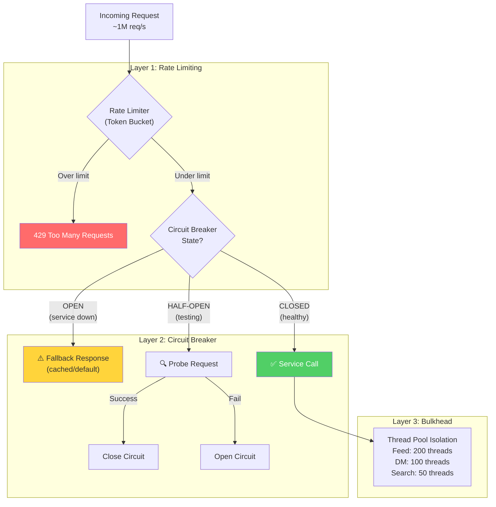

# Phân Tích Luồng Xử Lý Đồng Thời Cao - Instagram

> Instagram xử lý **hàng triệu requests/giây** từ 2+ tỷ users. Tài liệu này phân tích chi tiết các kỹ thuật xử lý high concurrency.

---

## 1. Vấn Đề "Celebrity Problem" - Hybrid Fan-out

Khi 1 celebrity có 100M followers đăng ảnh, hệ thống KHÔNG THỂ push tới 100M feed cùng lúc.

### Giải pháp: Hybrid Push/Pull

| Aspect | Push (Normal User) | Pull (Celebrity) |
|---|---|---|
| **Trigger** | Khi user đăng bài | Khi follower mở feed |
| **Write load** | O(N followers) - async | O(1) - chỉ cache post |
| **Read latency** | Rất thấp (feed sẵn sàng) | Cao hơn (phải merge) |
| **Áp dụng** | < 500K followers | > 500K followers |

---

## 2. Thundering Herd - Cache Stampede

Khi cache key phổ biến hết hạn → hàng triệu requests cùng đổ vào DB.

### Giải pháp: Promise Caching + Request Coalescing

### 3 kỹ thuật chống Thundering Herd

| Kỹ thuật | Mô tả |
|---|---|
| **Promise Caching** | Request đầu tiên lock cache key, các request sau đợi kết quả |
| **Soft TTL + Background Refresh** | Cache trả stale data, đồng thời refresh async ở background |
| **Lease-based Locking** | Memcached cấp "lease" cho 1 request, các request khác nhận stale value |

---

## 3. Celebrity Like Problem - Sharded Counters

Khi 1 bài post nhận **hàng triệu likes/phút**, update 1 row `like_count` → **lock contention** nghiêm trọng.

**Luồng chi tiết:**

1. **User nhấn Like** → API trả lời ngay *202 Accepted*
2. **Redis `INCR`** → counter tăng atomic, UI cập nhật instant
3. **Kafka event** → buffer absorb traffic spikes
4. **Workers** ghi vào N shards song song (không tranh lock)
5. **Periodic job** aggregate tổng shards → ghi vào DB chính

---

## 4. Database Concurrency Control

| Kỹ thuật | Mục đích | Chi tiết |
|---|---|---|
| **PgBouncer** | Connection pooling | 10K app connections → 200 DB connections |
| **Read Replicas** | Phân tải reads | 90% traffic → replicas, 10% → leader |
| **Optimistic Locking** | Tránh row locks | `WHERE version = N` thay vì `SELECT FOR UPDATE` |
| **Batch Writes** | Giảm round-trips | Gom nhiều writes thành 1 transaction |
| **Cache-aside** | Giảm DB load | 99%+ cache hit rate → DB chỉ nhận 1% traffic |

---

## 5. Async Processing Pipeline

**Nguyên tắc core:** Không bao giờ đặt operation nặng trên critical path.

| Path | SLA | Ví dụ |
|---|---|---|
| **Critical** | < 200ms | Auth, đọc feed, POST like |
| **Near-realtime** | < 5s | Push notification, feed update |
| **Background** | < 5min | Video transcode, email, analytics |

---

## 6. Rate Limiting & Circuit Breaker

### Rate Limiting tầng tầng lớp lớp

| Tầng | Loại | Limit |
|---|---|---|
| **CDN/Edge** | IP-based | 1000 req/min per IP |
| **API Gateway** | User-based (JWT) | 200 req/min per user |
| **Service Level** | Endpoint-based | POST /like: 60/min, GET /feed: 30/min |
| **Database** | Connection-based | Max 200 connections via PgBouncer |

---

## 7. Tổng Kết: Áp Dụng Cho NestJS Microservices

| Vấn đề | Instagram Solution | NestJS Implementation |
|---|---|---|
| **Fan-out Feed** | Hybrid push/pull | Bull queue + Redis Sorted Set |
| **Thundering Herd** | Promise caching | `cache-manager` + distributed lock (`redlock`) |
| **Hot Counter** | Sharded counters + Kafka | Redis `INCR` + Kafka consumer batch writes |
| **Connection Pool** | PgBouncer | TypeORM pool config + `pg-pool` |
| **Read/Write Split** | Leader + Replicas | TypeORM `replication` option |
| **Async Pipeline** | Celery + Kafka | `@nestjs/bull` + `@nestjs/microservices` Kafka |
| **Rate Limiting** | Multi-layer token bucket | `@nestjs/throttler` + Redis store |
| **Circuit Breaker** | Custom | `opossum` hoặc `mollitia` |
| **Bulkhead** | Thread pool isolation | Async worker pools + queue partitioning |

> [!TIP]
> **Nguyên tắc #1 của Instagram**: *"No synchronous unbounded operation on the critical path"* — Mọi operation có thể grow theo popularity phải được xử lý async.
