# Phân Tích Bảo Mật Hệ Thống Instagram

> Phân tích 8 lớp bảo mật của Instagram — từ network edge đến application logic, bảo vệ 2+ tỷ users trước hàng triệu cuộc tấn công mỗi ngày.

---

## Tổng Quan: Defense in Depth

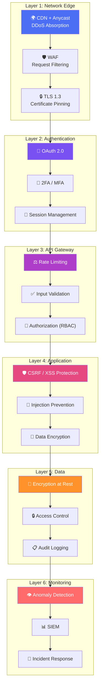

---

## 1. Network Security Layer

### 1.1 TLS & Certificate Pinning

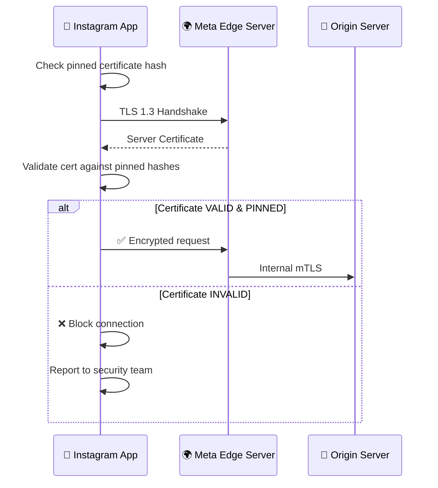

| Kỹ thuật | Mô tả |
|---|---|
| **TLS 1.3** | Encryption in-transit cho mọi kết nối |
| **Certificate Pinning** | App chỉ chấp nhận certs cụ thể → chống MITM |
| **mTLS (internal)** | Service-to-service authentication bằng mutual TLS |
| **HSTS** | Force HTTPS, chống downgrade attacks |

### 1.2 DDoS Protection

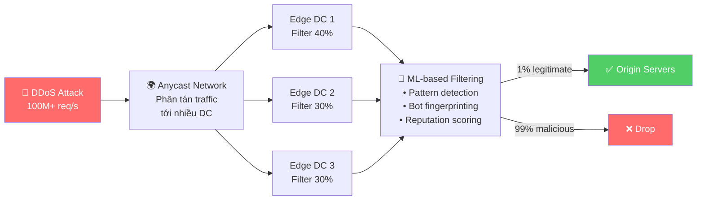

---

## 2. Authentication & Identity

### 2.1 OAuth 2.0 Flow (Third-party API)

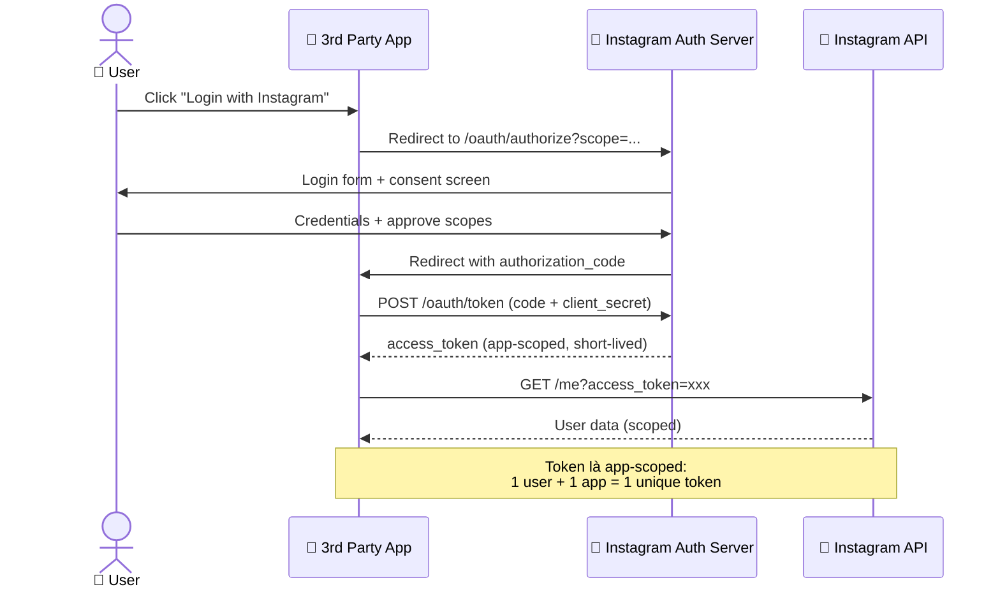

### 2.2 Multi-Factor Authentication & Login Detection

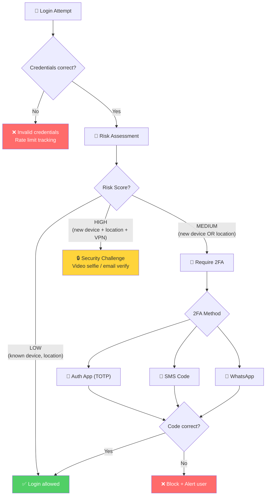

**Risk Assessment Signals:**

| Signal | Low Risk | Medium Risk | High Risk |
|---|---|---|---|
| Device | Known | New | New |
| Location | Same city | Same country | Different country |
| IP | Residential | Datacenter | Known VPN/Tor |
| Behavior | Normal | Slightly unusual | Automated/bot |
| Time | Usual hours | Off-hours | Never-before |

---

## 3. API Security & Rate Limiting

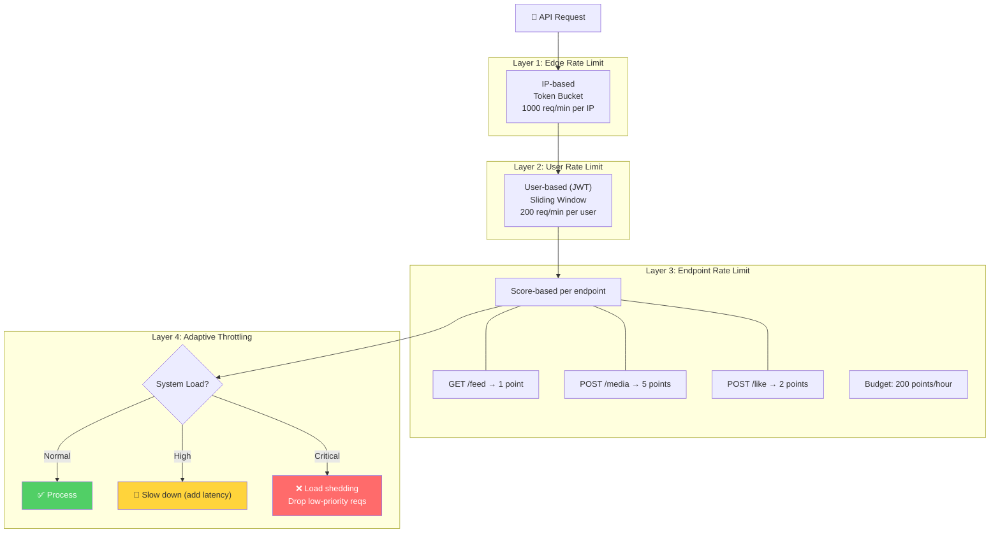

### API Security Checklist

| Check | Implementation |
|---|---|
| **Authentication** | OAuth 2.0 Bearer tokens, app-scoped |
| **Input Validation** | Schema validation mọi request body |
| **SQL Injection** | Parameterized queries (Django ORM) |
| **XSS** | Output encoding, CSP headers |
| **CSRF** | Token-based, SameSite cookies |
| **CORS** | Whitelist specific origins |
| **IDOR** | Ownership check trên mọi resource access |

---

## 4. Data Protection

### 4.1 Encryption Strategy

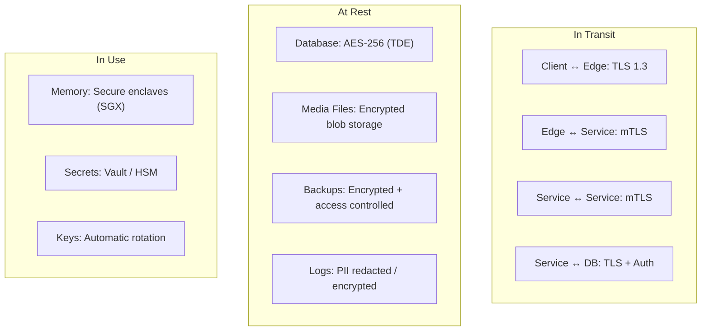

### 4.2 Data Classification & Access Control

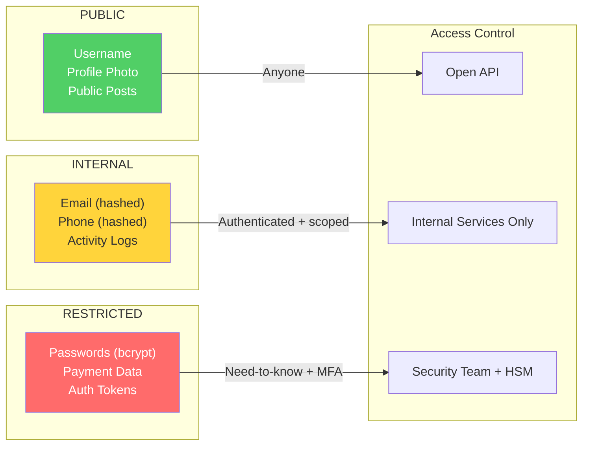

---

## 5. Application Security

### 5.1 Input Validation Pipeline

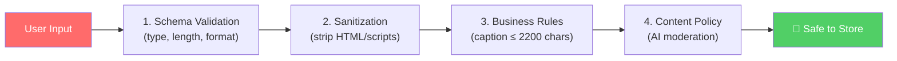

### 5.2 Security Headers

| Header | Value | Mục đích |
|---|---|---|
| `Content-Security-Policy` | `script-src 'self'` | Chống XSS, chỉ cho phép scripts từ domain |
| `X-Frame-Options` | `DENY` | Chống Clickjacking |
| `X-Content-Type-Options` | `nosniff` | Chống MIME-type sniffing |
| `Strict-Transport-Security` | `max-age=31536000` | Force HTTPS 1 năm |
| `Referrer-Policy` | `strict-origin` | Giới hạn referrer info |

---

## 6. Content Moderation & AI Security

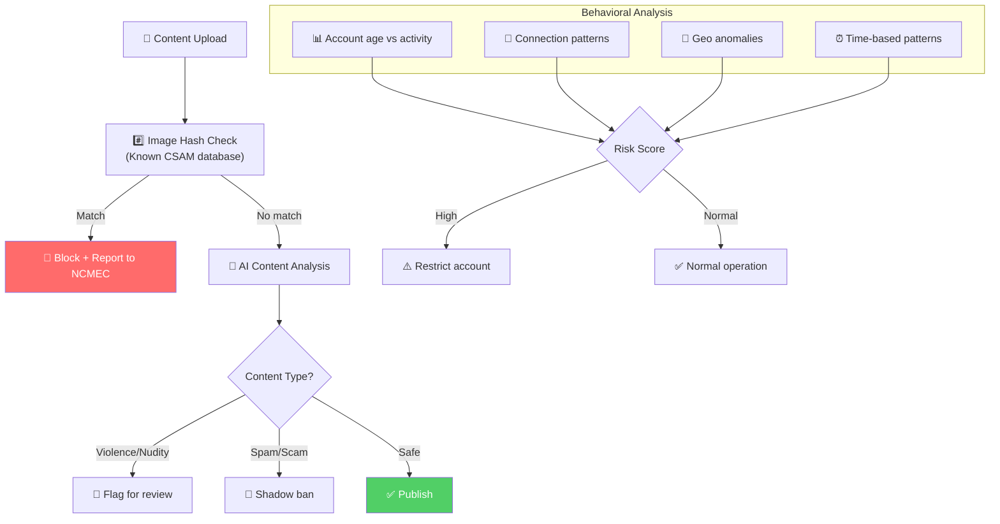

---

## 7. Security Monitoring & Incident Response

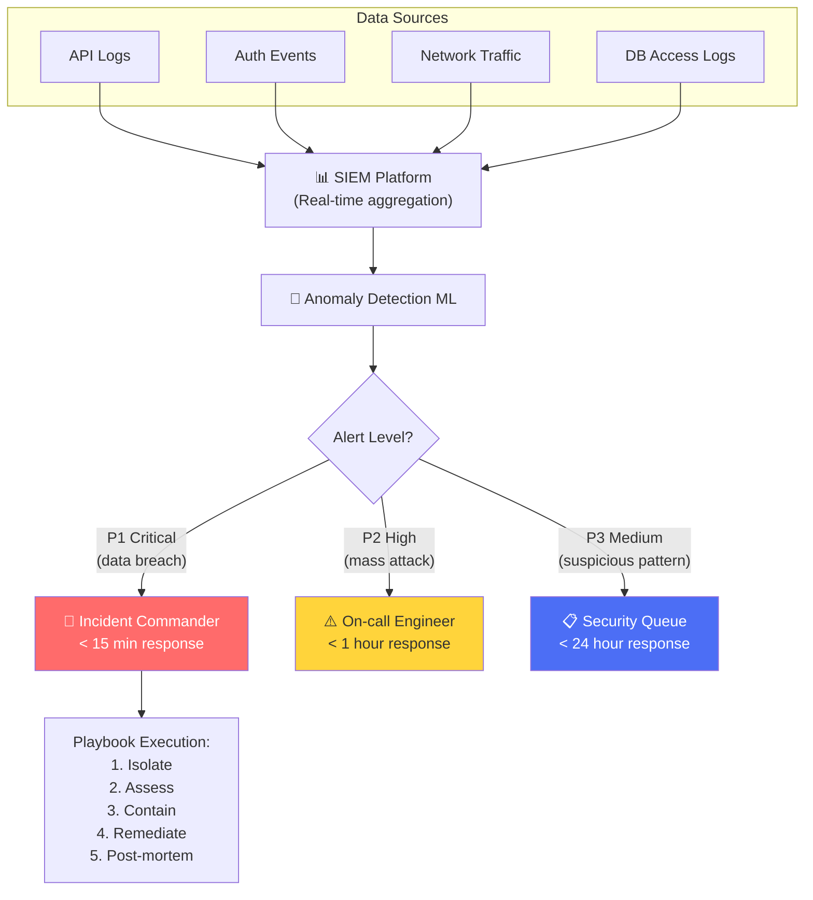

---

## 8. Áp Dụng Cho NestJS Microservices

| Layer | Instagram | NestJS Implementation |
|---|---|---|
| **TLS** | TLS 1.3 + cert pinning | Nginx/Traefik TLS termination |
| **Auth** | OAuth 2.0 + 2FA | `@nestjs/passport` + `passport-jwt` + `speakeasy` (TOTP) |
| **Rate Limit** | Multi-layer token bucket | `@nestjs/throttler` + Redis store |
| **Input Validation** | Schema validation | `class-validator` + `class-transformer` |
| **CSRF** | Token-based | `csurf` middleware |
| **Helmet** | Security headers | `@nestjs/helmet` (CSP, HSTS, X-Frame-Options) |
| **Encryption** | AES-256 at rest | `crypto` module + `argon2` for passwords |
| **IDOR** | Ownership guards | Custom `@OwnerGuard()` decorator |
| **Logging** | SIEM + anomaly detect | `winston` + ELK Stack + `@nestjs/terminus` health |
| **Circuit Breaker** | Internal protection | `opossum` library |

> [!IMPORTANT]
> **Nguyên tắc bảo mật #1**: *"Security is not a feature, it's a property"* — Bảo mật phải được thiết kế vào kiến trúc, không phải thêm vào sau.
