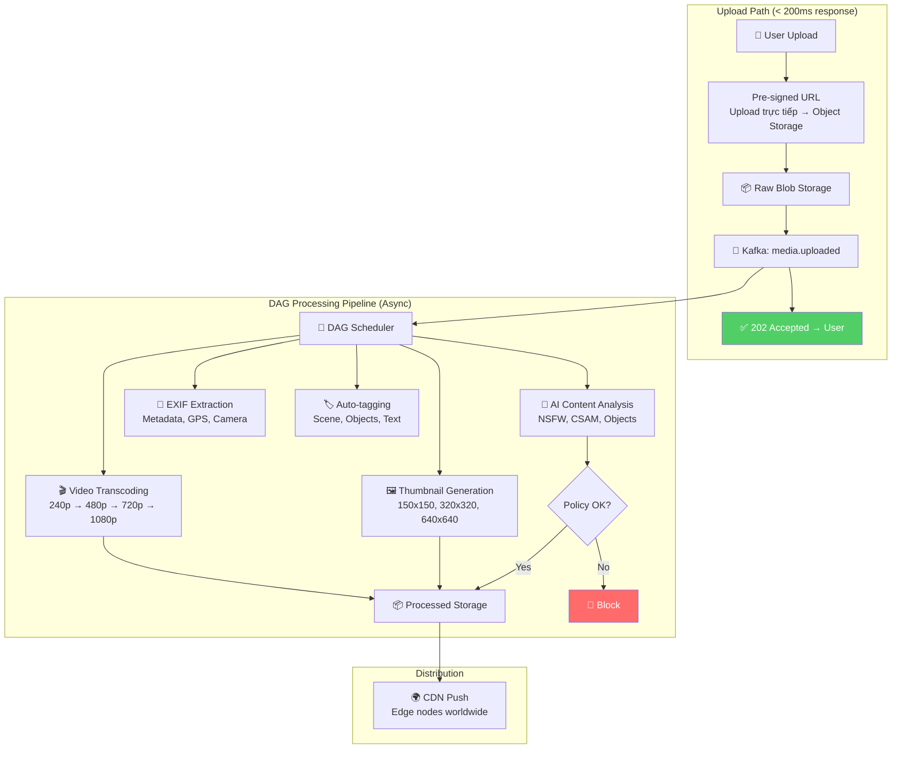
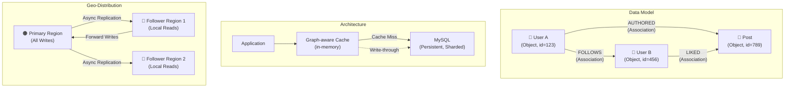
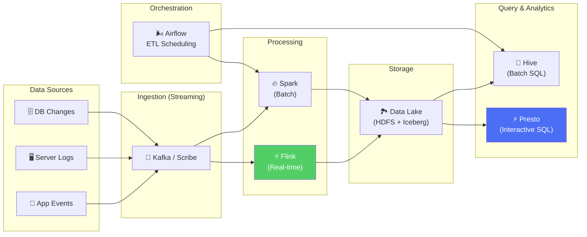
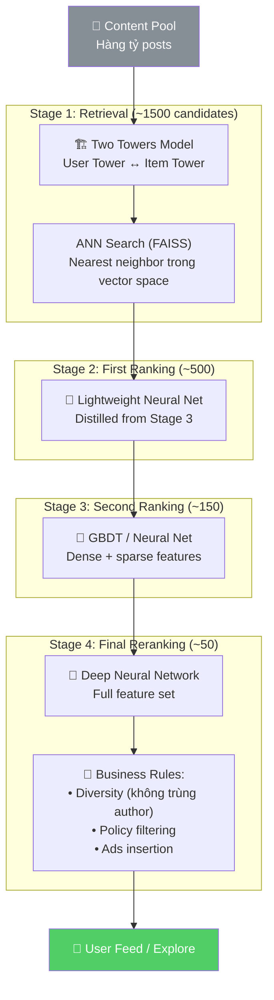
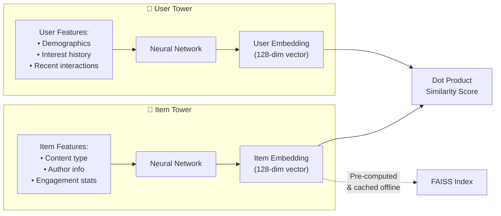
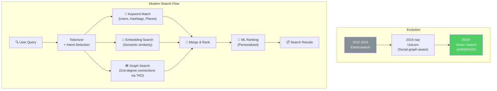
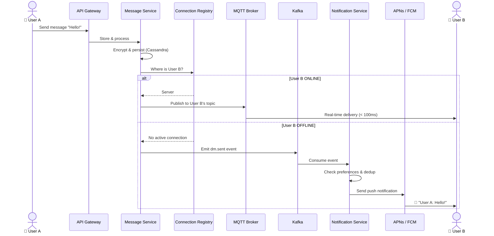
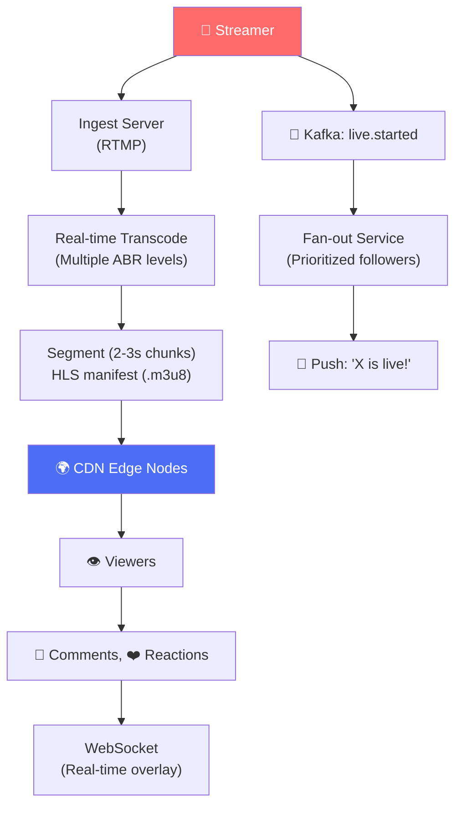
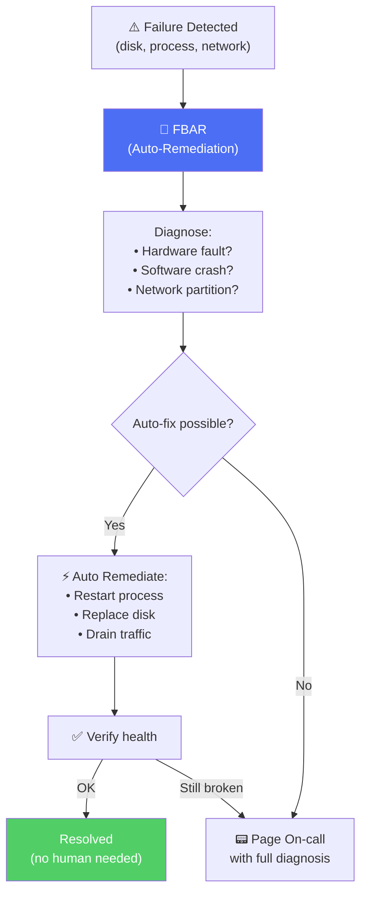
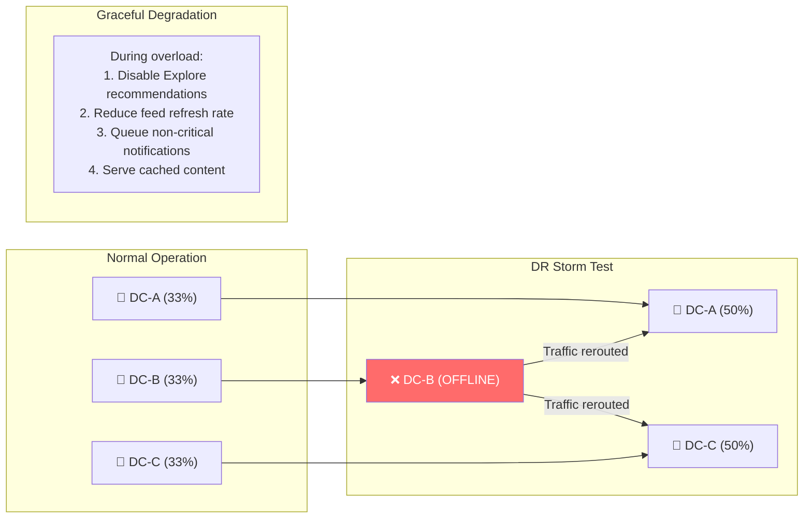

# Phân Tích Các Subsystem Còn Lại - Instagram

> 7 khía cạnh: Media Processing, Social Graph, Data Pipeline, ML/AI, Search, Real-time, Reliability.

---

## 1. Media Processing Pipeline

Instagram xử lý **500+ triệu uploads/ngày** qua pipeline DAG (Directed Acyclic Graph) async.

### Adaptive Bitrate Streaming (Reels)

| Resolution | Bitrate | Use Case |
|---|---|---|
| 240p | 300 kbps | 2G/3G, low-end devices |
| 480p | 800 kbps | 4G, mid-range |
| 720p | 2 Mbps | WiFi, standard |
| 1080p | 5 Mbps | WiFi, flagship devices |

**Tối ưu đặc biệt:** Meta giảm **94% compute** bằng cách repackage frames từ encoding sẵn có thay vì transcode lại từ source → tiết kiệm hàng triệu USD/năm.

**Prefetching:** App prefetch 2-3 giây đầu của video tiếp theo → user swipe thấy video play "instant".

---

## 2. Social Graph — TAO

TAO (The Associations and Objects) là distributed graph store phục vụ social graph cho Instagram.

| Feature | Mô tả |
|---|---|
| **Objects** | Typed nodes: User, Post, Comment, Story (64-bit ID) |
| **Associations** | Directed edges: FOLLOWS, LIKES, AUTHORED (có timestamp) |
| **Write-through cache** | Update cache ngay khi write → keep cache warm |
| **Sharding** | Hàng trăm nghìn shards trên MySQL |

---

## 3. Data Pipeline & Analytics

| Layer | Technology | Throughput |
|---|---|---|
| **Ingestion** | Kafka + Scribe | Hàng nghìn tỷ events/ngày |
| **Stream Processing** | Apache Flink | Real-time (< 1s latency) |
| **Batch Processing** | Apache Spark | Petabytes/ngày |
| **Data Lake** | HDFS + Apache Iceberg | ACID, time-travel queries |
| **Query** | Presto (interactive), Hive (batch) | Ad-hoc + scheduled |
| **Orchestration** | Airflow / MetaFlow | DAG scheduling, retries |
| **Schema** | Avro / Protobuf | Schema enforcement |

**Deterministic Sampling:** Chỉ xử lý 1% data cho dev/testing → iterate nhanh, giảm chi phí infrastructure.

---

## 4. ML/AI Recommendation

Instagram dùng **multi-stage ranking funnel** để chọn content cho Feed, Explore, Reels.

### Two Towers Model Detail

| Concept | Mô tả |
|---|---|
| **Teacher Model** | Model lớn, train offline với full features |
| **Student Model** | Model nhẹ, distill từ teacher → serve online |
| **Engagement Signals** | Likes, saves, shares, watch time, comments |
| **Diversity Rules** | Không quá 2 posts liên tiếp từ 1 author |

---

## 5. Search & Discovery

### Search Signals

| Signal | Weight | Ví dụ |
|---|---|---|
| **Text Match** | High | Username, hashtag, caption keywords |
| **Social Graph** | High | Accounts bạn follow, mutual connections |
| **Engagement** | Medium | Popularity, trending score |
| **Recency** | Medium | Nội dung mới hơn được ưu tiên |
| **Embeddings** | Medium | Semantic similarity (visual + text) |
| **User Interest** | Medium | Lịch sử tương tác cá nhân |

---

## 6. Real-time Systems

### 6.1 Messaging & Notifications

### 6.2 Live Streaming

### Notification Priority & Deduplication

| Priority | Type | Delivery |
|---|---|---|
| **P0 Critical** | DM, security alert | Instant push |
| **P1 High** | Live started, mention | Within 5s |
| **P2 Medium** | Like, follow, comment | Batched (30s window) |
| **P3 Low** | Suggestions, weekly digest | Delayed / email |

**Dedup rules:** Không gửi "X liked your post" 100 lần → aggregate thành "X and 99 others liked your post".

---

## 7. Reliability & SRE

### 7.1 Self-healing Infrastructure

### 7.2 Disaster Recovery — DR Storms

### 7.3 Observability Stack

| Layer | Tool | Mục đích |
|---|---|---|
| **Metrics** | Internal (Prometheus-like) | SLI/SLO tracking, dashboards |
| **Logging** | Scribe + Hive | Centralized log aggregation |
| **Tracing** | Distributed Tracing | Request flow across microservices |
| **Alerting** | Configerator | Config-driven, auto-generated alerts |
| **Chaos** | DR Storms + Fault Injection | Validate resilience proactively |

### 7.4 Incident Response

| Severity | Response Time | Example |
|---|---|---|
| **SEV-0** | < 5 min | Total site outage |
| **SEV-1** | < 15 min | Major feature degradation |
| **SEV-2** | < 1 hour | Partial outage, one region |
| **SEV-3** | < 4 hours | Non-critical service issue |
| **SEV-4** | Next business day | Minor bug, cosmetic issue |

---

## Mapping Tổng Hợp → NestJS

| Subsystem | Instagram | NestJS Implementation |
|---|---|---|
| **Media Pipeline** | DAG + Celery + CDN | `@nestjs/bull` DAG jobs + S3 + CloudFront |
| **Social Graph** | TAO (Objects + Assoc.) | Neo4j / TypeORM relations + Redis cache |
| **Data Pipeline** | Kafka → Flink → Hive | `@nestjs/microservices` Kafka → ClickHouse |
| **ML Ranking** | Two Towers + FAISS | TensorFlow Serving + `pgvector` |
| **Search** | Unicorn + Embeddings | Elasticsearch + `@nestjs/elasticsearch` |
| **Real-time** | MQTT + WebSocket | `@nestjs/websockets` + Socket.IO |
| **Notifications** | Kafka + APNs/FCM | `@nestjs/bull` + `firebase-admin` + `node-apn` |
| **Observability** | Scribe + Configerator | OpenTelemetry + Grafana + Prometheus |
| **DR** | DR Storms + FBAR | K8s PDB + Liveness probes + Chaos Mesh |
