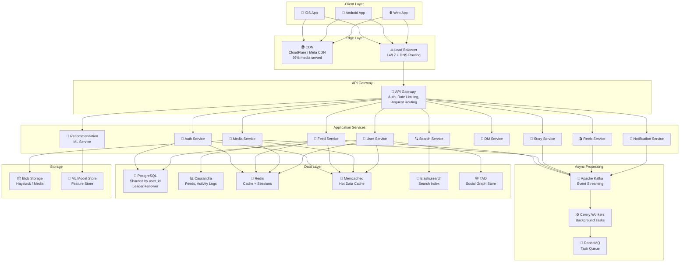
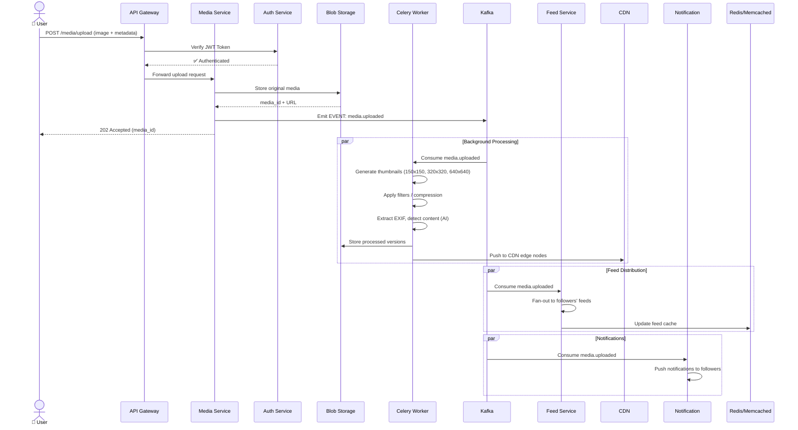
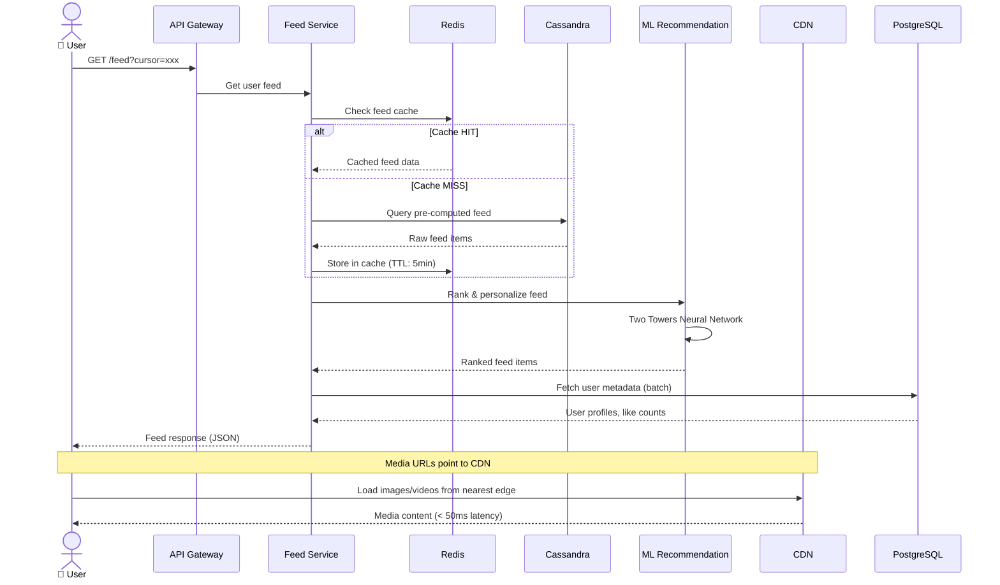
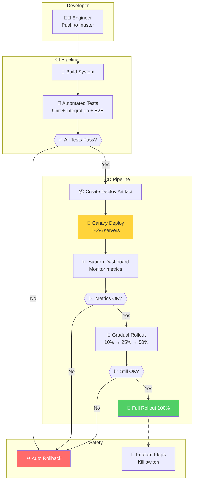
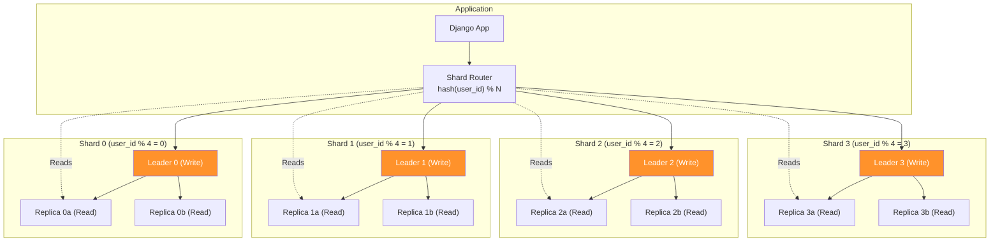
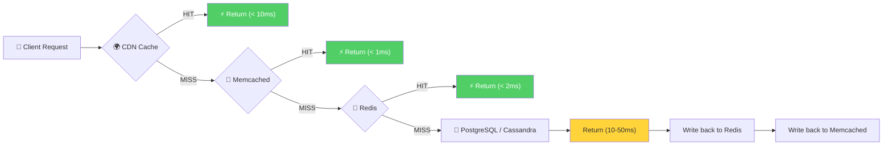
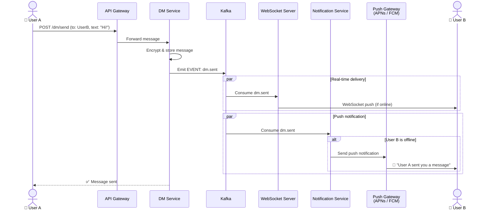
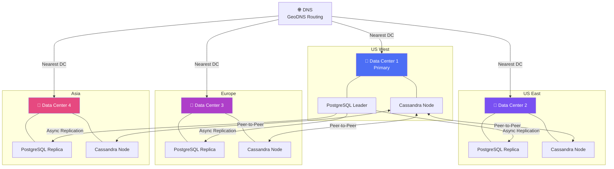

# Kiến Trúc Hệ Thống Instagram - System Flow

## 1. Tổng Quan Kiến Trúc Toàn Hệ Thống

---

## 2. Luồng Upload Ảnh/Video

---

## 3. Luồng Load Feed (News Feed)

---

## 4. Luồng Deployment (CI/CD)

---

## 5. Luồng Database Sharding

---

## 6. Luồng Caching Multi-Layer

---

## 7. Luồng Real-time (DM & Notifications)

---

## 8. Geo-Distribution & Data Center

