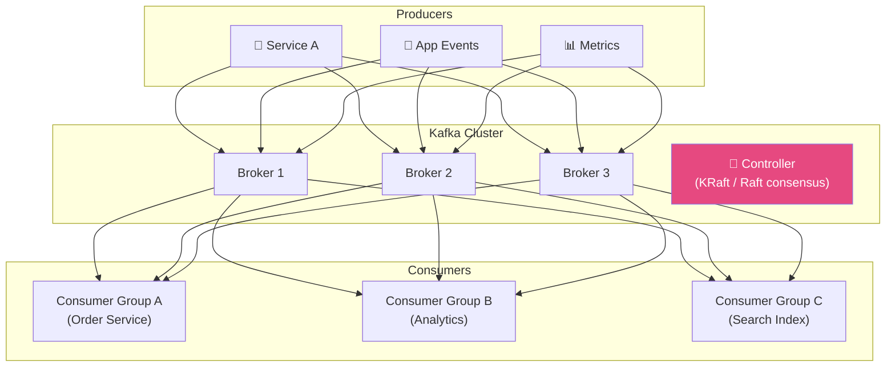
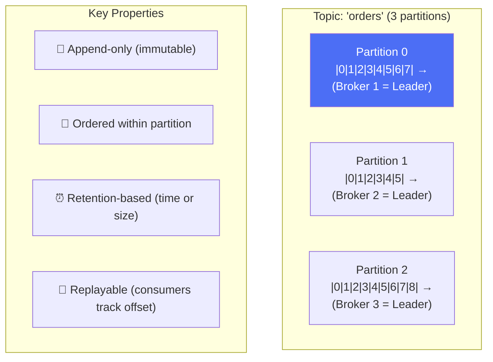
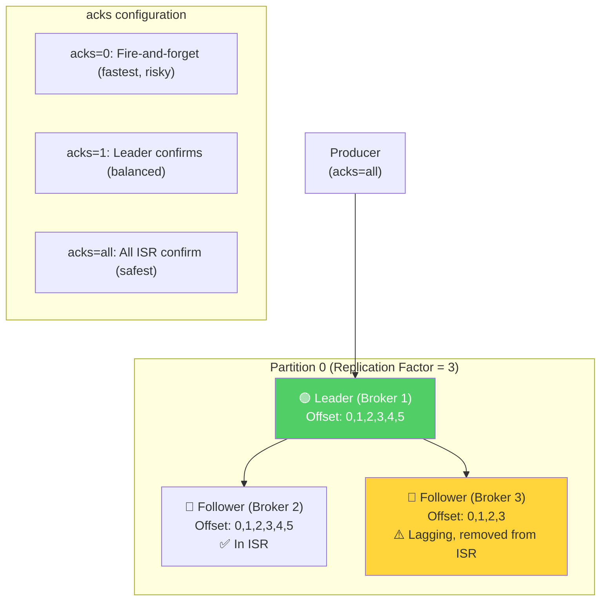
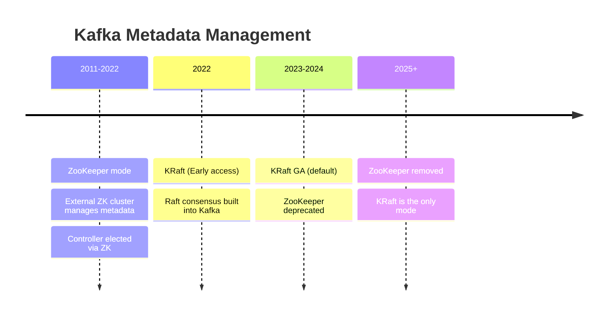
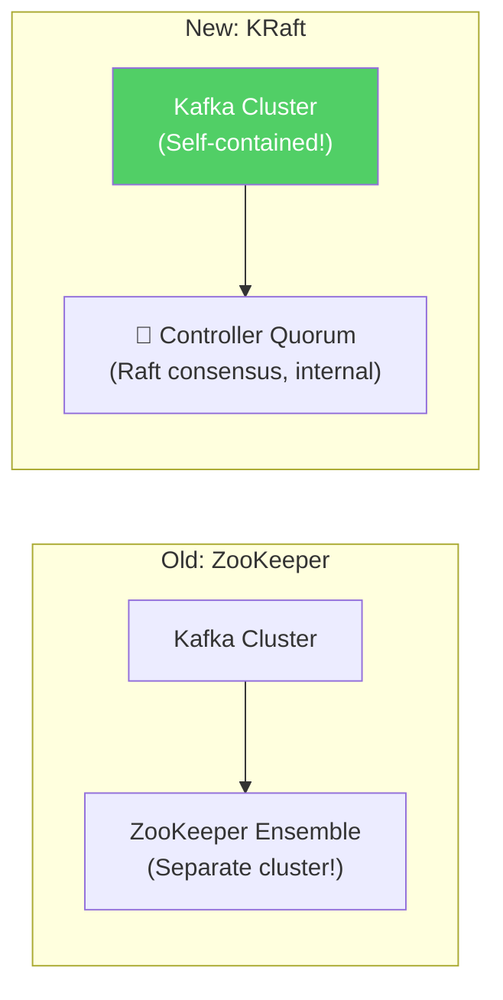
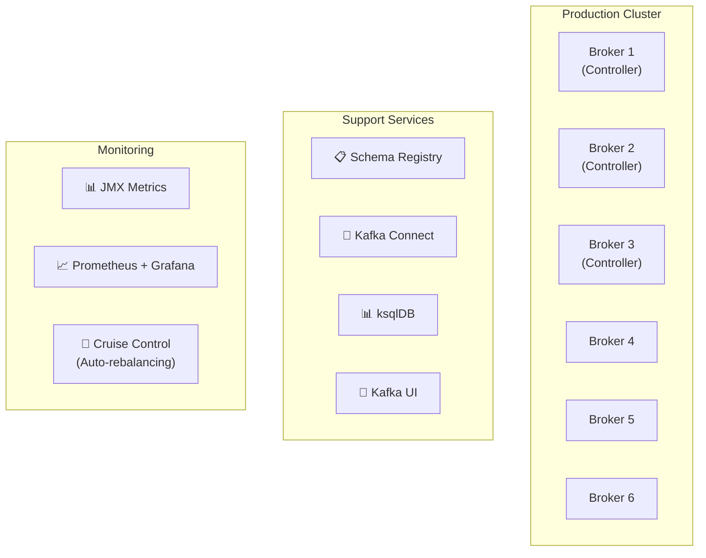

# Apache Kafka - Deployment & Architecture

> LinkedIn tạo ra Kafka xử lý **trillions messages/ngày**, nền tảng event streaming #1 thế giới.

---

## 1. Quy Mô (LinkedIn Reference)

| Metric | Giá trị |
|---|---|
| Messages/day (LinkedIn) | 7 trillion+ |
| Throughput | Millions msgs/sec per cluster |
| Companies using | LinkedIn, Uber, Spotify, Netflix, Stripe, Airbnb |
| Open source since | 2011 (Apache) |
| Creator | Jay Kreps, Neha Narkhede (LinkedIn) |

---

## 2. Core Architecture

---

## 3. The Distributed Log — Core Concept

### Why Append-Only Log is Fast

| Operation | Disk | Speed |
|---|---|---|
| Random write | Seek to position | ~10ms |
| Sequential write (Kafka) | Append to end | ~0.03ms |
| **Result** | Kafka = 300x faster | Sequential I/O wins |

**Zero-copy transfer:** Kafka uses `sendfile()` syscall → data goes from disk → network socket, bypassing user space → maximizes throughput.

---

## 4. Replication & ISR

---

## 5. ZooKeeper → KRaft Evolution

---

## 6. Deployment Topology

---

## Mapping → NestJS

| Kafka | NestJS Implementation |
|---|---|
| **Producer** | `@nestjs/microservices` Kafka transport |
| **Consumer** | `@MessagePattern()` / `@EventPattern()` |
| **Schema Registry** | `@kafkajs/confluent-schema-registry` |
| **KRaft cluster** | Docker Compose / K8s Helm chart |
| **Connect** | Use connectors for DB sync |
| **Monitoring** | `kafkajs` + Prometheus exporter |
