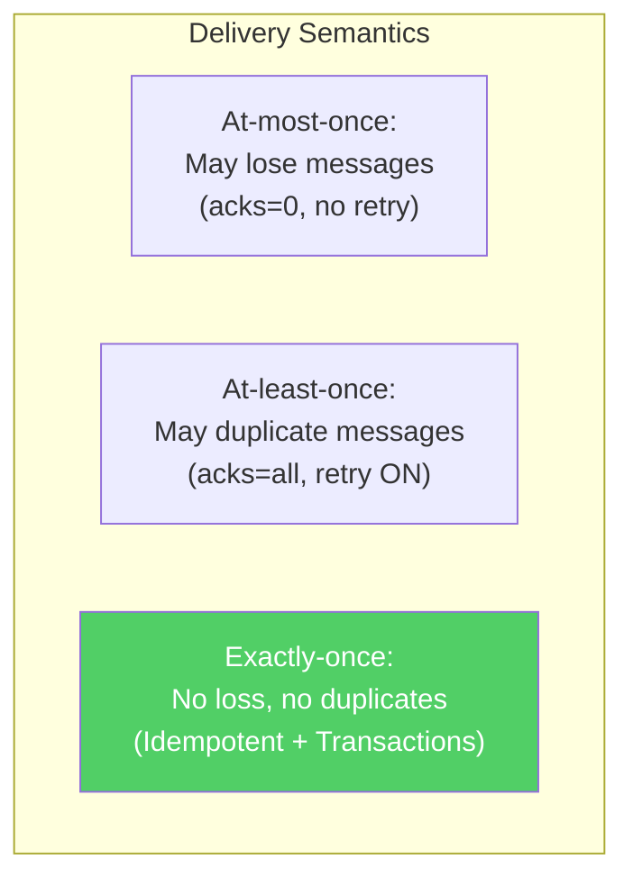
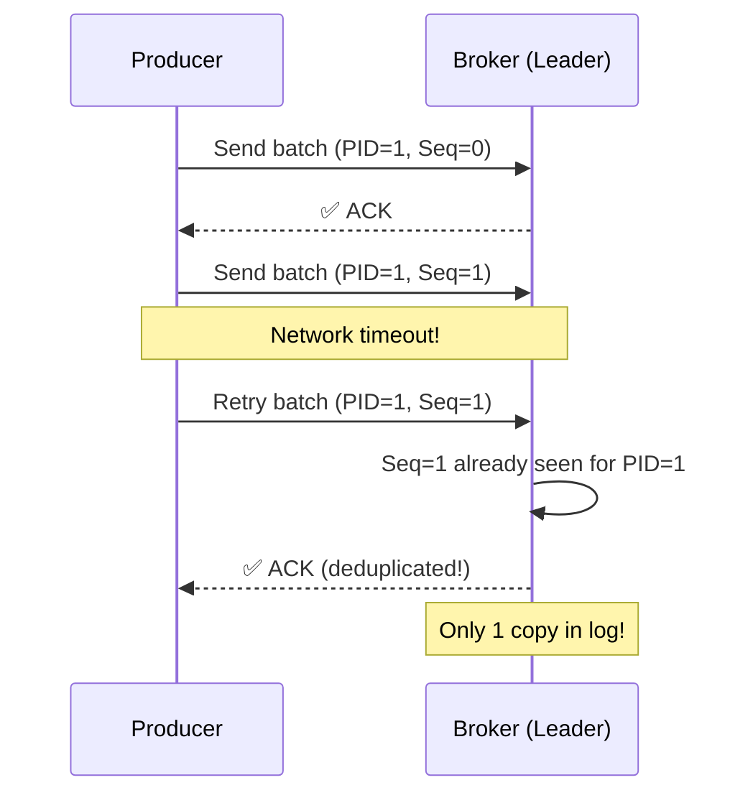
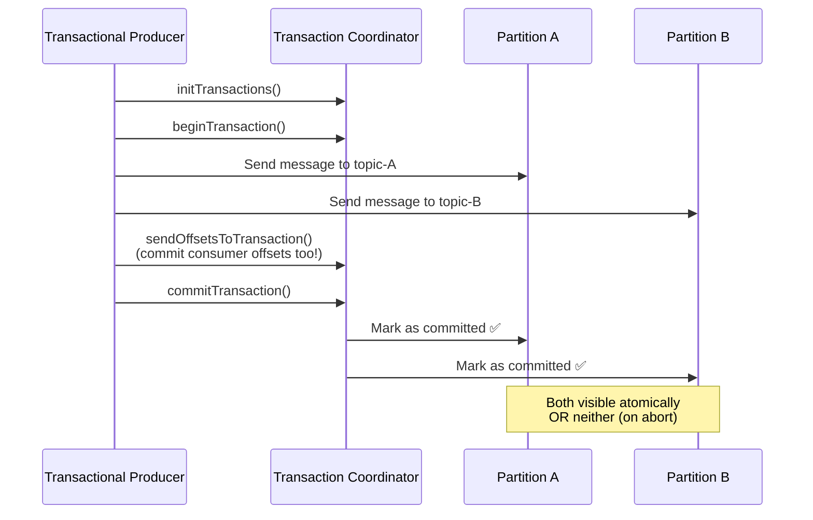
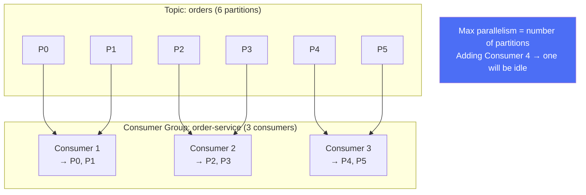
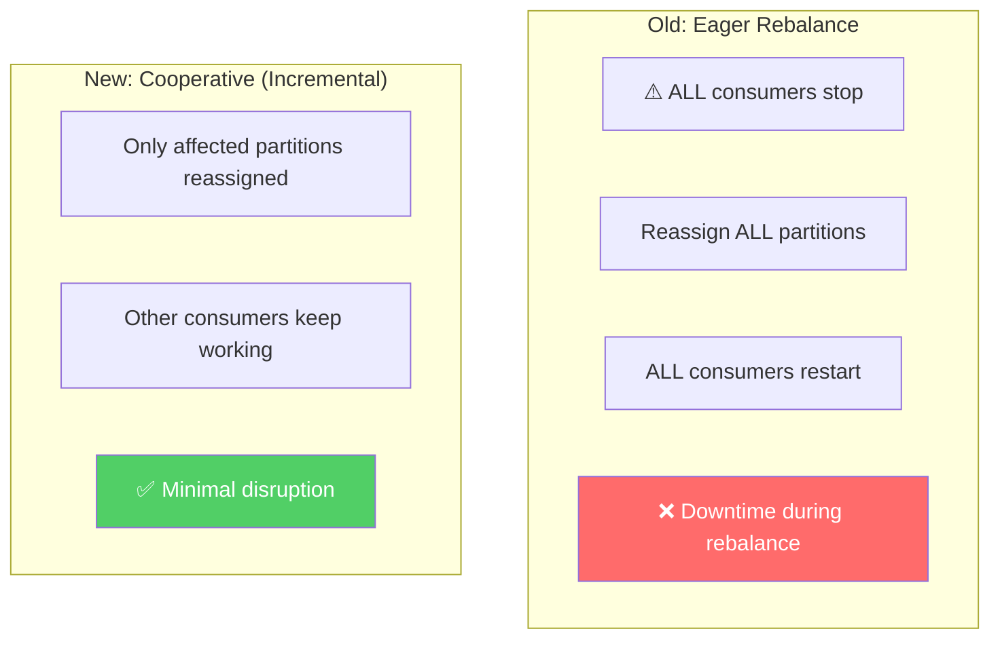
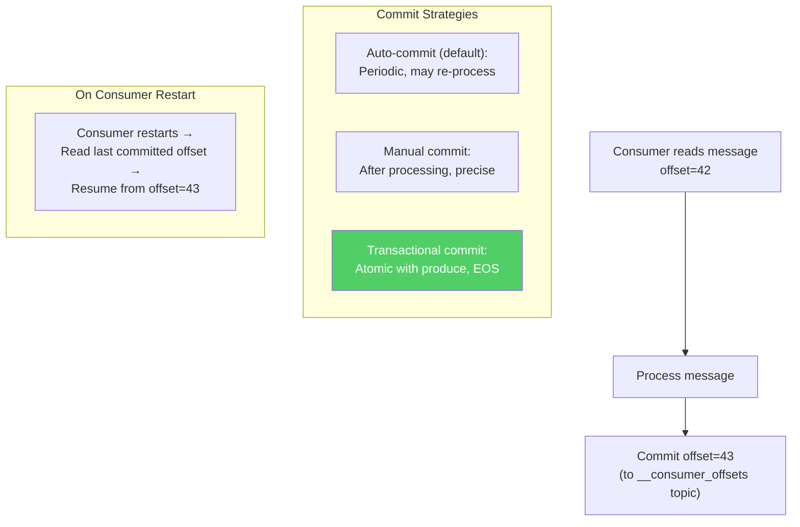

# Apache Kafka - Xử Lý Đồng Thời Cao & Exactly-Once

> Trillions msgs/ngày, exactly-once semantics, consumer group scaling.

---

## 1. Exactly-Once Semantics (EOS) — End to End



---

## 2. Idempotent Producer



```
Config:
  enable.idempotence = true   # Auto-sets acks=all, retries=MAX
  
Broker tracks per partition:
  { ProducerID → last sequence number }
  → Rejects duplicates automatically
```

---

## 3. Transactional Producer (Atomic Multi-Partition Writes)



---

## 4. Consumer Groups & Rebalancing



### Cooperative Rebalancing



---

## 5. Offset Management



---

## 6. Performance Tuning

| Parameter | Default | Tuned | Effect |
|---|---|---|---|
| **batch.size** | 16KB | 64KB-256KB | More throughput |
| **linger.ms** | 0 | 5-20 | Batches more messages |
| **compression.type** | none | lz4/snappy | 50-70% less network |
| **buffer.memory** | 32MB | 64-128MB | More buffering |
| **fetch.min.bytes** | 1 | 1KB-1MB | Less consumer overhead |
| **num.partitions** | 1 | 6-12 per topic | More parallelism |

---

## Mapping → NestJS

| Pattern | Kafka | NestJS Implementation |
|---|---|---|
| **Idempotent producer** | `enable.idempotence=true` | KafkaJS config in `ClientKafka` |
| **Transactional** | `transactional.id` | KafkaJS producer transactions |
| **Consumer group** | `group.id` | `@nestjs/microservices` group option |
| **Manual commit** | `autoCommit: false` | Custom `commitOffsets()` in handler |
| **Batch consumption** | `eachBatch` | KafkaJS `eachBatch` mode |
| **Compression** | `compression: lz4` | KafkaJS compression codec |
