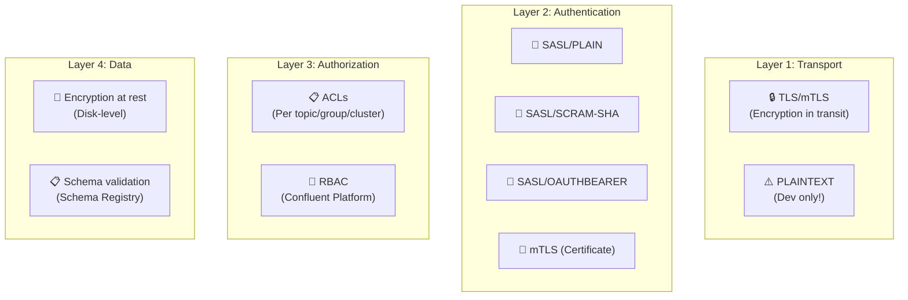
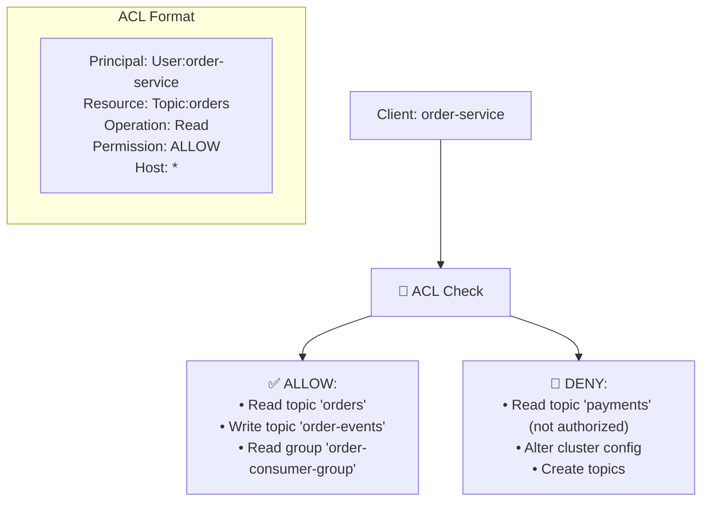
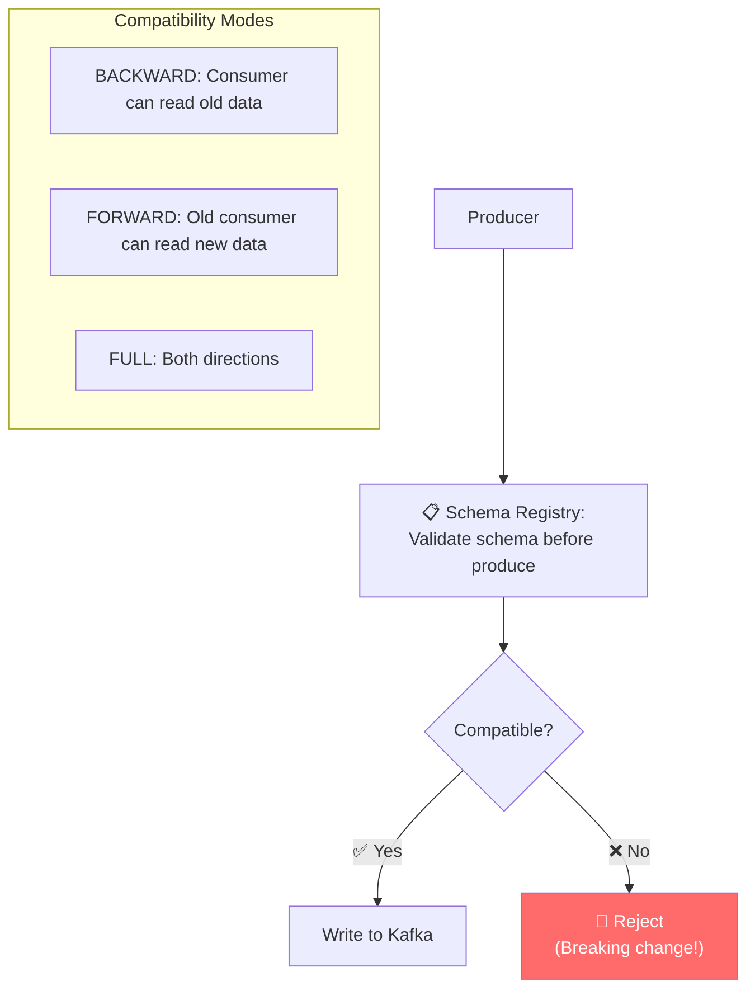

# Apache Kafka - Security Analysis

> Kafka bảo vệ data-in-motion: mTLS, SASL, ACLs, encryption.

---

## Tổng Quan

---

## 1. Authentication — SASL Mechanisms

| Mechanism | Security | Use Case |
|---|---|---|
| **SASL/PLAIN** | Low (credentials in clear) | Dev/test only |
| **SASL/SCRAM-SHA-256** | Medium (challenge-response) | Production (no KDC) |
| **SASL/SCRAM-SHA-512** | High | Production (recommended) |
| **SASL/GSSAPI (Kerberos)** | High | Enterprise with KDC |
| **SASL/OAUTHBEARER** | High | Cloud-native, OAuth2 |
| **mTLS** | Highest | Zero-trust environments |

---

## 2. ACL Authorization

---

## 3. Data Governance — Schema Registry

---

## 4. So Sánh Security

| Layer | Kafka | Stripe | Amazon | Netflix |
|---|---|---|---|---|
| **Transport** | mTLS / TLS | TLS 1.2+ | TLS + VPC | TLS |
| **Auth** | SASL / mTLS | API keys | IAM | OAuth |
| **Authorization** | ACLs / RBAC | Key scoping | IAM policies | Token scope |
| **Data protection** | Disk encryption | HSM vault | KMS | DRM |

---

## Mapping → NestJS

| Pattern | Kafka | NestJS Implementation |
|---|---|---|
| **TLS** | `ssl: { ca, cert, key }` | KafkaJS ssl config |
| **SASL** | `sasl: { mechanism, username, password }` | KafkaJS sasl config |
| **Schema validation** | Avro/Protobuf schemas | `@kafkajs/confluent-schema-registry` |
| **ACLs** | `kafka-acls` CLI | Admin API or Terraform |
