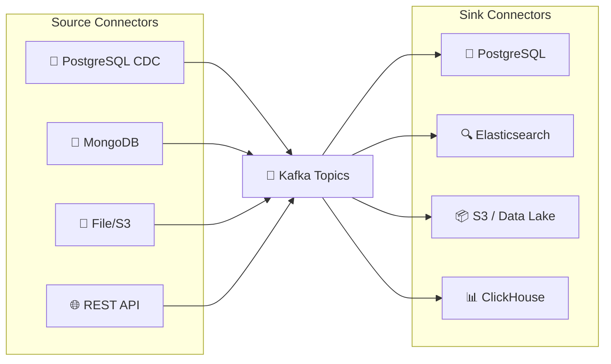
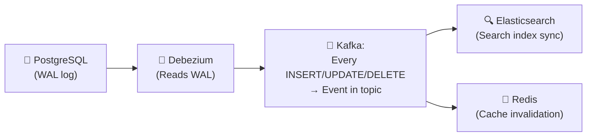
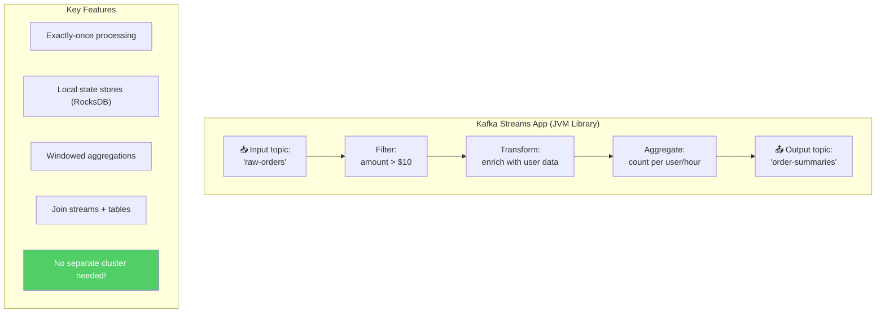

# Apache Kafka - Subsystems Analysis

> Kafka Connect, Kafka Streams, ksqlDB, Event Sourcing, CQRS.

---

## 1. Kafka Connect — Data Integration



### Debezium — CDC (Change Data Capture)



---

## 2. Kafka Streams — Stream Processing



---

## 3. Event Sourcing + CQRS with Kafka

```mermaid
flowchart TB
    subgraph "Write Side (Commands)"
        CMD["📝 Command:<br/>'PlaceOrder'"] --> VALIDATE2["Validate"]
        VALIDATE2 --> EVENT["📨 Event:<br/>'OrderPlaced'<br/>→ Kafka topic"]
    end

    subgraph "Kafka (Event Store)"
        KAFKA26["📨 orders-events topic<br/>|OrderPlaced|ItemAdded|OrderPaid|OrderShipped|"]
    end

    EVENT --> KAFKA26

    subgraph "Read Side (Queries) — Multiple projections"
        KAFKA26 --> VIEW1["🔍 Search Index<br/>(Elasticsearch)"]
        KAFKA26 --> VIEW2["📊 Analytics<br/>(ClickHouse)"]
        KAFKA26 --> VIEW3["📋 Order Status<br/>(PostgreSQL materialized view)"]
        KAFKA26 --> VIEW4["📧 Notification<br/>(Send email on OrderPaid)"]
    end

    style KAFKA26 fill=#4c6ef5,color:#fff
```

### Event Sourcing Benefits

| Benefit | Description |
|---|---|
| **Audit trail** | Every state change is recorded |
| **Time travel** | Replay events to any point in time |
| **Multiple views** | Build different read models from same events |
| **Decoupling** | Write side doesn't know about read side |
| **Debugging** | Replay events to reproduce bugs |

---

## 4. ksqlDB — SQL on Streams

```sql
-- Create a stream from topic
CREATE STREAM orders_stream (
  order_id VARCHAR KEY,
  user_id VARCHAR,
  amount DOUBLE,
  status VARCHAR
) WITH (kafka_topic='orders', value_format='JSON');

-- Real-time aggregation
CREATE TABLE order_counts AS
  SELECT user_id,
         COUNT(*) AS total_orders,
         SUM(amount) AS total_spent
  FROM orders_stream
  WINDOW TUMBLING (SIZE 1 HOUR)
  GROUP BY user_id;

-- Push query (live results)
SELECT * FROM order_counts EMIT CHANGES;
```

---

## 5. Real-World Kafka Deployments

| Company | Scale | Use Case |
|---|---|---|
| **LinkedIn** | 7T+ msgs/day | Activity tracking, metrics, logs |
| **Uber** | Millions msgs/sec | Ride matching, surge pricing |
| **Spotify** | Billions events/day | Play tracking, recommendations |
| **Netflix** | 700B+ events/day | Stream processing, analytics |
| **Stripe** | Billions/day | Payment events, webhooks |
| **Airbnb** | Trillions events | Search ranking, pricing |

---

## 6. Kafka Unique Innovations

| Innovation | Impact |
|---|---|
| **Append-only log** | Redefined messaging → now an event platform |
| **Consumer groups** | Scalable pub/sub → industry standard |
| **Exactly-once** | First distributed system with practical EOS |
| **KRaft** | Self-contained consensus → simplified ops |
| **Kafka Connect** | Standardized data integration ecosystem |
| **Kafka Streams** | Stream processing without separate cluster |
| **Log compaction** | Infinite retention for latest-value semantics |

---

## Mapping → NestJS

| Subsystem | Kafka | NestJS Implementation |
|---|---|---|
| **Kafka Connect** | Debezium CDC | `@nestjs/microservices` + Debezium |
| **Streams** | KStreams (JVM) | KafkaJS consumers + state in Redis |
| **Event Sourcing** | Append-only topics | `@nestjs/cqrs` + Kafka event store |
| **CQRS** | Separate read/write | NestJS command/query handlers |
| **ksqlDB** | SQL on streams | ClickHouse materialized views |
| **Schema Registry** | Avro/Protobuf | `@kafkajs/confluent-schema-registry` |
| **Dead letter queue** | Error topics | Custom DLQ topic + retry consumer |
