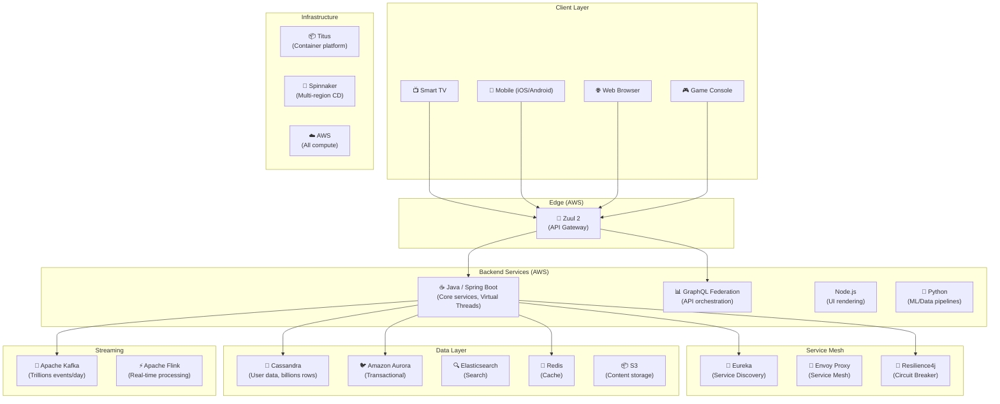
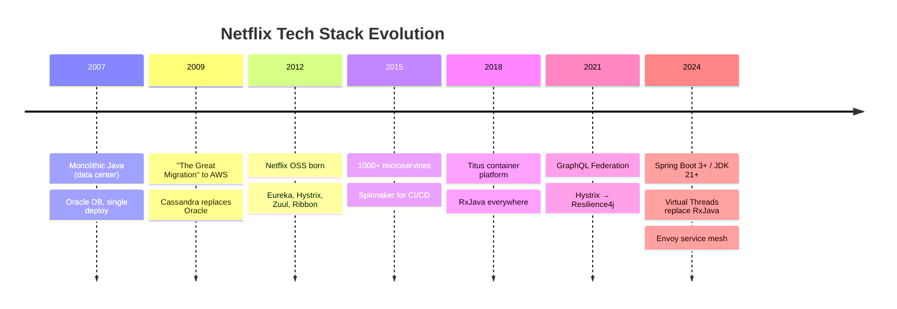
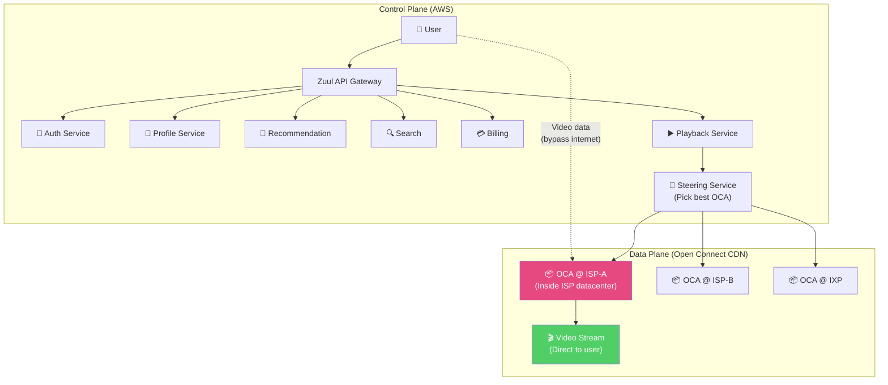
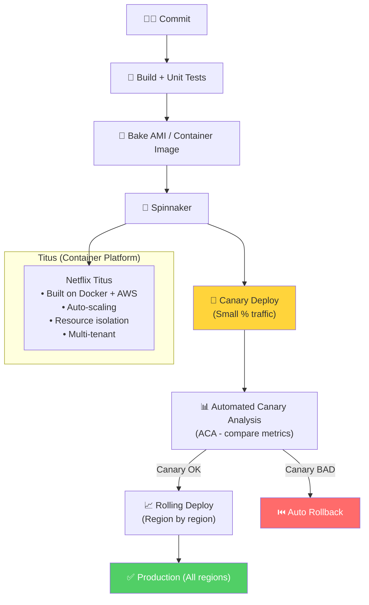

# Netflix - Deployment & Architecture

> Netflix phục vụ **260M+ subscribers** tại 190+ quốc gia — pioneer của microservices & cloud-native.

---

## 1. Quy Mô

| Metric | Giá trị |
|---|---|
| Paid subscribers | 260M+ |
| Countries | 190+ |
| Streaming hours/day | 500M+ |
| Bandwidth | ~15% internet traffic toàn cầu |
| Microservices | 1,000+ |
| API calls/day | Hàng tỷ |
| Titles in catalog | 15,000+ |

---

## 2. Technology Stack

### Tech Stack Evolution

---

## 3. System Architecture — Dual Plane

**Key insight:** Control plane (auth, recommendations, billing) ở AWS. Data plane (actual video bytes) ở Open Connect CDN **bên trong ISP** → bypasses public internet.

---

## 4. Deployment — Spinnaker + Titus

| Tool | Purpose |
|---|---|
| **Spinnaker** | Multi-region CD, canary analysis, automated rollback |
| **Titus** | Container orchestration (Netflix's internal K8s alternative) |
| **ACA** | Automated Canary Analysis — statistical comparison of metrics |
| **Bake** | Immutable server images (AMI / container) |

---

## 5. Netflix OSS — Open Source Contributions

| Tool | Purpose | Status |
|---|---|---|
| **Eureka** | Service Discovery | Active — still core |
| **Zuul 2** | API Gateway (async) | Active |
| **Hystrix** | Circuit Breaker | ❌ Retired → Resilience4j |
| **Ribbon** | Client-side Load Balancer | ❌ Retired → Spring Cloud LB |
| **Spinnaker** | Continuous Delivery | Active — CNCF project |
| **Chaos Monkey** | Random instance termination | Active |
| **Titus** | Container platform | Active |
| **Conductor** | Workflow orchestration | Active |
| **Zuul** | Edge routing | Active |

---

## Mapping → NestJS

| Netflix | NestJS Implementation |
|---|---|
| **Java + Spring Boot** | NestJS (TypeScript) |
| **Zuul (API Gateway)** | `@nestjs/microservices` + Kong/Nginx |
| **Eureka (Discovery)** | Consul / `nestjs-consul` |
| **Resilience4j** | `opossum` (circuit breaker) |
| **Spinnaker (CD)** | GitHub Actions + ArgoCD |
| **Titus (Containers)** | Kubernetes + Helm |
| **GraphQL** | `@nestjs/graphql` + Apollo Federation |
| **Kafka** | `@nestjs/microservices` Kafka transport |
| **Cassandra** | `cassandra-driver` / TypeORM |
