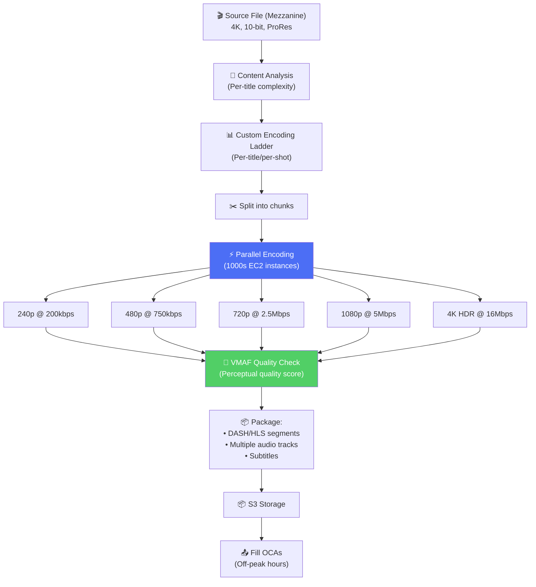
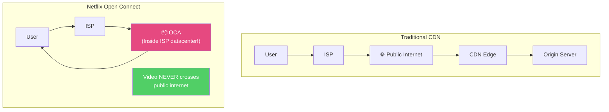
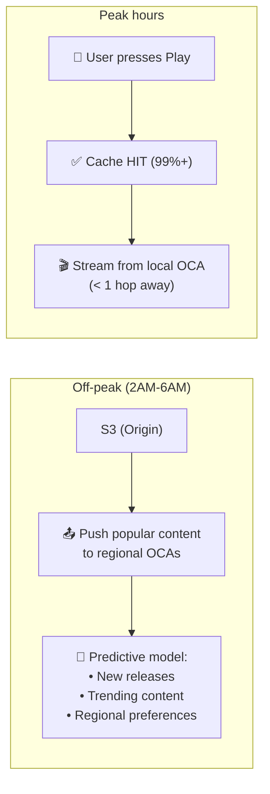
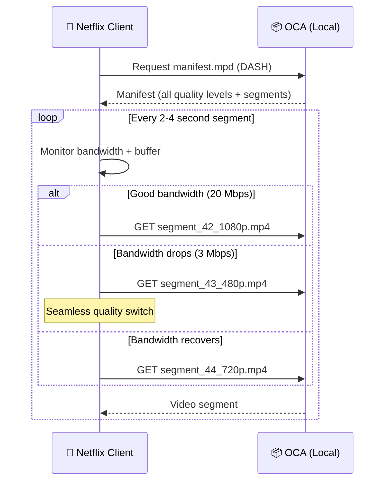
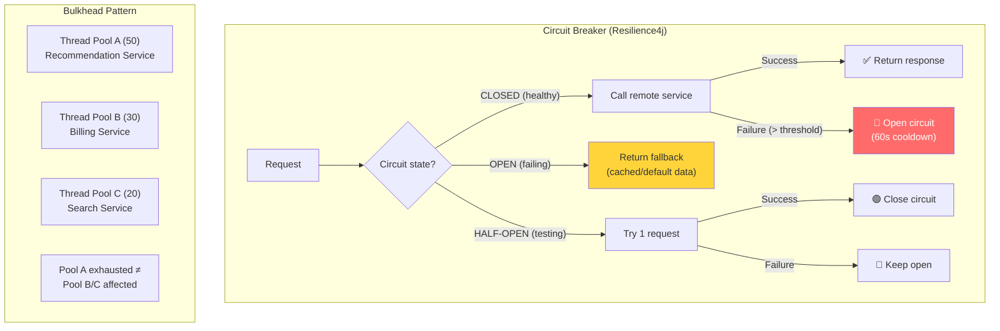
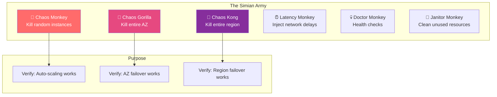

# Netflix - Xử Lý Đồng Thời Cao & Streaming

> 500M+ giờ streaming/ngày, ~15% bandwidth internet toàn cầu.

---

## 1. Video Encoding Pipeline

### Per-Title Encoding — Netflix Innovation

| Content Type | Approach | Example |
|---|---|---|
| Animation (simple) | Lower bitrate, same quality | 1080p @ 1.5 Mbps |
| Drama (medium) | Standard ladder | 1080p @ 4 Mbps |
| Action (complex) | Higher bitrate needed | 1080p @ 8 Mbps |

**VMAF** (Video Multi-Method Assessment Fusion): Netflix-created quality metric → thay PSNR/SSIM → correlate tốt hơn với human perception.

---

## 2. Open Connect — Netflix CDN

### OCA (Open Connect Appliance)

| Spec | Value |
|---|---|
| **Storage** | 100+ TB NVMe SSDs |
| **Throughput** | 90+ Gbps per appliance |
| **Cost to ISP** | Free (Netflix provides) |
| **Benefit to ISP** | Reduces transit costs 60-95% |
| **Locations** | 17,000+ servers, 6,000+ ISP/IXP locations |
| **Traffic** | >95% of Netflix traffic served from OCAs |

### Proactive Cache Filling

---

## 3. Adaptive Bitrate Streaming (ABR)

---

## 4. Resilience Patterns — "Design for Failure"

### Chaos Engineering — Simian Army

### Graceful Degradation Tiers

| Tier | Trigger | Action |
|---|---|---|
| **Normal** | All healthy | Full personalization |
| **Degraded L1** | Recommendation down | Show generic "popular" lists |
| **Degraded L2** | Search down | Disable search, show browse only |
| **Degraded L3** | Auth degraded | Allow cached sessions |
| **Emergency** | Major outage | Static fallback page |

---

## 5. So Sánh Concurrency: Netflix vs Others

| Aspect | Netflix | Instagram | Twitter | WhatsApp |
|---|---|---|---|---|
| **Challenge** | Massive bandwidth | Write amplification | Read amplification | Connection count |
| **Peak metric** | 500M+ hrs/day | 2B+ likes/day | 200B+ timeline views/day | 100B+ msgs/day |
| **Solution** | Own CDN (Open Connect) | Hybrid fan-out | Hybrid fan-out | BEAM actor model |
| **Resilience** | Chaos Engineering | Redundancy | Priority queues | Supervision trees |
| **Unique** | Per-title encoding | Sharded counters | Trending detection | Hot code swap |

---

## Mapping → NestJS

| Pattern | Netflix | NestJS Implementation |
|---|---|---|
| **Circuit Breaker** | Resilience4j | `opossum` npm package |
| **Bulkhead** | Thread pool isolation | Worker threads / `piscina` |
| **Fallback** | Cached/default response | `@Catch()` exception filter + Redis cache |
| **Chaos Engineering** | Chaos Monkey | `chaos-mesh` (K8s) / custom middleware |
| **ABR Streaming** | DASH/HLS | `hls.js` (client) + video segmentation pipeline |
| **CDN** | Open Connect | CloudFront / Cloudflare |
| **Canary Deploy** | Spinnaker ACA | ArgoCD progressive delivery |
