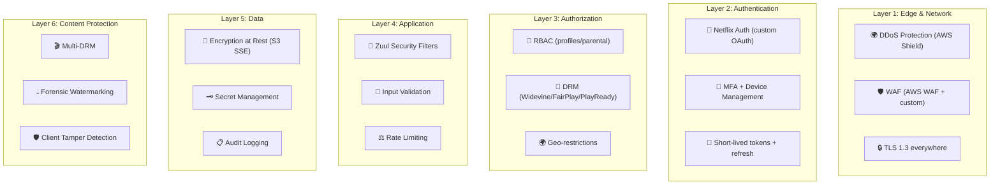
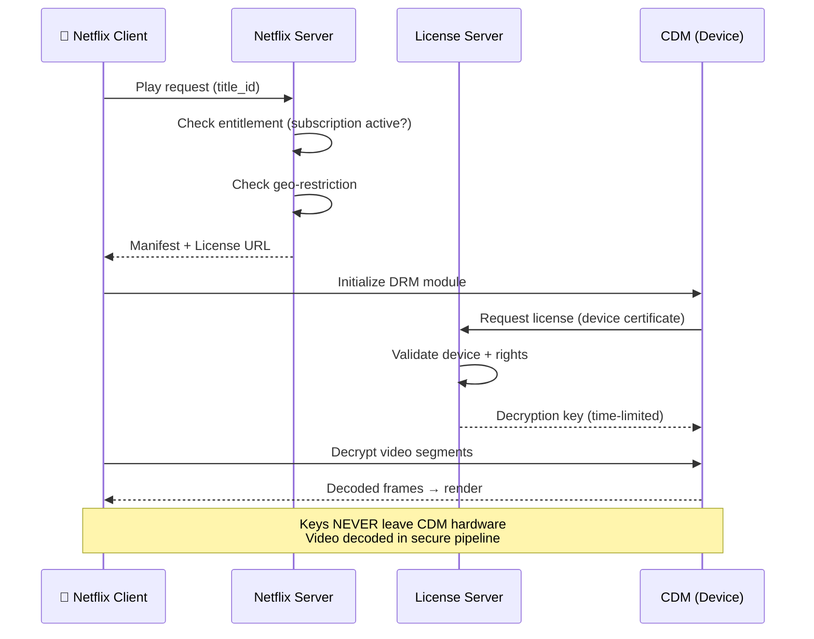
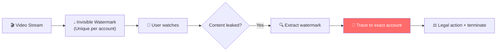
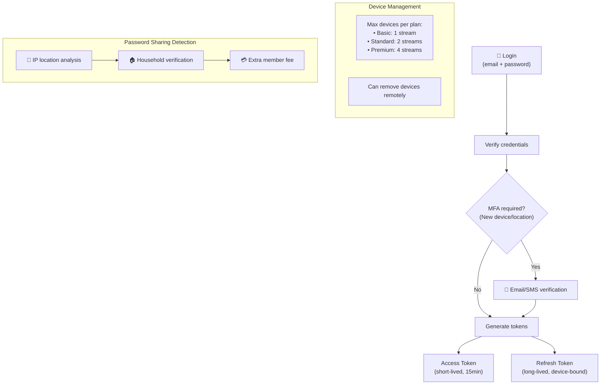
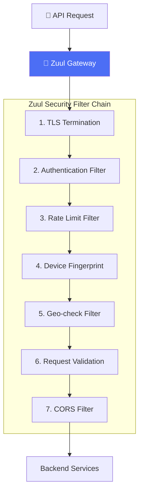
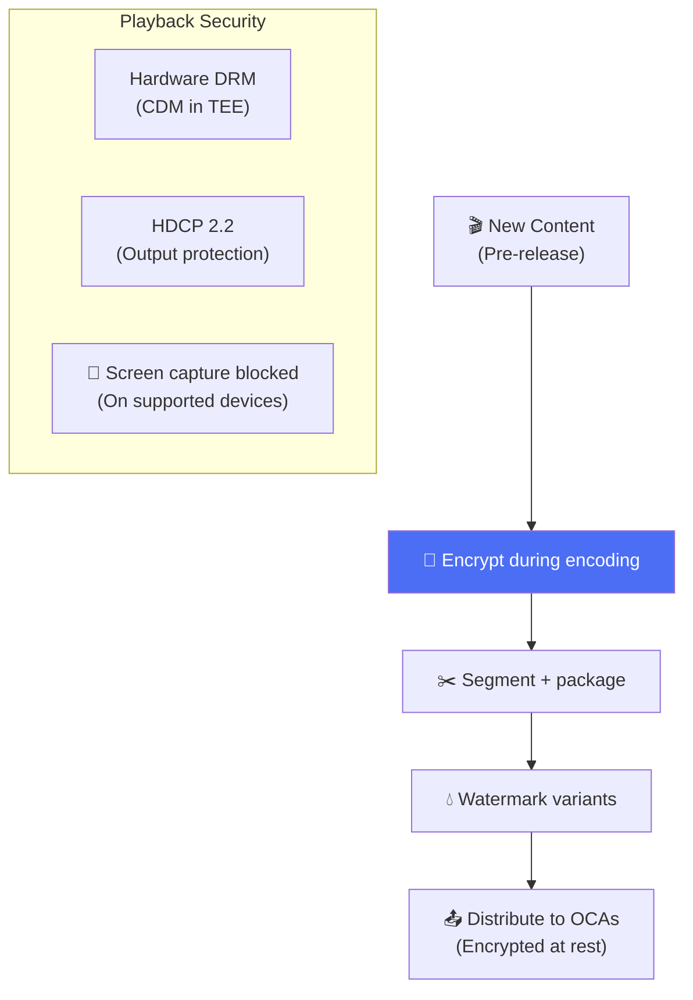

# Netflix - Security Analysis

> Netflix bảo vệ 260M+ accounts, DRM content trị giá hàng tỷ USD, và streaming data toàn cầu.

---

## Tổng Quan: Defense in Depth

---

## 1. DRM — Digital Rights Management

### Multi-DRM Strategy

| DRM | Platform | Security Level |
|---|---|---|
| **Widevine L1** | Android, Chrome, Smart TVs | Hardware-backed (4K allowed) |
| **Widevine L3** | Desktop Chrome | Software (720p max) |
| **FairPlay** | iOS, macOS, Apple TV | Hardware-backed |
| **PlayReady** | Windows, Xbox | Hardware-backed |

### Forensic Watermarking

---

## 2. Authentication & Session

---

## 3. API Security (Zuul Filters)

---

## 4. Data Protection

| Data Type | Protection | Storage |
|---|---|---|
| **Passwords** | bcrypt (cost factor 12) | Aurora (encrypted) |
| **Payment info** | PCI DSS, tokenized | 3rd-party processor |
| **Viewing history** | Encrypted at rest | Cassandra (encrypted) |
| **Content files** | AES-128/256 (DRM) | S3 SSE + OCA |
| **API secrets** | Netflix Vault (custom) | Auto-rotation |
| **Logs** | PII scrubbed | S3 + Elasticsearch |

---

## 5. Content Security Pipeline

---

## 6. So Sánh Security: Netflix vs Others

| Layer | Netflix | Instagram | Twitter | WhatsApp |
|---|---|---|---|---|
| **Focus** | Content protection (DRM) | Account security | API security | Message encryption |
| **Auth** | Custom OAuth + device mgmt | OAuth 2.0 | OAuth 2.0 PKCE | Phone + OTP |
| **Encryption** | DRM (Widevine/FairPlay) | TLS | TLS | Signal E2EE |
| **Unique** | Forensic watermarking | ML login risk | Community Notes | Forward secrecy |
| **Threat model** | Content piracy | Account takeover | Bot/scraping | Surveillance |
| **Cloud** | AWS (full) | Meta DCs | Google Cloud | Meta DCs |

---

## Mapping → NestJS

| Pattern | Netflix | NestJS Implementation |
|---|---|---|
| **Gateway security** | Zuul filter chain | NestJS Guards + Pipes + Interceptors |
| **Token auth** | Custom OAuth + refresh | `@nestjs/jwt` + refresh token rotation |
| **Device management** | Device registry + limits | Redis `SET` per user + limit middleware |
| **Rate limiting** | Per-device/per-user | `@nestjs/throttler` with custom storage |
| **DRM** | Widevine/FairPlay | HLS.js + Shaka Player (client-side) |
| **Watermarking** | Per-account invisible | Server-side video overlay pipeline |
| **Secret management** | Netflix Vault | AWS Secrets Manager / HashiCorp Vault |
