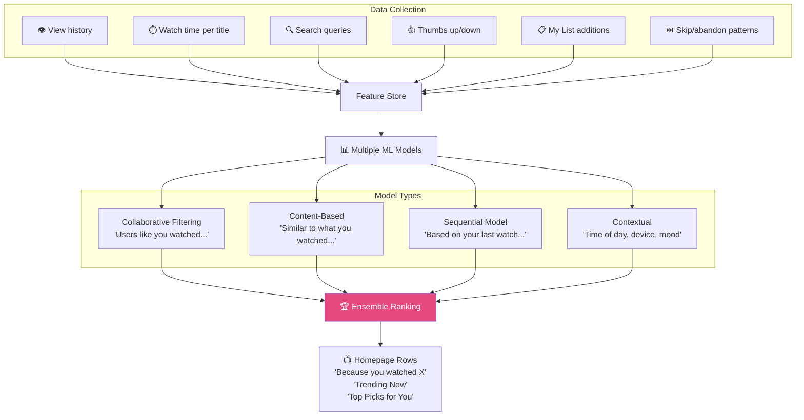
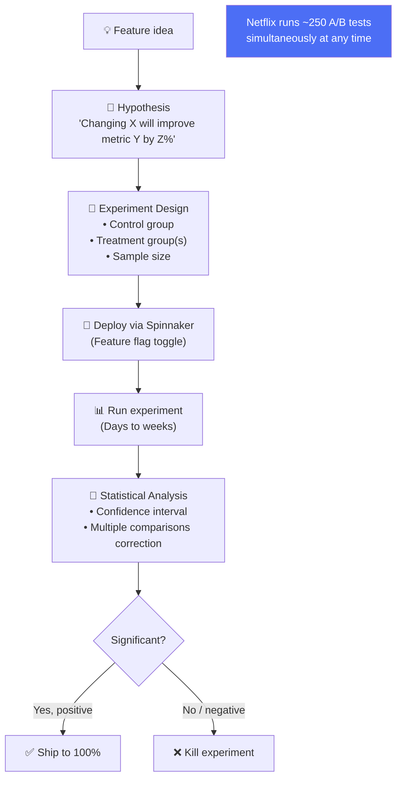
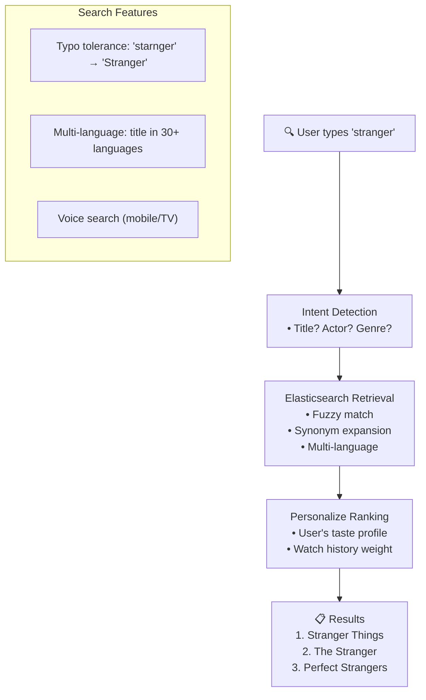
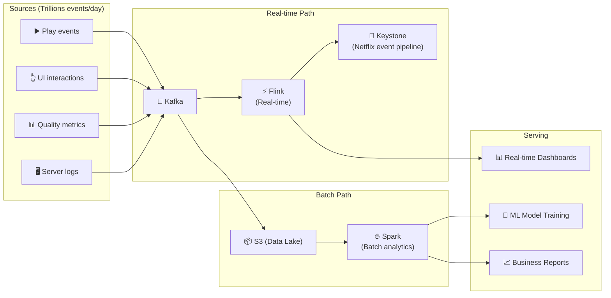

# Netflix - Subsystems Analysis

> Recommendation, Search, Data Pipeline, A/B Testing, Observability.

---

## 1. Recommendation Engine

### Personalized Everything

| Element | Personalization |
|---|---|
| **Homepage rows** | Row order, row content, row title |
| **Artwork** | Different poster per user (A/B tested!) |
| **Search results** | Ranked by personal relevance |
| **Autoplay preview** | Selected based on engagement prediction |
| **Continue watching** | Order based on likely resume |

---

## 2. A/B Testing — Netflix Culture

**Key insight:** Thậm chí **poster artwork** của mỗi phim cũng được A/B test — mỗi user có thể thấy poster khác nhau cho cùng 1 phim!

---

## 3. Search Architecture

---

## 4. Data Pipeline

---

## 5. Observability — Netflix Atlas

| Component | Tool | Purpose |
|---|---|---|
| **Metrics** | Atlas (Netflix internal) | Time-series, 2B+ data points/min |
| **Logging** | Edgar (Netflix internal) | Distributed request tracing |
| **Tracing** | Mantis (Netflix internal) | Real-time event processing |
| **Alerting** | PagerDuty + internal | SLO-based alerting |
| **Dashboards** | Lumen (Netflix internal) | Service health visualization |

---

## 6. So Sánh Tổng Hợp: 4 Systems

| Dimension | Netflix | Instagram | Twitter | WhatsApp |
|---|---|---|---|---|
| **Primary** | Video streaming | Photo/Video social | Microblogging | Messaging |
| **Language** | Java (Spring Boot) | Python (Django) | Scala/Java | Erlang/OTP |
| **Cloud** | AWS | Meta DCs | Google Cloud | Meta DCs |
| **CDN** | Open Connect (own) | Meta CDN | Generic CDN | N/A |
| **Search** | Elasticsearch | Unicorn | Earlybird | N/A |
| **ML** | Recommendation for everything | Explore/Feed ranking | Trending + ranking | Spam detection |
| **Unique** | Chaos Engineering | TAO social graph | Snowflake IDs | E2EE at scale |
| **OSS Contributions** | Eureka, Zuul, Spinnaker | Less public | Zipkin, Finagle | Less public |
| **Resilience** | Circuit breaker + Chaos | Redundancy | Priority queues | Supervision trees |
| **A/B Testing** | 250+ simultaneous tests | Extensive | Moderate | Minimal |

---

## Netflix Unique Innovations

| Innovation | Impact | Industry Adoption |
|---|---|---|
| **Netflix OSS** | Pioneered microservices tooling | Spring Cloud ecosystem |
| **Chaos Engineering** | "Test in production" culture | Adopted by Amazon, Google, Microsoft |
| **Open Connect** | CDN inside ISPs (free!) | Unique — no other company does this |
| **Per-title Encoding** | 20% bandwidth savings | Adopted by YouTube, Disney+ |
| **VMAF** | Perceptual quality metric | Open-source, industry standard |
| **Spinnaker** | Multi-region CD | CNCF project, used by Google, SAP |
| **Titus** | Container platform | Internal, but influenced K8s ecosystem |

---

## Mapping → NestJS

| Subsystem | Netflix | NestJS Implementation |
|---|---|---|
| **Recommendation** | Custom ML ensemble | TensorFlow.js / Python ML service via gRPC |
| **A/B Testing** | Internal platform | LaunchDarkly / Unleash + `@nestjs/config` |
| **Search** | Elasticsearch | `@nestjs/elasticsearch` |
| **Data Pipeline** | Kafka → Flink → S3 | `@nestjs/microservices` Kafka → ClickHouse |
| **Metrics** | Atlas | Prometheus + Grafana + OpenTelemetry |
| **Tracing** | Edgar | Jaeger / Zipkin + `nestjs-otel` |
| **Feature Flags** | Internal | Unleash / LaunchDarkly SDK |
