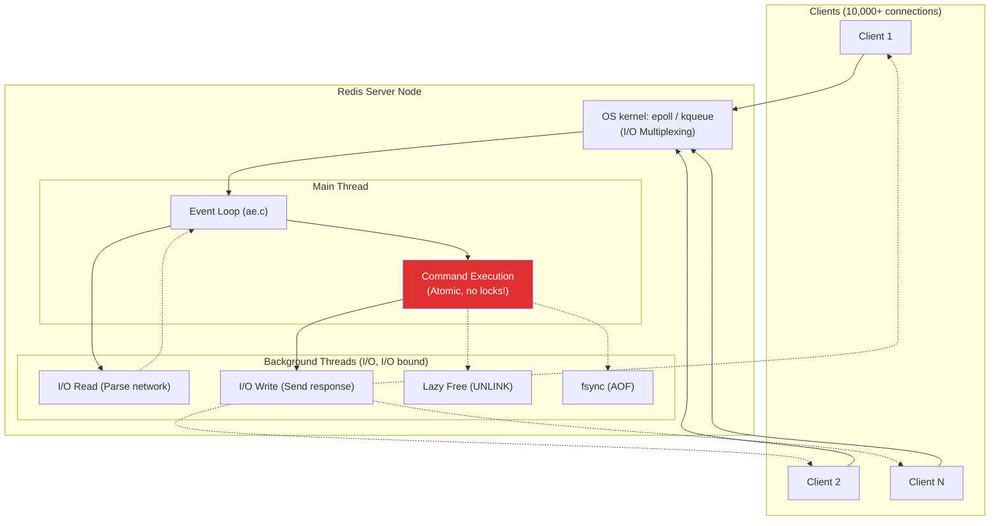
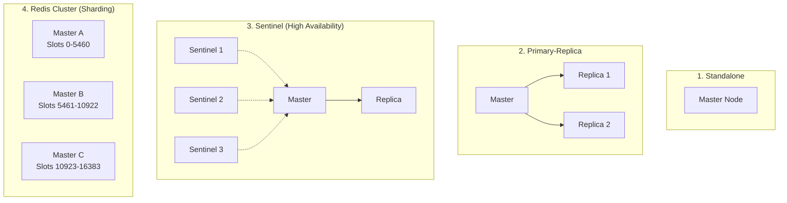

# Redis - Deployment & Architecture

> Bộ nhớ đệm (Cache) và In-Memory Data Store phổ biến nhất thế giới.

---

## 1. Single-Threaded Architecture

### Tại sao lại là Single-Threaded?
1. **CPU không phải là cổ chai:** Redis chạy trên RAM → cổ chai thường là Network hoặc Memory B/W.
2. **Không tốn chi phí Context Switching:** Chuyển đổi ngữ cảnh giữa các thread rất đắt.
3. **Không cần Locks/Mutex:** Lập trình nhàn hơn, không bị race condition, mọi lệnh đều tự động là Atomic.

*(Lưu ý: Từ Redis 6, I/O Network được đẩy sang Multi-threads, nhưng phần Execute Command vẫn là Single-thread).*

---

## 2. Memory Allocation (`jemalloc`)

Redis mặc định dùng `jemalloc` (thay vì `glibc`) trên Linux.
* **Mục đích:** Giảm thiểu "Memory Fragmentation" (phân mảnh bộ nhớ).
* Khi dữ liệu liên tục bị xóa/sửa, RAM sẽ bị rỗ. `jemalloc` gom lại cực kỳ hiệu quả, giúp tiết kiệm RAM đáng kể cho in-memory DB.

---

## 3. Data Structures & Internals

| Data Type | External Use | Internal Implementation (Encoding) | Tại sao? |
|---|---|---|---|
| **String** | Cache, Counter | **SDS (Simple Dynamic String)** | Nhớ độ dài O(1), Binary-safe, tránh buffer overflow. |
| **Hash** | User profile | Small: **listpack** Large: **Hash Table** | Cỡ nhỏ dùng listpack ép thành 1 khối memory cho gọn. Cỡ to lấy O(1) để lookup. |
| **List** | Message queue | **quicklist** | Kết hợp giữa Doubly-Linked-List và listpack (chống phân mảnh). |
| **Set** | Unique tags | Small: **intset** Large: **Hash Table** | Mảng số nguyên cực kỳ tiết kiệm bộ nhớ. |
| **Sorted Set** | Leaderboard | **Skip List + Hash Table** | Skip List tìm kiếm O(log N) hiệu quả hơn Balanced Tree, Hash table lấy score O(1). |

---

## 4. Kiến Trúc Triển Khai (Deployment Modes)

---

## Mapping → NestJS

| Đặc điểm Redis | NestJS Implementation |
|---|---|
| **In-memory cache** | `@nestjs/cache-manager` + `cache-manager-redis-store` |
| **Single-threaded atomic** | Dùng LUA Script hoặc Redis Transaction (MULTI/EXEC) để khóa resource |
| **IO Multiplexing** | Node.js dùng libuv (epoll) → Kiến trúc hoàn toàn tương đồng Redis! |
| **Distributed Lock** | `redlock` npm package (để NestJS scaling ko đụng nhau) |
