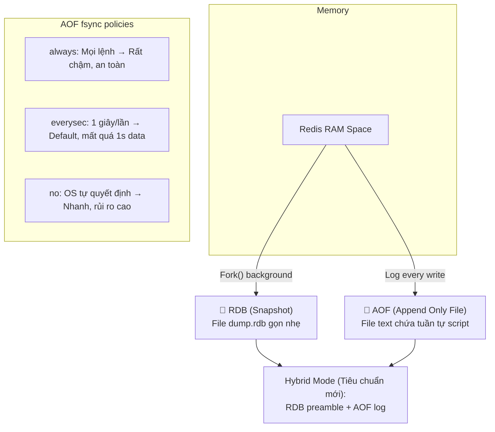
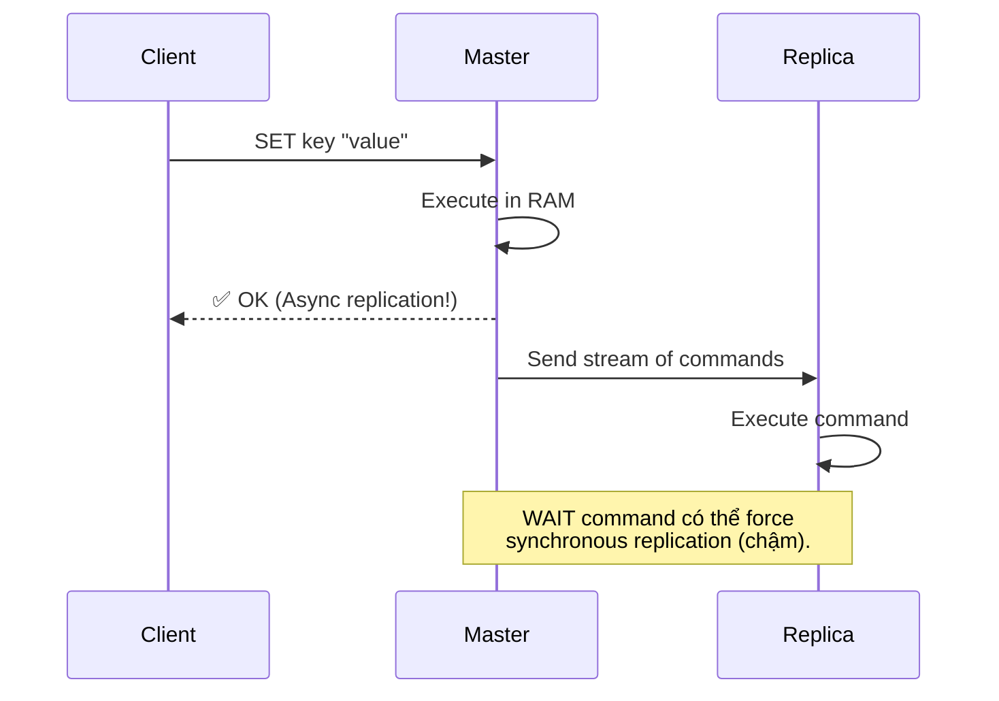
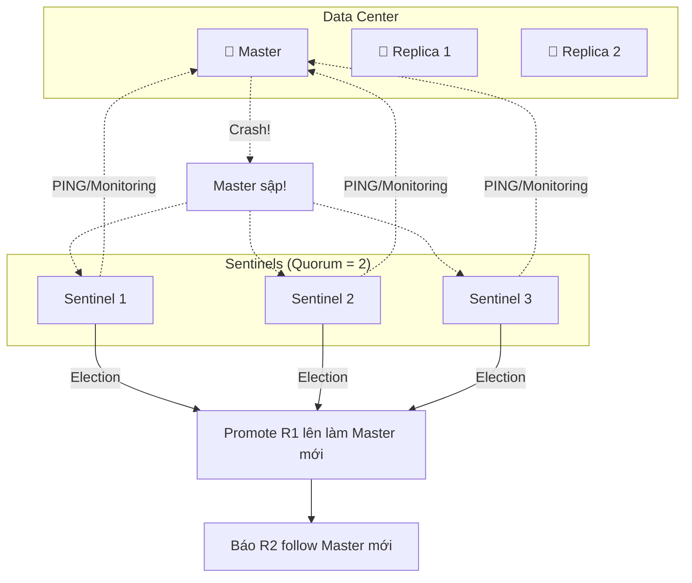
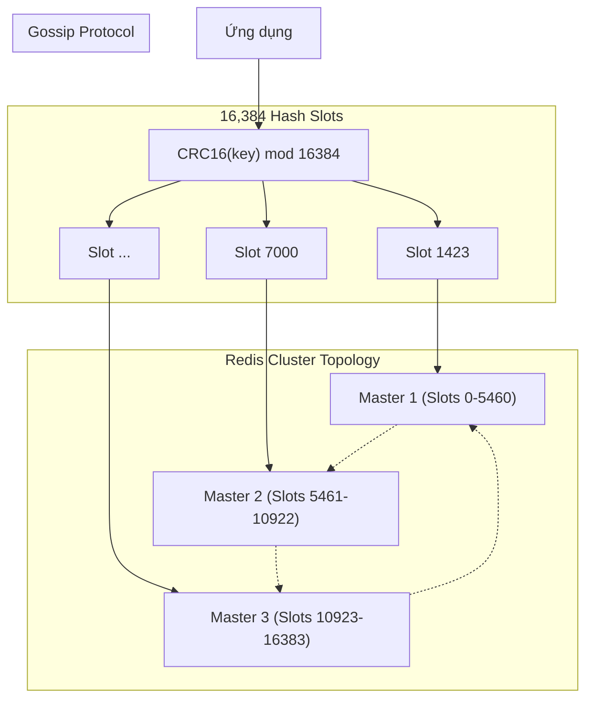

# Redis - Xử Lý Đồng Thời Cao & Scaling

> Scaling read/write, Persistent data (RDB/AOF), Redis Cluster.

---

## 1. Persistence: RDB vs AOF

Làm sao in-memory DB lại không mất dữ liệu khi sập nguồn?

---

## 2. Replication (Master-Replica)

---

## 3. High Availability (Redis Sentinel) & Split-Brain

**Split-Brain Problem:** 
Chỉ nên chạy số lẻ Sentinel (3, 5). Nếu chạy 2 Sentinel, khi đứt cáp mạng ở giữa, 2 bên đều có 1 Sentinel + 1 Redis node → Không bên nào đạt Quorum (2) → Failover không diễn ra, hoặc hệ thống nghĩ có 2 Master (Split-brain). 

---

## 4. Redis Cluster (Horizontal Scaling)

Khi dữ liệu vượt quá RAM của 1 server (VD: 100GB+), phải sharding.

### Gossip Protocol
Thay vì cần ZooKeeper (như Kafka cũ) để quản lý cluster, các node Redis Cluster tự PING-PONG nói chuyện với nhau (Gossip protocol) qua Cluster Bus port (VD: node port 6379 thì bus port là 16379) để chia sẻ:
- Node nào đang sống/chết.
- Slots nào thuộc node nào.

### Hash Tags
Nếu cần chạy lệnh Multi-key (như `MGET` hoặc Transaction) mà các keys khác Node sẽ báo lỗi.
Giải quyết: Dùng `{tag}` trong key.
Ví dụ: `user:{123}:profile` và `user:{123}:orders` → Redis chỉ hash số `123` → Chắc chắn 2 keys rơi vào cùng 1 Slot và cùng 1 Node.

---

## Mapping → NestJS

| Pattern | NestJS Implementation |
|---|---|
| **Cluster mode** | Bật `ioredis` dùng `new Redis.Cluster([{ host, port }...])` |
| **Hash Tags** | Dịch vụ khi tạo key luôn kẹp ID: `` `${prefix}:{${userId}}` `` |
| **Replication** | Lệnh write về Master, read đẩy sang Replica (ioredis scale reads) |
| **Sentinel** | `ioredis` config `sentinels: [{ host, port }]`, `name: 'mymaster'` |
