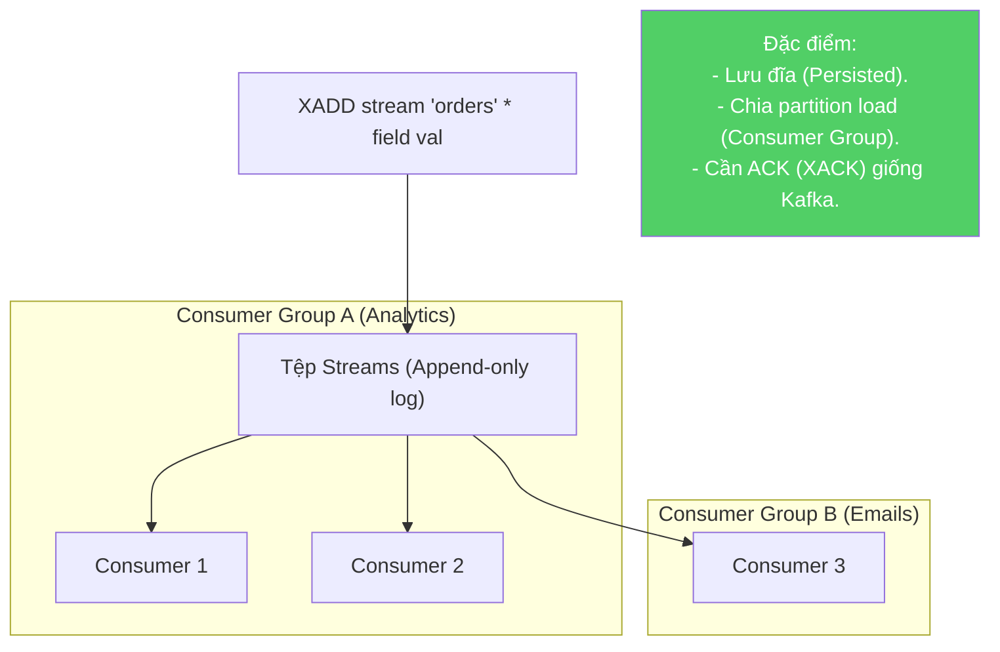
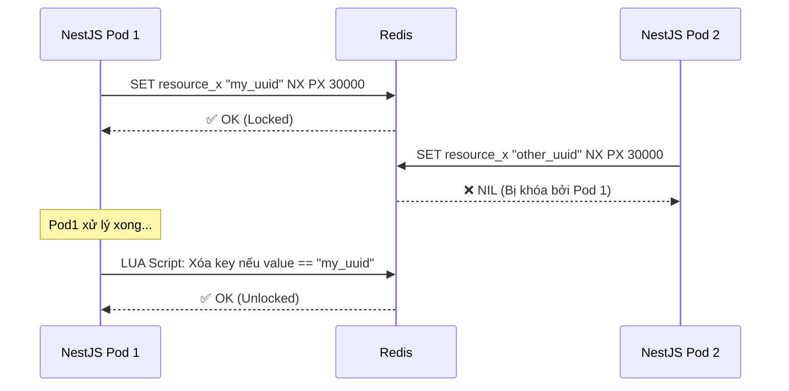
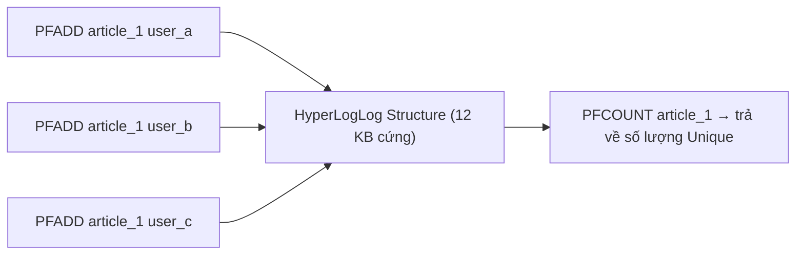
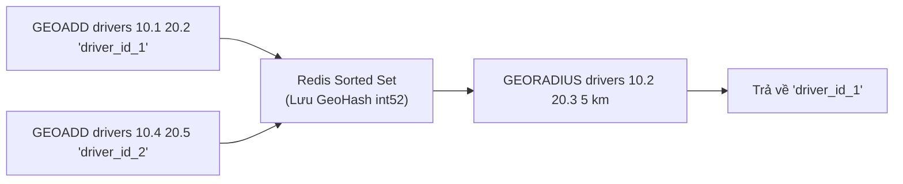

# Redis - Subsystems & Use Cases

> Các patterns cao cấp: Pub/Sub, Streams, Distributed Lock, Geospatial.

---

## 1. Pub/Sub (Phát Sóng Tức Thời)

```mermaid
flowchart LR
    P["Producer (Publisher)"] -->|PUBLISH chat room_1 "Hello"| BUS{"Redis Pub/Sub Bus"}
    
    BUS -->|Push| S1["Subscriber A"]
    BUS -->|Push| S2["Subscriber B"]
    
    NOTE21["Đặc điểm:<br/>- Không lưu đĩa (Ephemeral).<br/>- Gửi đi và quên ngay (Fire and forget).<br/>- Subscriber sập ngắt kết nối = Mất Message."]

    style NOTE21 fill:#ff6b6b,color:#fff
```

*Use case:* Chat apps realtime (Socket.io local adapter), bắn Invalidation Cache event giữa các microservices.

---

## 2. Redis Streams (Bản Sao Kafka Của Redis)



*Use case:* Queue xử lý order, Task log, Timeline feeds (Gọn nhẹ hơn Kafka, dễ setup).

---

## 3. Distributed Lock (Khóa Phân Tán)

Trong Microservices (N instances chạy song song), cần khóa tài nguyên chung (VD: Trừ tiền).



**Tại sao LUA Script?** Bắt buộc phải check giá trị + delete bằng 1 cục gộp chung (Atomic), nếu check xong rồi Redis CPU bị pre-empt, UUID dổi, lúc delete xóa nhầm khóa thằng khác.

---

## 4. HyperLogLog (Count Unique)

Đếm số lượt view (Unique Visitors) của 1 bài báo? Dùng Set chứa UserID tốn vài chục MB RAM.
**HyperLogLog (PFADD, PFCOUNT):** Đếm gần đúng (sai số ~0.81%), hàng triệu user chỉ tốn ĐÚNG 12KB RAM.



---

## 5. Geo-Spatial (Tọa Độ Địa Lý)



*Use case:* Uber Rider tìm tài xế bán kính 5km, Tinder tìm quanh đây (Tốc độ query mili-giây, nhanh hơn PostGIS).

---

## So Sánh: Redis vs. Các Queue/Cache Khác

| Tính năng | Redis Pub/Sub | Redis Streams | RabbitMQ | Kafka | Memcached |
|---|---|---|---|---|---|
| **Lưu trữ** | RAM, bay màu | RAM + RDB/AOF | RAM + Disk | Disk (Log) | RAM, bay màu |
| **Consumer Group**| Không | Có | Round Robin | Có (Partitions)| N/A |
| **Replay Message**| Không | Có | Khó | Rất dễ | N/A |
| **Data Types** | Rất phong phú | Streams | Message text | Byte Array | String/Object|

---

## Mapping → NestJS

| Subsystem | Redis feature | NestJS / NodeJS Implementation |
|---|---|---|
| **Distributed Lock**| `SET NX PX` + Lua Script | `redlock` (chống Redlock race condition) |
| **Queue/Workers** | Hashes + ZSET | Đã có hệ sinh thái `BullMQ` (Dùng Redis ngầm) cực khủng trong Nest. |
| **Streams** | `XADD`, `XREADGROUP` | `ioredis` hỗ trợ trực tiếp. |
| **Pub/Sub** | `PUBLISH`, `SUBSCRIBE` | `@nestjs/microservices` Redis Transport, Socket.io Adapter. |
| **Rate Limiter** | Counter + Expire (Sliding window) | `@nestjs/throttler` (ThrottlerStorageRedis). |
| **Geo Search** | `GEOADD`, `GEORADIUS` | Dùng cache vị trí tài xế tạm thời trước khi push vào DB. |
