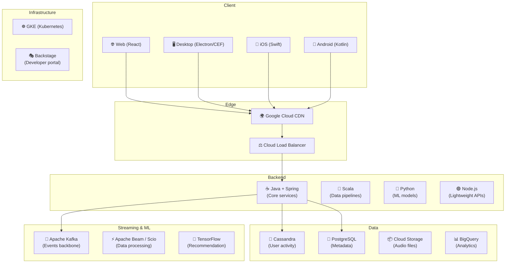
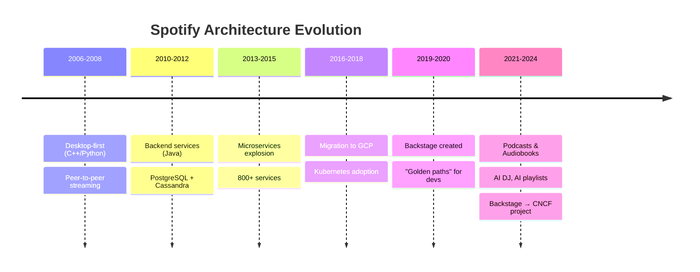
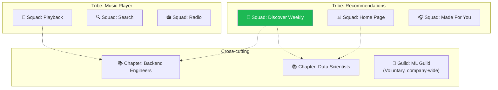
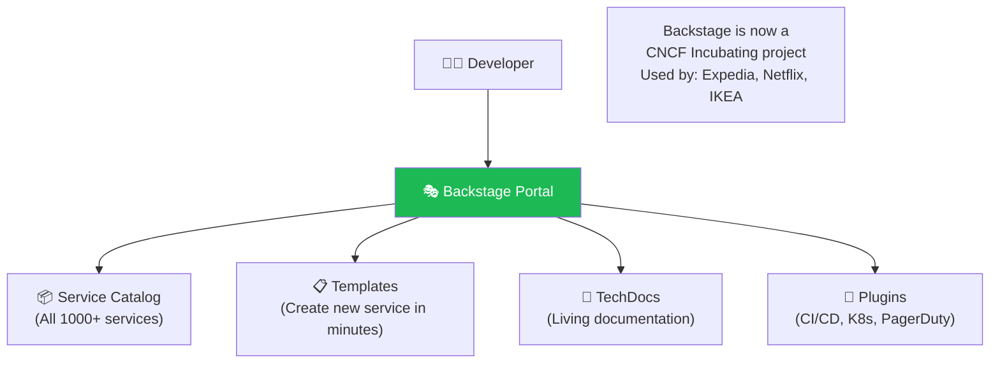
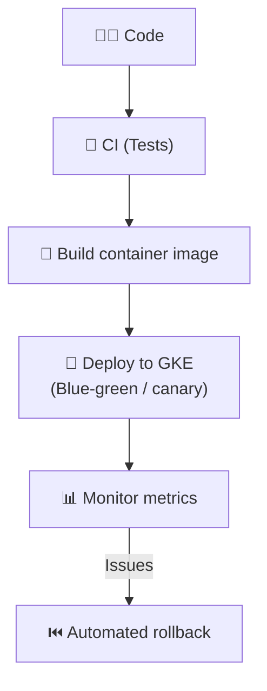

# Spotify - Deployment & Architecture

> Spotify phục vụ **600M+ users**, **100M+ tracks**, **5M+ podcasts** tại 180+ markets.

---

## 1. Quy Mô

| Metric | Giá trị |
|---|---|
| Monthly Active Users | 600M+ |
| Premium subscribers | 230M+ |
| Tracks | 100M+ |
| Podcasts | 5M+ |
| Markets | 180+ |
| Microservices | 1,000+ |
| Playlists created | 4B+ |

---

## 2. Technology Stack

---

## 3. Architecture Evolution

---

## 4. Squad Model — Organization Design

| Concept | Description |
|---|---|
| **Squad** | 6-12 people, autonomous, owns feature end-to-end |
| **Tribe** | Group of related squads (40-150 people) |
| **Chapter** | Same-role people across squads (mentorship) |
| **Guild** | Voluntary community of interest (knowledge sharing) |

---

## 5. Backstage — Developer Portal

---

## 6. Deployment

---

## Mapping → NestJS

| Spotify | NestJS Implementation |
|---|---|
| **Java + Spring** | NestJS (TypeScript) |
| **Scala/Beam** | BullMQ workers / Kafka consumers |
| **Cassandra** | `cassandra-driver` / ScyllaDB |
| **Backstage** | Backstage (directly reusable!) |
| **GKE** | Any Kubernetes cluster |
| **Squad model** | NestJS module per squad/domain |
| **Kafka** | `@nestjs/microservices` Kafka transport |
