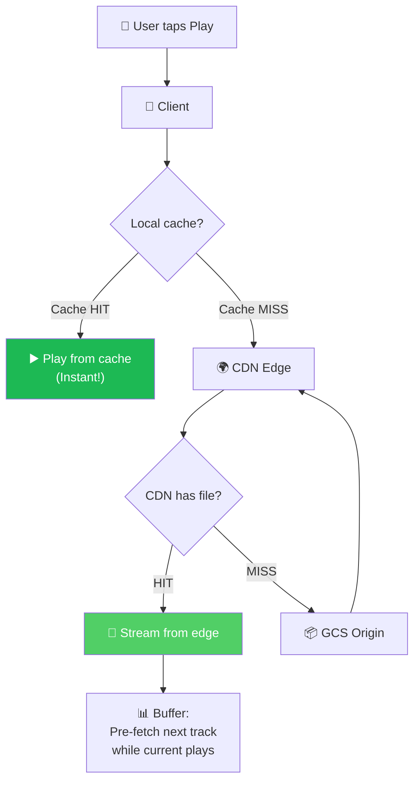
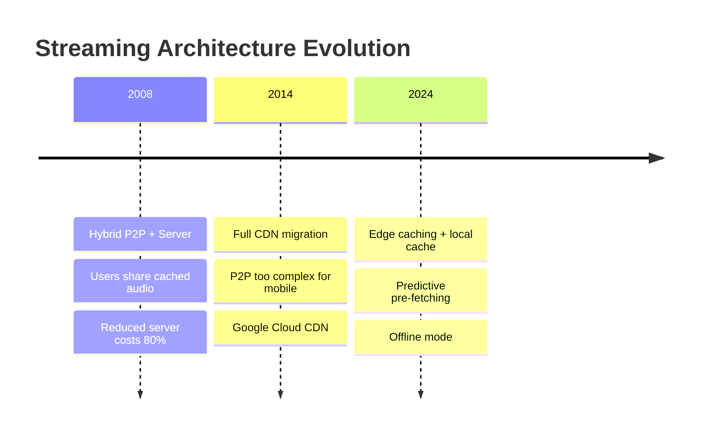
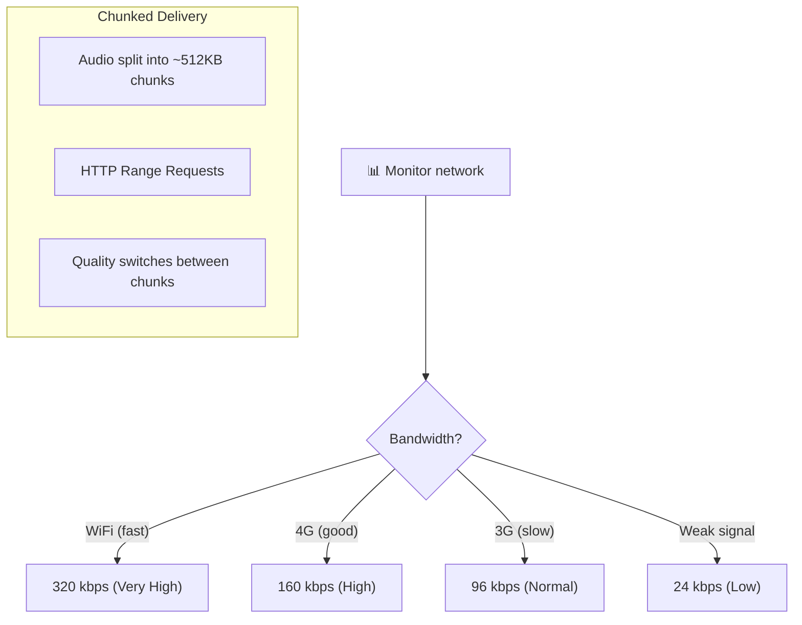
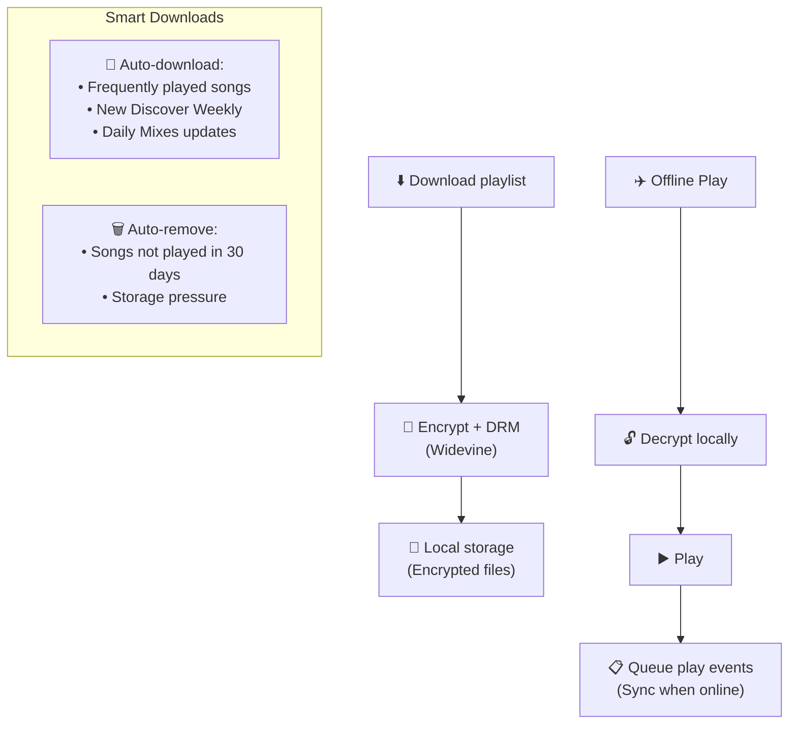
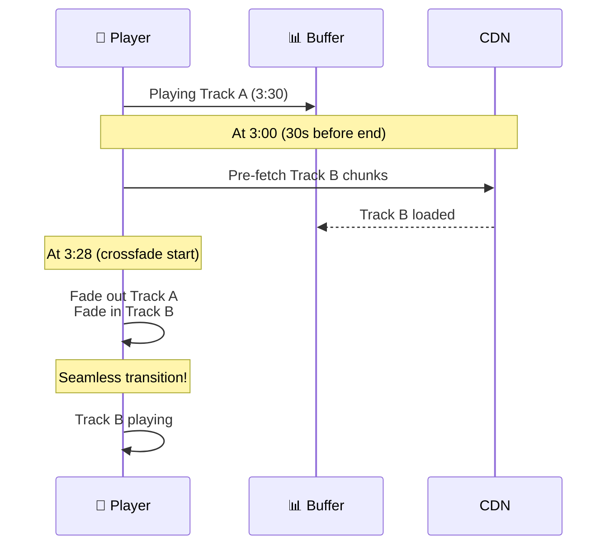
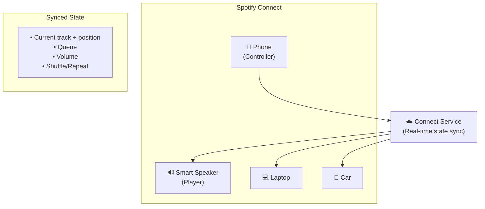

# Spotify - Xử Lý Đồng Thời Cao & Audio Streaming

> 600M+ users streaming đồng thời, 100M+ tracks, instant playback < 200ms.

---

## 1. Audio Streaming Architecture

### Audio Codec & Quality

| Tier | Codec | Bitrate | Quality |
|---|---|---|---|
| **Low** | Ogg Vorbis | 24 kbps | Data saver |
| **Normal** | Ogg Vorbis | 96 kbps | Acceptable |
| **High** | Ogg Vorbis | 160 kbps | Good (Free default) |
| **Very High** | Ogg Vorbis | 320 kbps | Premium only |
| **HiFi** | FLAC | 1411 kbps | Lossless (Premium) |

### P2P → CDN Evolution

---

## 2. Adaptive Bitrate

---

## 3. Offline Mode

---

## 4. Gapless Playback & Crossfade

---

## 5. Playback State Sync (Connect)

---

## 6. So Sánh Streaming: Spotify vs Others

| Aspect | Spotify | YouTube Music | Netflix | WhatsApp |
|---|---|---|---|---|
| **Media** | Audio | Audio + Video | Video | Audio messages |
| **Codec** | Ogg Vorbis / FLAC | AAC / Opus | AV1 / VP9 | Opus |
| **CDN** | Google CDN | Google CDN | Open Connect | N/A |
| **Offline** | Encrypted download | Encrypted download | Encrypted download | Auto-download |
| **Latency** | < 200ms start | < 1s start | < 1s start | Real-time |
| **Unique** | Gapless + crossfade | Music videos | Per-title encode | E2EE audio |

---

## Mapping → NestJS

| Pattern | Spotify | NestJS Implementation |
|---|---|---|
| **Audio streaming** | Chunked + CDN | S3 + CloudFront + Range requests |
| **Offline mode** | Encrypted local | `crypto` + client-side storage |
| **Adaptive bitrate** | Quality switching | Multiple encodings + client negotiation |
| **Pre-fetch** | Next-track preload | WebSocket hint from server |
| **Connect (sync)** | Real-time state | `@nestjs/websockets` + Redis Pub/Sub |
| **Play events** | Kafka + batch process | Kafka → queue → batch to ClickHouse |
