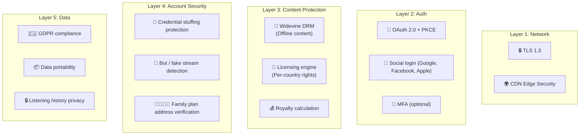
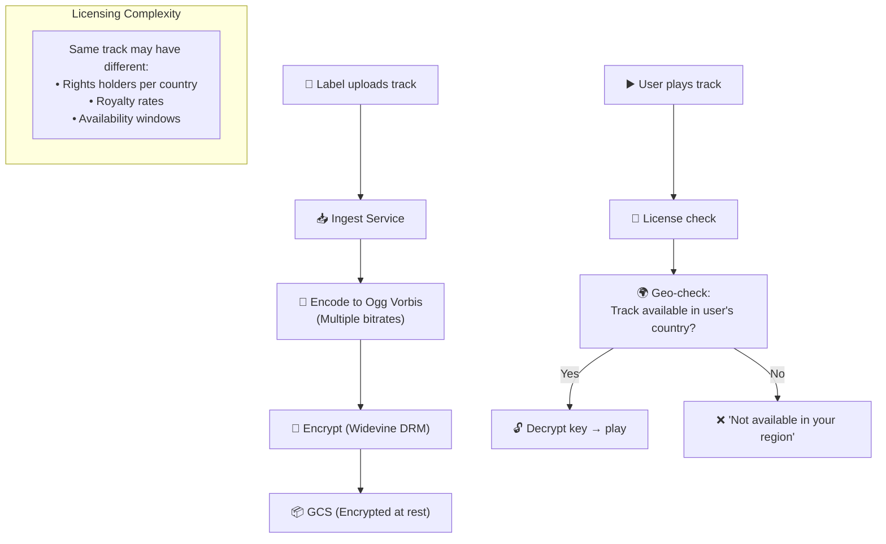
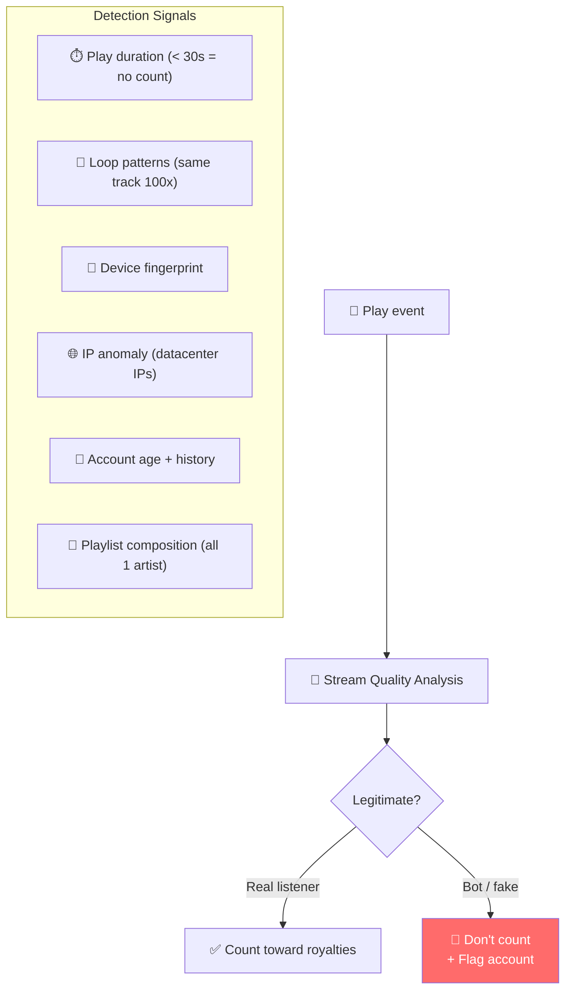

# Spotify - Security Analysis

> Spotify bảo vệ 600M+ accounts, DRM cho 100M+ tracks, licensing agreements toàn cầu.

---

## Tổng Quan

---

## 1. Content DRM & Licensing

---

## 2. Fake Stream Detection

**Why critical:** Fake streams steal royalties from real artists. Spotify removes fake streams retroactively → protects artist earnings.

---

## 3. Account Security

| Threat | Protection |
|---|---|
| **Credential stuffing** | Rate limiting + CAPTCHA + leaked password check |
| **Account sharing** | Device limit (6 devices offline, 1 stream per account) |
| **Family plan abuse** | Address verification (GPS + billing address) |
| **Premium fraud** | Payment verification + trial restrictions |
| **Session hijacking** | Short-lived tokens + refresh rotation |

---

## 4. So Sánh Security: Spotify vs Others

| Layer | Spotify | Netflix | YouTube | Stripe |
|---|---|---|---|---|
| **Focus** | Stream integrity + licensing | Content piracy | Copyright | Payment fraud |
| **DRM** | Widevine (offline) | Widevine + FairPlay | N/A (free) | N/A |
| **Content protection** | Fake stream detection | Forensic watermark | Content ID | Radar ML |
| **Unique** | Per-country licensing | Multi-DRM | $9B rights payments | Cross-merchant fraud |
| **Revenue model** | Ads + Premium | Subscription | Ads + Premium | Transaction fee |

---

## Mapping → NestJS

| Pattern | Spotify | NestJS Implementation |
|---|---|---|
| **Fake stream detection** | ML + rules | Kafka consumer + anomaly rules |
| **Licensing/geo-check** | Per-country rights DB | PostgreSQL + `geoip-lite` |
| **DRM** | Widevine | CDN-level DRM (CloudFront) |
| **Account limits** | Device tracking | Redis SET per user (max 6) |
| **GDPR** | Data export/delete | Bulk export endpoint + soft delete |
