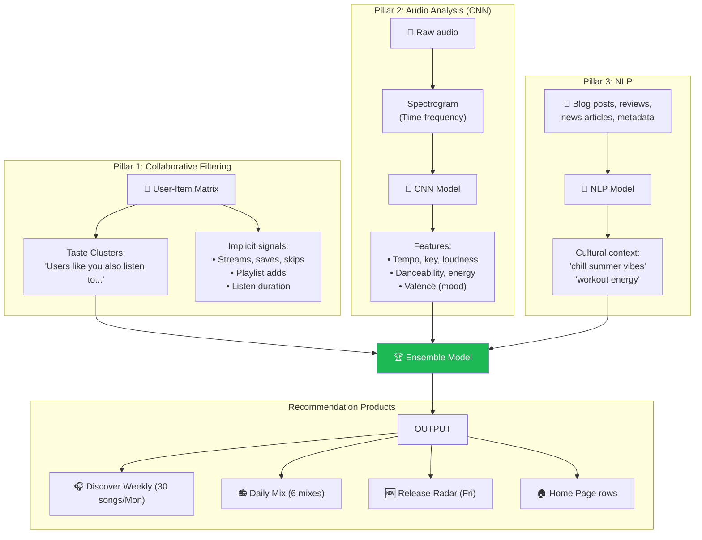
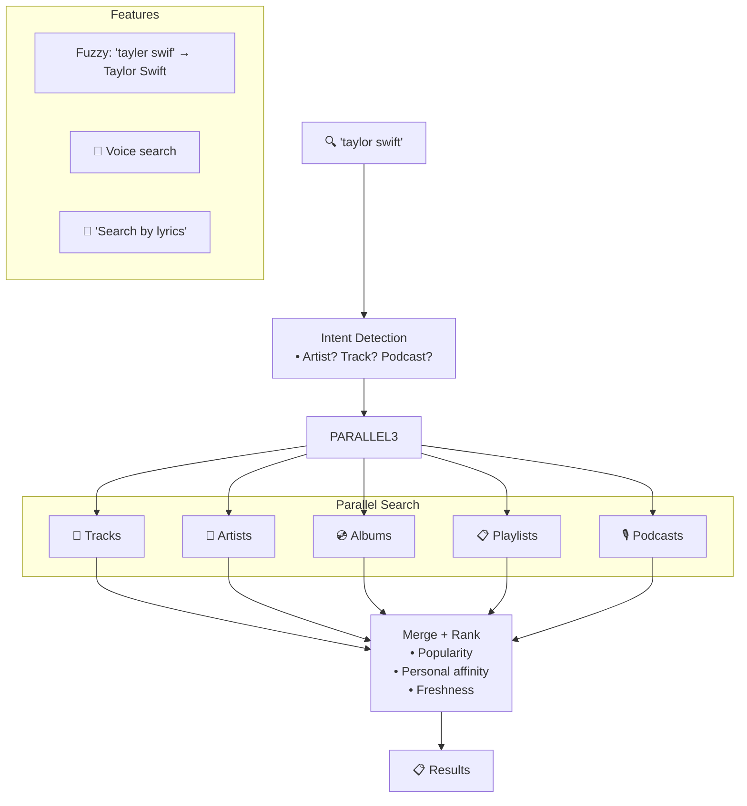
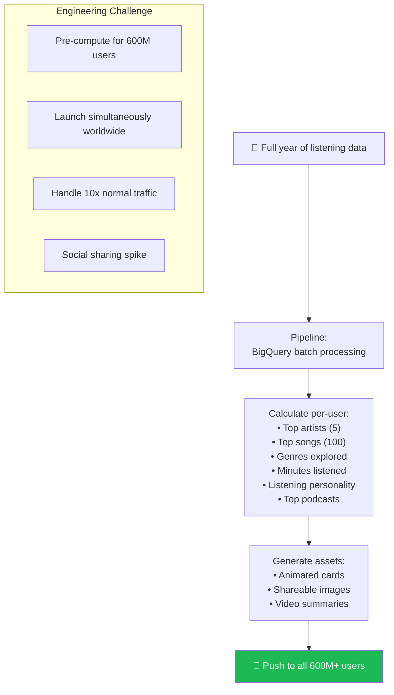
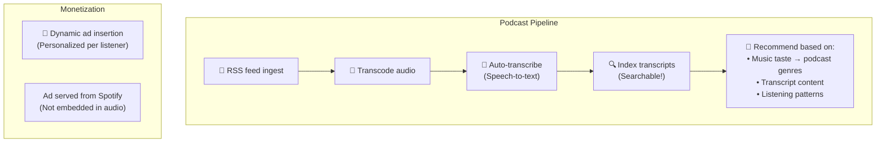
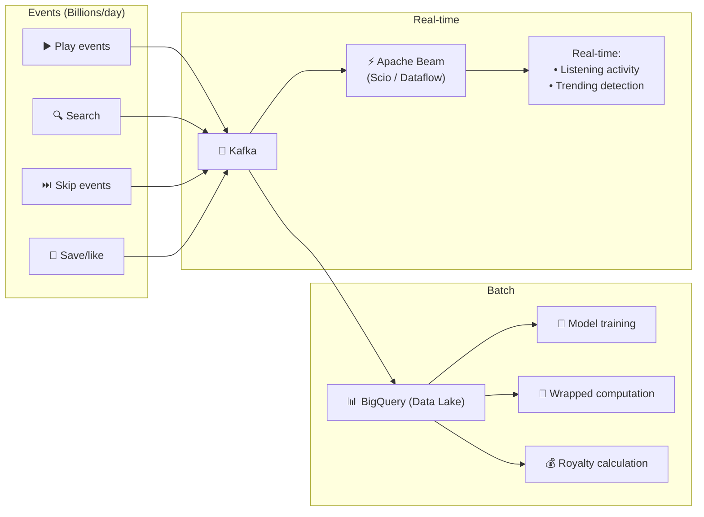

# Spotify - Subsystems Analysis

> Recommendation (Discover Weekly), Search, Podcasts, Wrapped, Data Pipeline.

---

## 1. Recommendation Engine — 3 Pillars

### Cold Start Problem

| Scenario | Solution |
|---|---|
| **New user** | Ask genres on signup → bootstrap with popular |
| **New track (no listens)** | Audio CNN → similar sounding tracks |
| **New artist** | NLP (blog mentions) + audio similarity |

---

## 2. Search Architecture

---

## 3. Spotify Wrapped — Year-End Data Product

---

## 4. Podcasts & Audiobooks

---

## 5. Data Pipeline

---

## 6. So Sánh Tổng Hợp: 9 Systems

| Dimension | Spotify | Stripe | Amazon | Uber | YouTube | Netflix | Instagram | Twitter | WhatsApp |
|---|---|---|---|---|---|---|---|---|---|
| **Primary** | Audio streaming | Payments | E-commerce | Rides | Video | Streaming | Photo | Microblog | Messaging |
| **Language** | Java/Scala | Ruby/Java | Java | Go/Java | Python/C++ | Java | Python | Scala | Erlang |
| **ML highlight** | 3-pillar rec | Radar fraud | Item-to-Item | ETA | Two-Tower | Everything rec | Explore | Trending | Spam |
| **Open source** | Backstage, Scio | Stripe SDKs | AWS | H3, Jaeger | Vitess, VP9 | Netflix OSS | Fewer | Zipkin | Fewer |
| **Unique** | Audio CNN | Idempotency | Bezos Mandate | DOMA | Content ID | Chaos Eng | TAO | Snowflake | E2EE |

---

## Spotify Unique Innovations

| Innovation | Impact |
|---|---|
| **Backstage** | Developer portal → CNCF project, used by 2000+ companies |
| **Squad Model** | Org design → studied/adopted worldwide |
| **Audio CNN** | Deep learning on raw audio → cold start solved |
| **Discover Weekly** | Personalized playlist → redefined music discovery |
| **Wrapped** | Data product → viral marketing event globally |
| **Scio** | Scala API for Apache Beam → open source |
| **Dynamic Ad Insertion** | Per-listener podcast ads → new monetization model |

---

## Mapping → NestJS

| Subsystem | Spotify | NestJS Implementation |
|---|---|---|
| **Recommendation** | CF + CNN + NLP | TensorFlow.js / Python gRPC |
| **Search** | Custom + fuzzy | `@nestjs/elasticsearch` + fuzzy |
| **Wrapped** | BigQuery batch | ClickHouse + scheduled BullMQ |
| **Podcast ingest** | RSS → transcode | `rss-parser` + `fluent-ffmpeg` |
| **Ad insertion** | Dynamic per-listener | Server-side ad stitching |
| **Backstage** | CNCF developer portal | Directly adopt Backstage! |
| **Data pipeline** | Kafka → Beam → BigQuery | Kafka → workers → ClickHouse |
