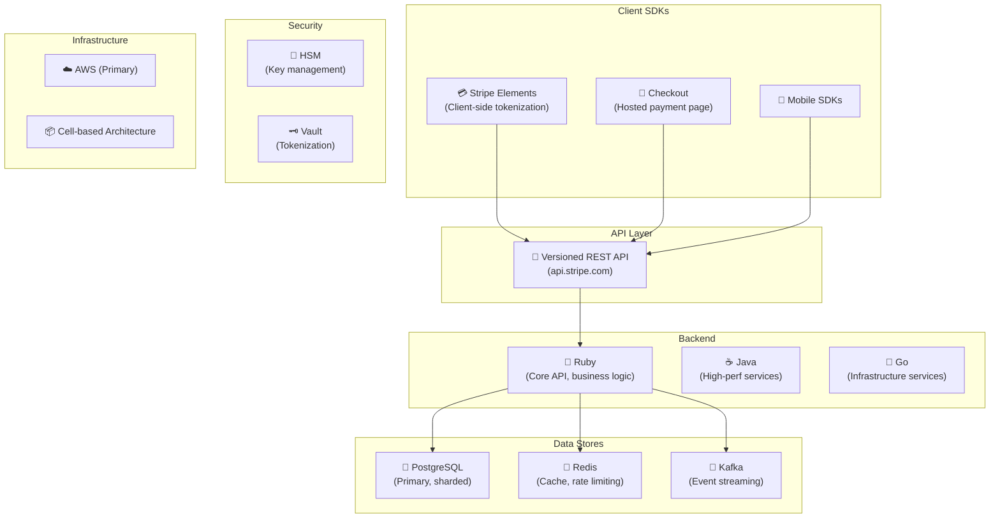
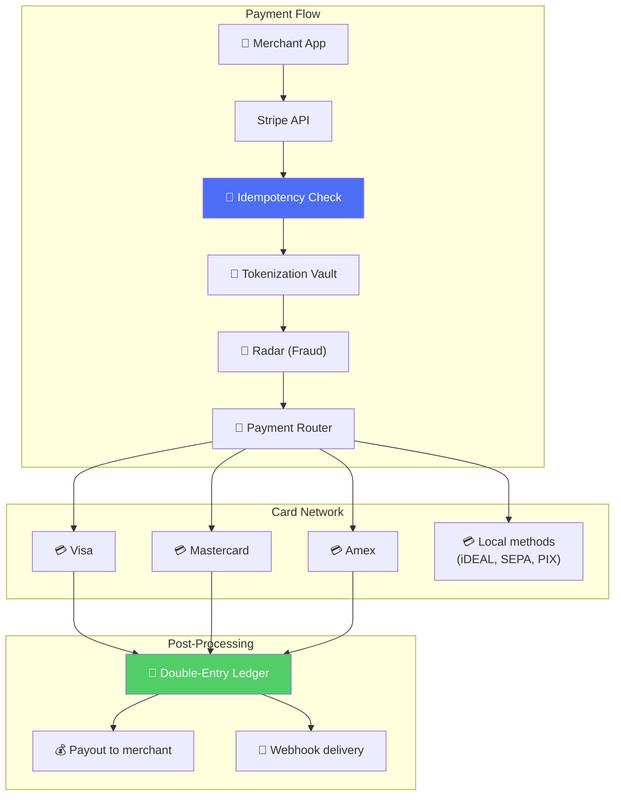
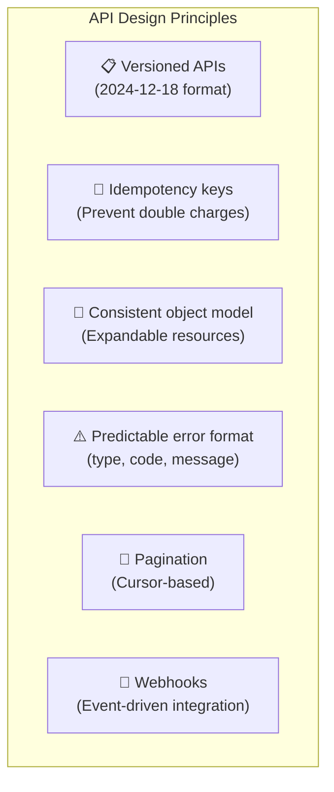
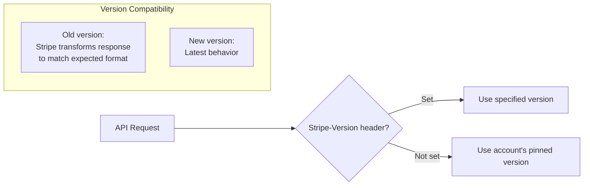
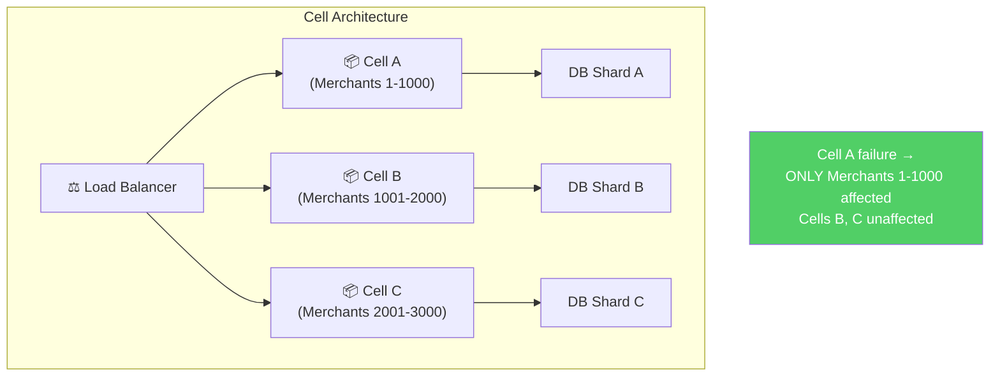
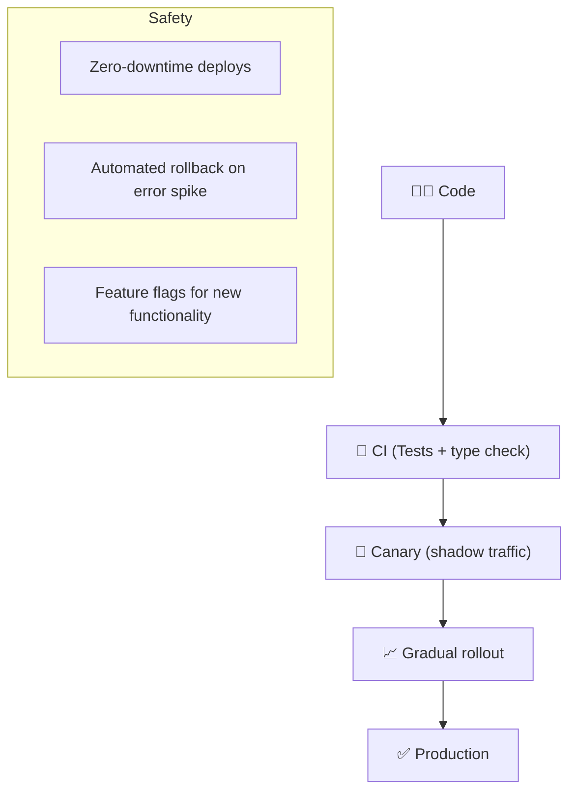

# Stripe - Deployment & Architecture

> Stripe xử lý **hàng trăm tỷ USD/năm**, 99.9995% uptime — gold standard API-first payments.

---

## 1. Quy Mô

| Metric | Giá trị |
|---|---|
| Transaction volume | $1T+/năm |
| Businesses using Stripe | Millions |
| Countries supported | 46+ (direct), 135+ (global payments) |
| Availability target | 99.9995% ("five-and-a-half nines") |
| API requests/day | Billions |
| Fraud blocked (Radar) | $60B+/năm |

---

## 2. Technology Stack

---

## 3. System Architecture

---

## 4. API Design — Industry Benchmark

### API Versioning Strategy

**Key insight:** Stripe maintains backward compatibility by transforming API responses through version-specific mappers — merchants NEVER break on upgrade.

---

## 5. Cell-Based Architecture

---

## 6. Deployment

---

## Mapping → NestJS

| Stripe | NestJS Implementation |
|---|---|
| **API versioning** | Custom `@ApiVersion()` decorator + interceptor |
| **Idempotency key** | Custom middleware + Redis `SETNX` |
| **Cell architecture** | K8s namespace + DB connection per cell |
| **Double-entry ledger** | PostgreSQL + debit/credit rows |
| **Webhooks** | Bull queue + retry with exponential backoff |
| **Ruby core** | NestJS (TypeScript) |
| **HSM** | AWS KMS / HashiCorp Vault |
