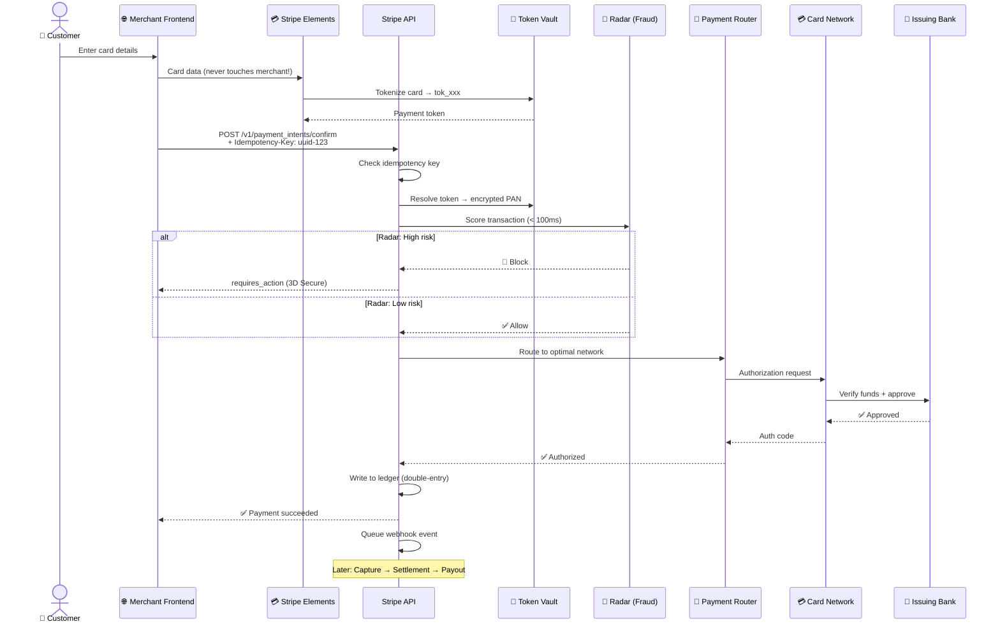
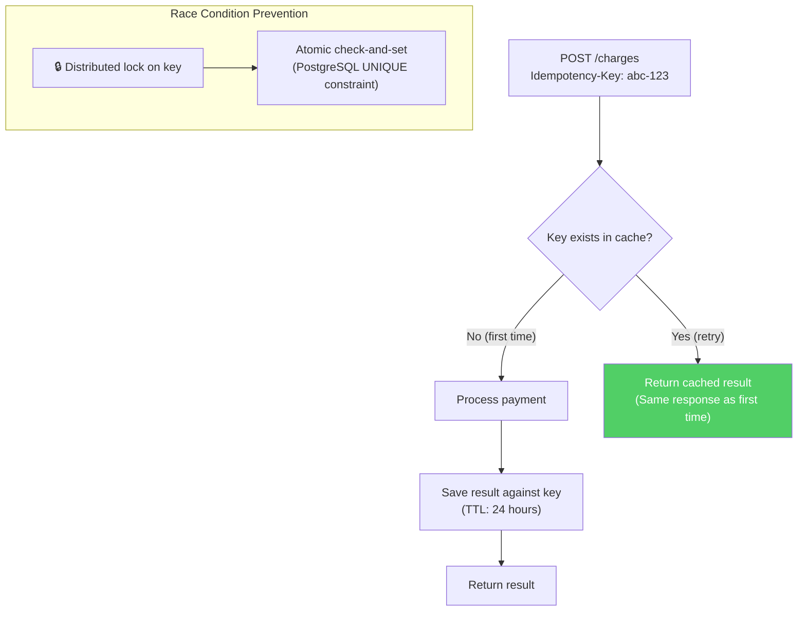
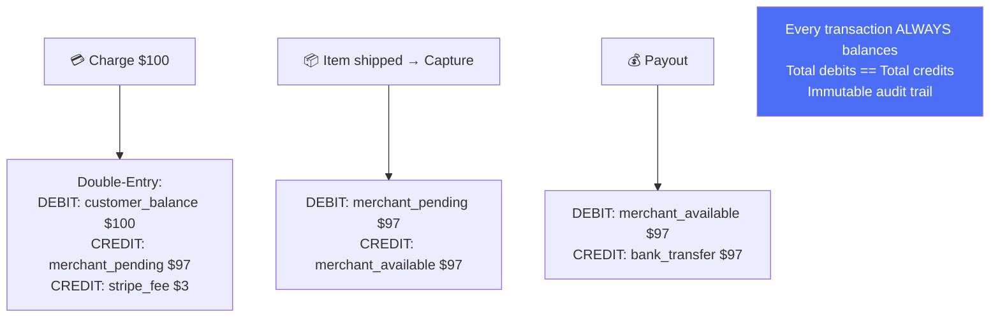
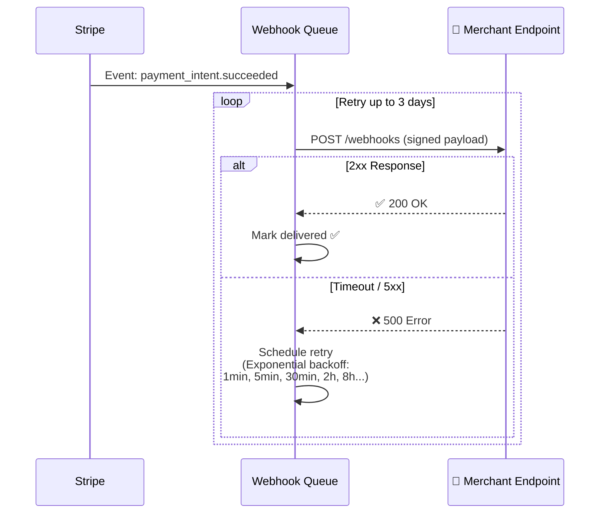
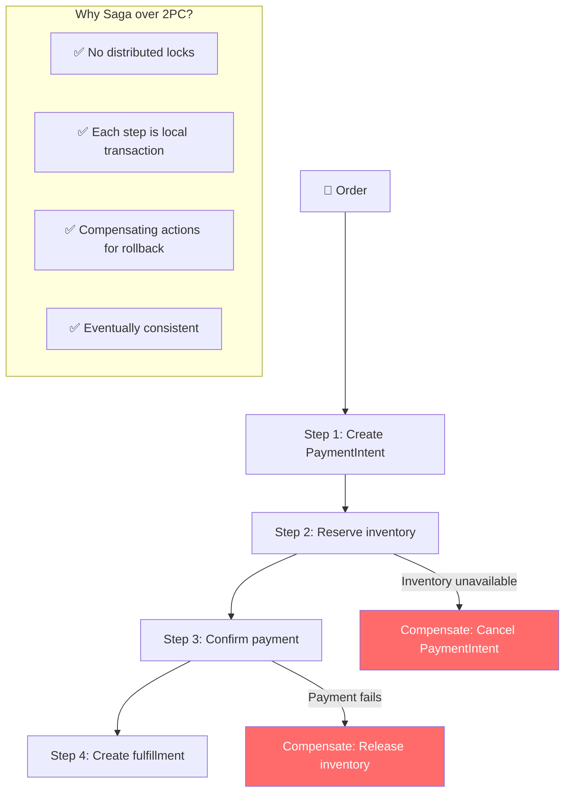
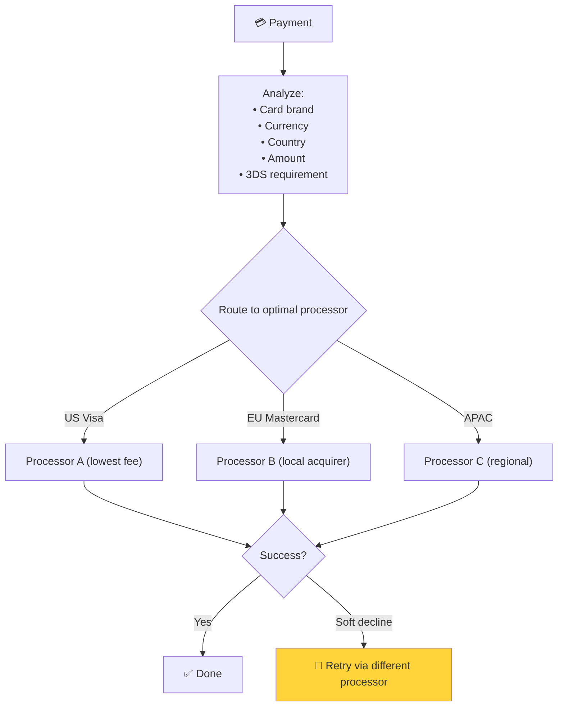

# Stripe - Xử Lý Đồng Thời Cao & Payment Processing

> Billions API calls/ngày, exactly-once payment semantics, < 100ms fraud scoring.

---

## 1. Payment Processing Flow



---

## 2. Idempotency — Exactly-Once Payments



### Implementation Pattern

```
Idempotency Flow:
1. Client generates UUID → Idempotency-Key header
2. Server: SELECT FROM idempotency_keys WHERE key = ?
3. If found → return cached response
4. If not → INSERT key (with lock), process, store result
5. Key expires after 24 hours
```

---

## 3. Double-Entry Ledger



---

## 4. Webhook Delivery System



### Webhook Best Practices

| Rule | Reason |
|---|---|
| **Verify signature** | Prevent spoofed webhooks |
| **Respond 200 fast** | Process async (queue internally) |
| **Handle duplicates** | Webhooks are at-least-once |
| **Fetch fresh state** | Don't rely on webhook data alone |

---

## 5. Saga Pattern — Distributed Transactions



---

## 6. Smart Payment Routing



**Adaptive Acceptance:** Stripe auto-retries soft declines through alternative processors → increases authorization rate by 2-5%.

---

## Mapping → NestJS

| Pattern | Stripe | NestJS Implementation |
|---|---|---|
| **Idempotency key** | UUID header + PostgreSQL | Custom `@Idempotent()` decorator + Redis |
| **Double-entry ledger** | Balanced transactions | 2 rows per transaction in PostgreSQL |
| **Webhook delivery** | Queue + retry 3 days | BullMQ + exponential backoff |
| **Webhook verification** | HMAC-SHA256 signature | `crypto.timingSafeEqual` |
| **Saga pattern** | Compensating transactions | `nestjs-saga` / custom orchestrator |
| **Smart routing** | ML-optimized | Rules engine + weighted selection |
| **Rate limiting** | Per-API-key | `@nestjs/throttler` + Redis |
