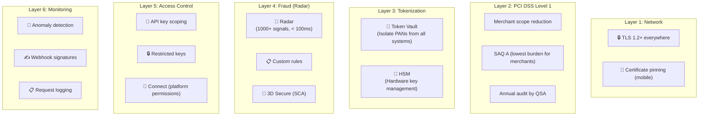
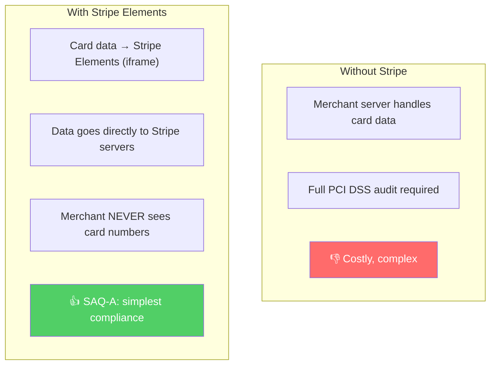
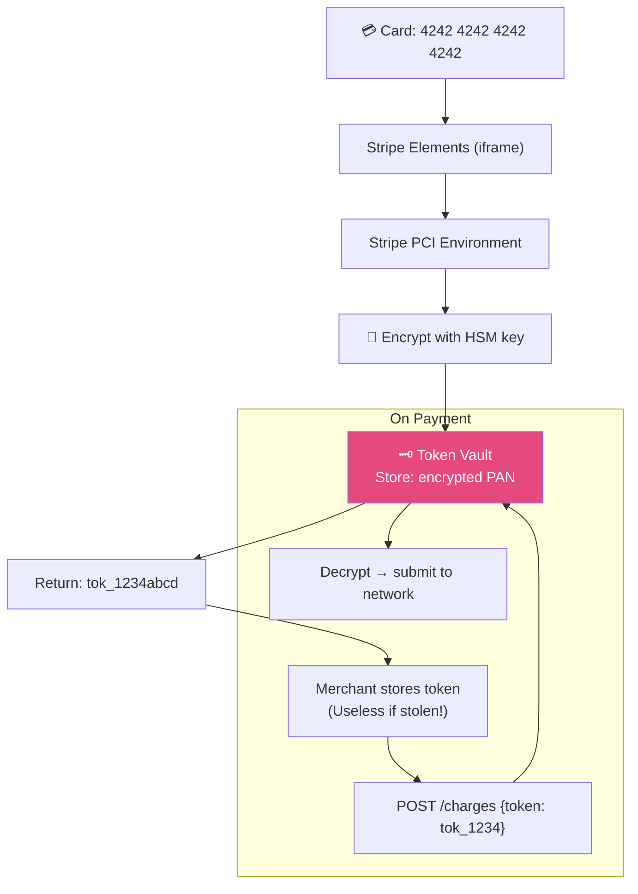
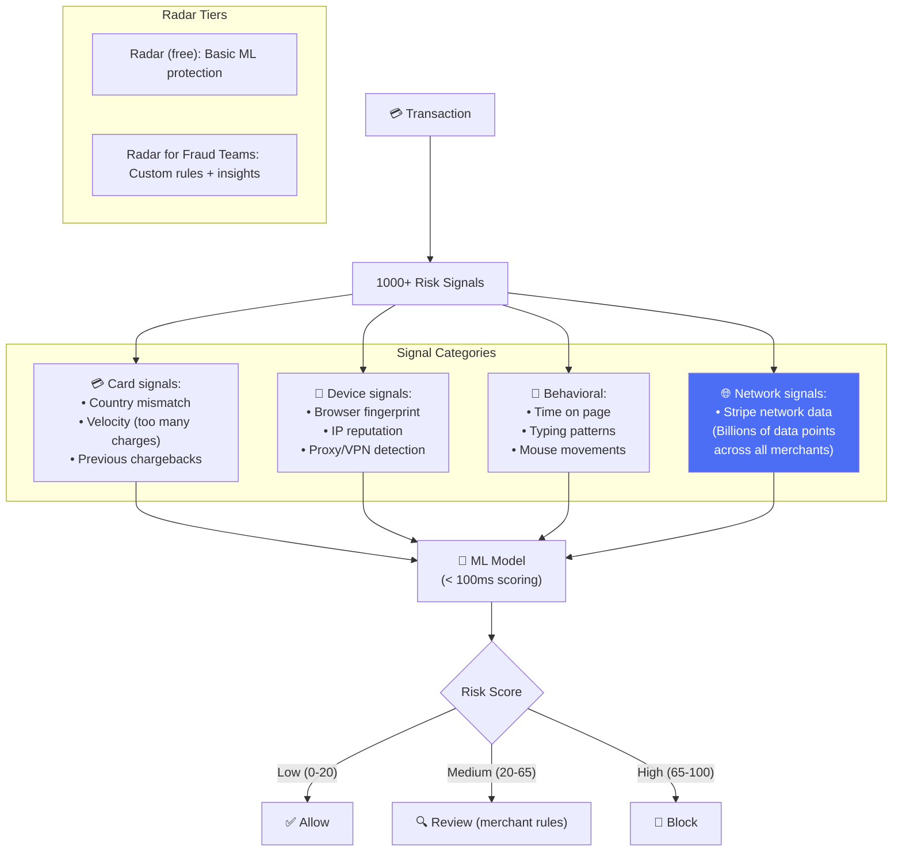
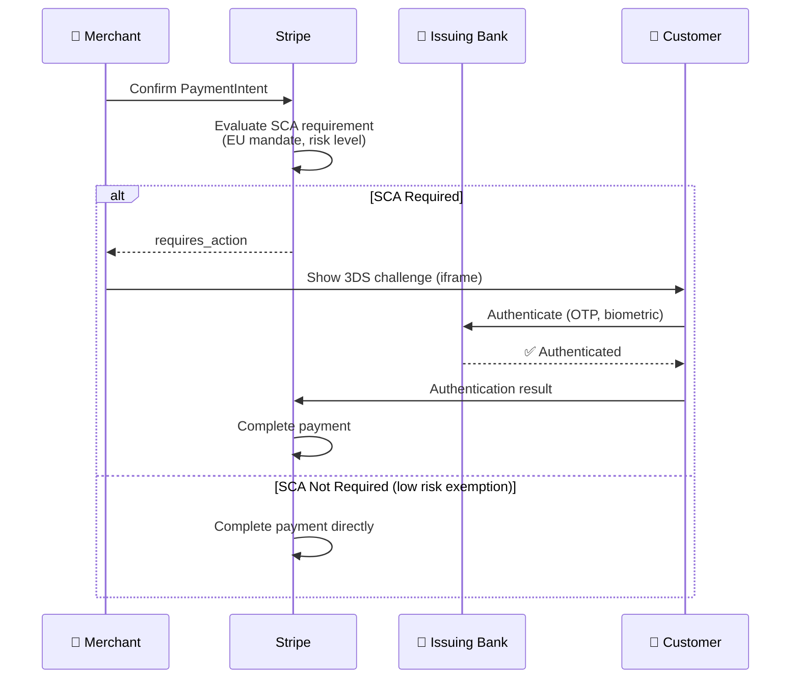

# Stripe - Security Analysis

> PCI DSS Level 1 Service Provider, $60B+ fraud blocked/năm bởi Radar.

---

## Tổng Quan

---

## 1. PCI DSS — How Stripe Reduces Merchant Burden

---

## 2. Tokenization Architecture

---

## 3. Stripe Radar — ML Fraud Detection

**Key advantage:** Stripe sees transactions across ALL merchants → can detect cross-merchant fraud patterns that individual merchants cannot.

---

## 4. 3D Secure / Strong Customer Authentication

---

## 5. API Key Security

| Key Type | Scope | Use |
|---|---|---|
| **Publishable key** | Client-safe, tokenize only | `pk_live_xxx` in frontend |
| **Secret key** | Full API access | `sk_live_xxx` server-only |
| **Restricted key** | Limited permissions | Specific endpoints only |
| **Webhook signing secret** | Verify webhook origin | `whsec_xxx` |

---

## 6. So Sánh Security: Stripe vs Others

| Layer | Stripe | Amazon | Uber | Netflix |
|---|---|---|---|---|
| **Focus** | Payment security | Marketplace trust | Safety + fraud | Content protection |
| **Compliance** | PCI DSS Level 1 SP | PCI DSS Level 1 | PCI DSS | SOC 2 |
| **Fraud** | Radar ML (network-wide) | ML scoring | Mastermind rules | N/A |
| **Unique** | Cross-merchant intelligence | A-to-Z Guarantee | GPS spoof detection | DRM watermark |
| **Tokenization** | Vault + HSM | PSP tokenization | PSP tokenization | N/A |

---

## Mapping → NestJS

| Pattern | Stripe | NestJS Implementation |
|---|---|---|
| **PCI scope reduction** | Elements (iframe) | Stripe Elements SDK |
| **Tokenization** | Vault + HSM | Stripe API (never handle cards) |
| **Radar** | Network-wide ML | Stripe Radar (built-in) |
| **3D Secure** | Automatic SCA | Stripe PaymentIntents API |
| **API key scoping** | Restricted keys | Custom API key middleware + CASL |
| **Webhook verification** | HMAC-SHA256 | `stripe.webhooks.constructEvent()` |
