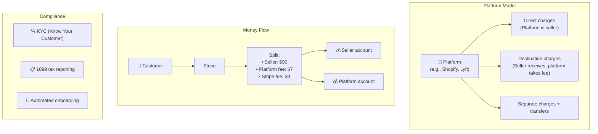
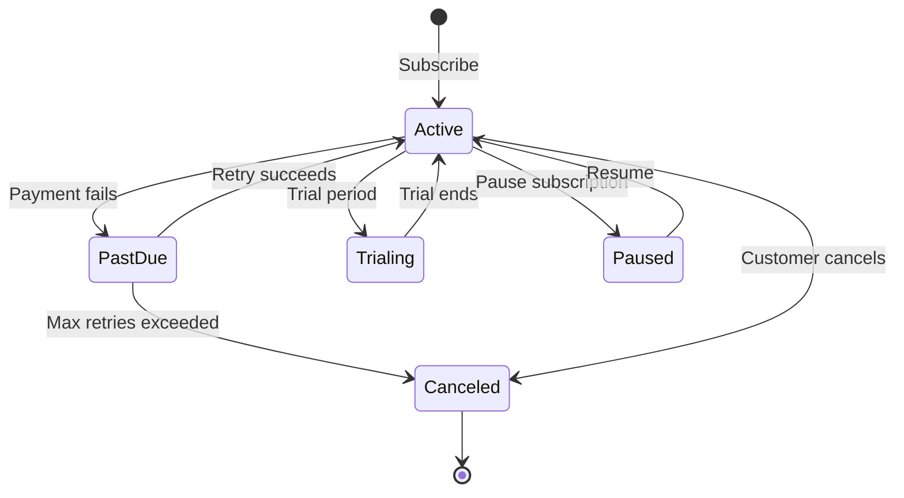
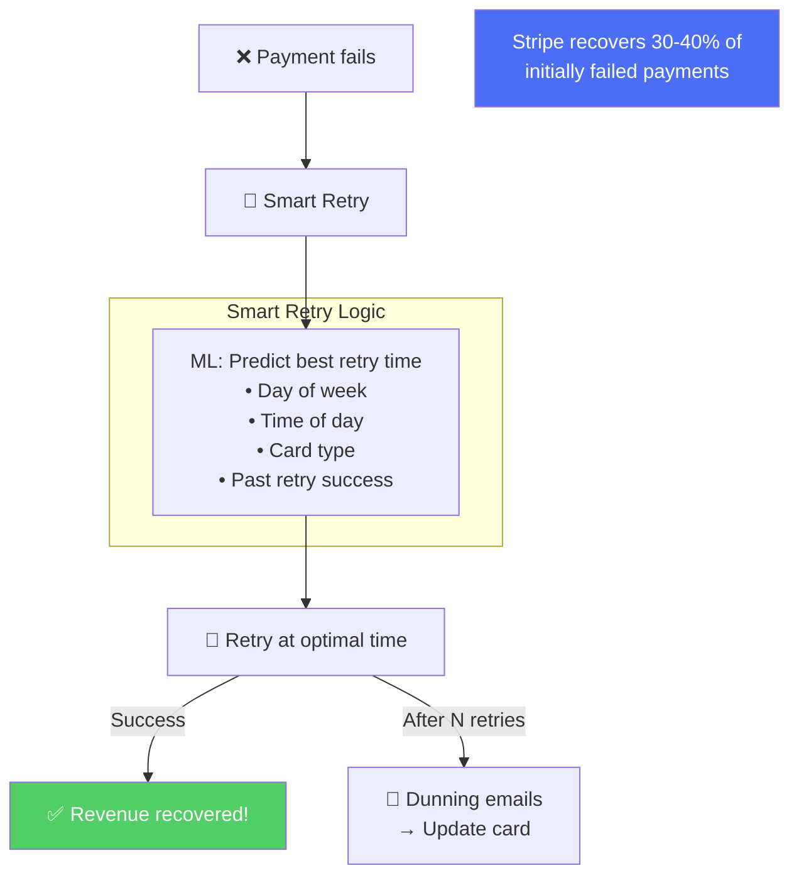
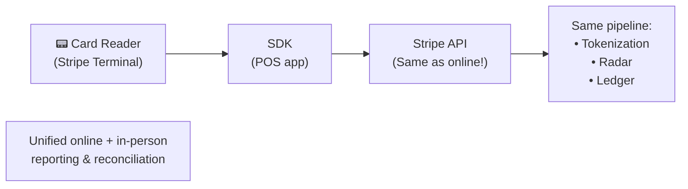
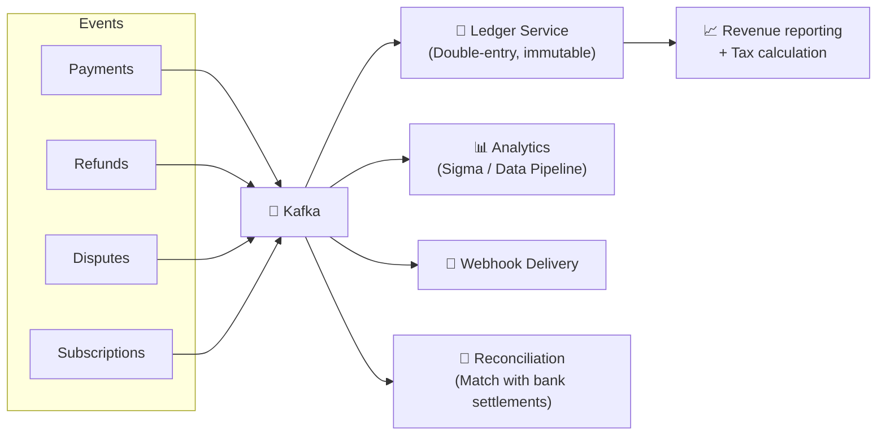
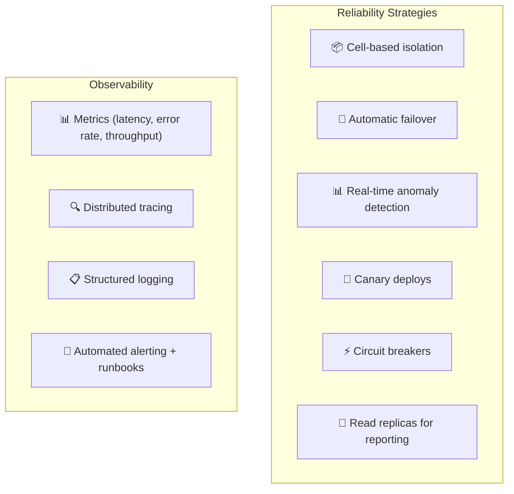

# Stripe - Subsystems Analysis

> Connect, Billing, Terminal, Atlas, Data Pipeline, Reliability.

---

## 1. Stripe Connect — Platform Payments

---

## 2. Stripe Billing — Subscription Engine

### Smart Retries (Revenue Recovery)

---

## 3. Stripe Terminal — In-Person Payments

---

## 4. Financial Data Pipeline

---

## 5. Reliability — 99.9995% Target

---

## 6. So Sánh Tổng Hợp: 8 Systems

| Dimension | Stripe | Amazon | Uber | YouTube | Netflix | Instagram | Twitter | WhatsApp |
|---|---|---|---|---|---|---|---|---|
| **Primary** | Payments API | E-commerce | Ride-hailing | Video UGC | Streaming | Photo social | Microblog | Messaging |
| **Language** | Ruby/Java/Go | Java/Kotlin | Go/Java | Python/C++ | Java | Python | Scala/Java | Erlang |
| **Key pattern** | Idempotency | Event-driven | Geospatial | Video pipeline | Chaos eng | Fan-out | Push/pull | Store-forward |
| **Database** | PostgreSQL | DynamoDB | MySQL+Cass | Vitess | Cassandra | PostgreSQL | Manhattan | Mnesia |
| **Unique** | Double-entry ledger | Bezos Mandate | H3 hex grid | Content ID | Open Connect | TAO graph | Snowflake | E2EE |
| **Availability** | 99.9995% | 99.99% | 99.99% | 99.99% | 99.97% | 99.95% | 99.95% | 99.99% |
| **Compliance** | PCI DSS L1 SP | PCI DSS L1 | PCI DSS | COPPA | GDPR | GDPR | GDPR | GDPR |

---

## Stripe Unique Innovations

| Innovation | Impact |
|---|---|
| **Idempotency keys** | Standard pattern for payment APIs → adopted industry-wide |
| **API versioning** | Date-based versioning with backward compat transforms |
| **Stripe Radar** | Network-wide ML fraud → $60B+ blocked/year |
| **Connect** | Multi-party payment orchestration for platforms |
| **Smart Retries** | ML-optimized retry timing → 30-40% recovery |
| **Developer Experience** | Set the gold standard for API documentation |

---

## Mapping → NestJS

| Subsystem | Stripe | NestJS Implementation |
|---|---|---|
| **Connect** | Multi-party payments | Stripe Connect SDK + custom splits |
| **Billing** | Subscription lifecycle | Stripe Billing API + webhook handlers |
| **Smart Retries** | ML retry timing | BullMQ delayed jobs + heuristic timing |
| **Terminal** | In-person payments | Stripe Terminal SDK |
| **Ledger** | Double-entry bookkeeping | PostgreSQL + 2 rows per txn |
| **Reconciliation** | Match bank settlements | Scheduled cron job + Stripe reporting API |
| **Observability** | Real-time monitoring | Prometheus + Grafana + `nestjs-otel` |
