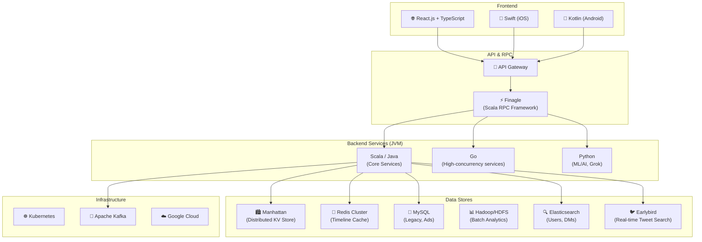
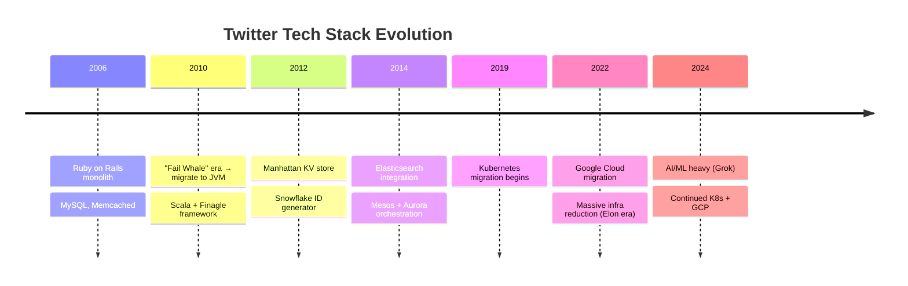
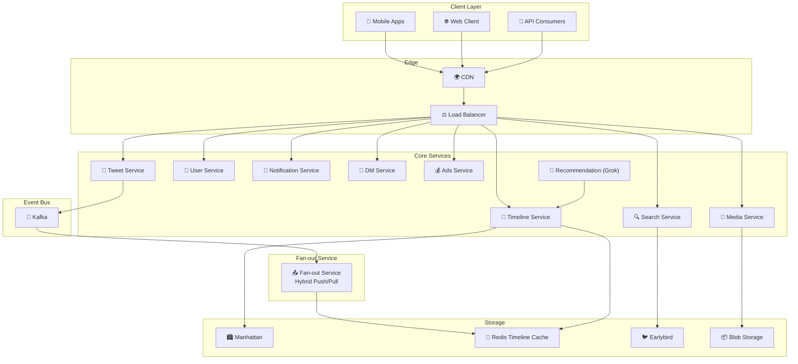
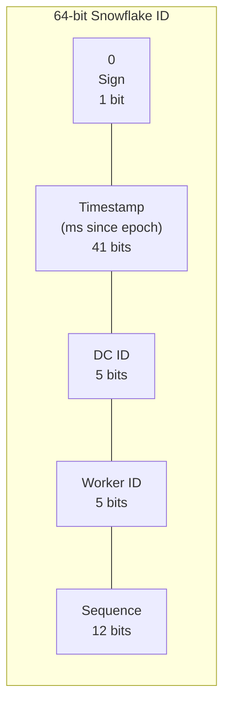

# Hệ Thống Twitter/X - Deployment & Architecture

> Twitter xử lý **500K+ tweets/phút**, **200K+ requests/giây** phục vụ 500M+ users.

---

## 1. Tổng Quan & Quy Mô

| Metric | Giá trị |
|---|---|
| Monthly Active Users | 500M+ |
| Tweets per day | 500M+ |
| Timeline views/day | 200B+ |
| Peak tweets/second | 150K+ (Super Bowl, World Cup) |
| Servers | Tens of thousands |
| Requests/second | 200K+ |

---

## 2. Technology Stack

### Tech Stack Evolution

---

## 3. System Architecture - Tổng Quan

---

## 4. Snowflake ID — Distributed ID Generation

Twitter tạo ra **Snowflake** để sinh unique IDs mà KHÔNG cần central coordinator.

| Component | Bits | Range |
|---|---|---|
| Sign | 1 | Always 0 |
| Timestamp | 41 | ~69 years từ custom epoch |
| Datacenter ID | 5 | 32 datacenters |
| Worker ID | 5 | 32 workers per DC |
| Sequence | 12 | 4,096 IDs/ms/worker |

**Throughput:** ~4 triệu IDs/giây/worker. Time-ordered → sortable by creation time.

---

## 5. Deployment & Infrastructure

```mermaid
flowchart TB
    subgraph "CI/CD Pipeline"
        COMMIT["👨‍💻 Commit"] --> BUILD["🔨 Build (Bazel)"]
        BUILD --> TEST["🧪 Tests"]
        TEST --> ARTIFACT["📦 Container Image"]
        ARTIFACT --> CANARY2["🐤 Canary (1-5%)"]
        CANARY2 --> STAGED["📊 Staged Rollout"]
        STAGED --> PROD["🚀 Production"]
    end

    subgraph "Infrastructure Evolution"
        BARE["🖥️ Bare Metal<br/>(Own DCs)"]
        MESOS["⚙️ Mesos + Aurora"]
        K8S2["☸️ Kubernetes"]
        GCP2["☁️ Google Cloud"]
        BARE --> MESOS --> K8S2 --> GCP2
    end

    style GCP2 fill:#4c6ef5,color:#fff
```

| Era | Infrastructure | Deployment |
|---|---|---|
| 2010-2014 | Bare metal, own DCs | Custom scripts, SSH |
| 2014-2019 | Mesos + Aurora | Aurora scheduler |
| 2019-2022 | Kubernetes migration | K8s declarative (YAML) |
| 2022+ | Google Cloud + K8s | GKE, standardized CI/CD |

---

## Mapping → NestJS

| Twitter/X | NestJS Implementation |
|---|---|
| **Scala + Finagle** | NestJS + gRPC (`@grpc/grpc-js`) |
| **Manhattan** | Redis + TypeORM (PostgreSQL) |
| **Snowflake ID** | `snowflake-id` / custom BigInt generator |
| **Kubernetes** | Docker + K8s (Helm charts) |
| **Bazel build** | `npm run build` + Docker multi-stage |
