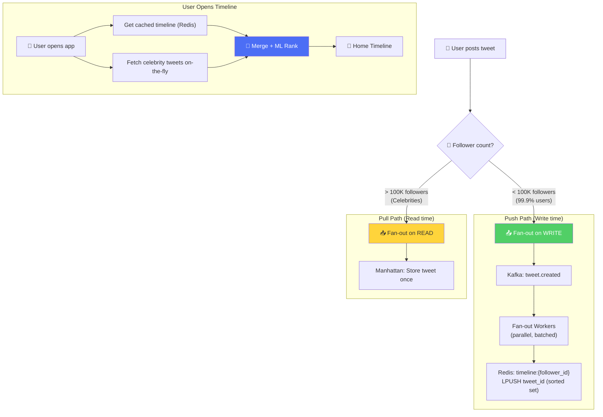
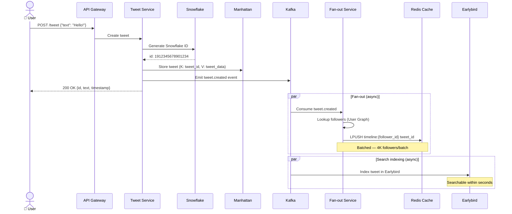
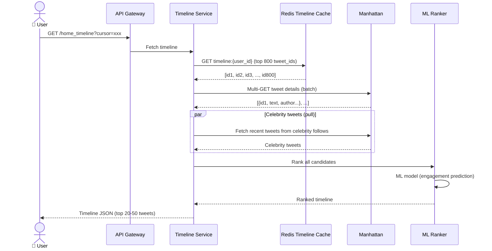
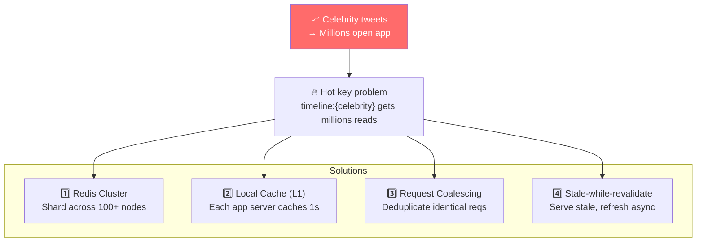
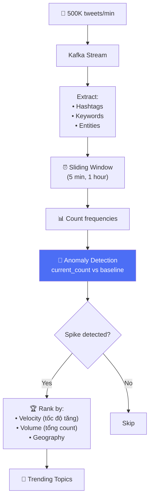
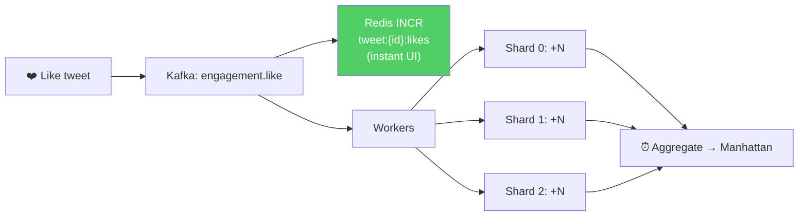

# Twitter/X - Xử Lý Đồng Thời Cao & Timeline Fan-out

> Phân tích cách Twitter xử lý 500K+ tweets/phút và deliver tới 500M+ users.

---

## 1. Timeline Fan-out — Hybrid Push/Pull

Đây là **core engineering challenge** lớn nhất của Twitter.

### Fan-out Numbers

| Scenario | Writes triggered | Time to deliver |
|---|---|---|
| User with 100 followers | 100 Redis LPUSH | < 5 seconds |
| User with 10K followers | 10K Redis LPUSH | < 10 seconds |
| Celebrity with 50M followers | **0** writes (pull model) | On-demand merge |

---

## 2. Tweet Write Path

---

## 3. Tweet Read Path (Home Timeline)

---

## 4. Thundering Herd — Celebrity Tweet Spike

Khi Elon tweet → hàng triệu users mở app cùng lúc.

---

## 5. Trending Topics — Real-time Detection

**Key insight:** Trending KHÔNG phải top hashtags theo tổng count. Mà là hashtags có **tốc độ tăng bất thường** — velocity > baseline.

---

## 6. Engagement Counters — Like/Retweet

Giống Instagram celebrity like problem, Twitter dùng sharded counters.

---

## So Sánh: Twitter vs Instagram Fan-out

| Aspect | Twitter | Instagram |
|---|---|---|
| **Content type** | Text-first (280 chars) | Media-first (photos/videos) |
| **Fan-out threshold** | ~100K followers | ~500K followers |
| **Timeline cache** | Redis (Sorted Sets) | Redis + Cassandra |
| **Storage** | Manhattan (custom KV) | PostgreSQL (sharded) |
| **Search** | Earlybird (custom Lucene) | Unicorn (graph-aware) |
| **ID generation** | Snowflake (custom) | PostgreSQL sequences (sharded) |
| **Celebrity merge** | On-read, merge 2 sources | On-read, merge 2 sources |

---

## Mapping → NestJS

| Pattern | Twitter/X | NestJS Implementation |
|---|---|---|
| **Fan-out** | Kafka → Redis LPUSH (batched) | `@nestjs/microservices` Kafka → Bull job → Redis |
| **Timeline cache** | Redis Sorted Set | `ioredis` ZADD/ZRANGE |
| **Trending** | Sliding window + anomaly detect | Redis Sorted Set + cron job frequency analysis |
| **Sharded counter** | Kafka → multi-shard workers | BullMQ + Redis INCR + periodic DB flush |
| **Snowflake ID** | Custom 64-bit generator | `snowflake-id` npm package / custom BigInt |
| **Request coalescing** | Promise-based dedup | `dataloader` pattern (batch + cache) |
