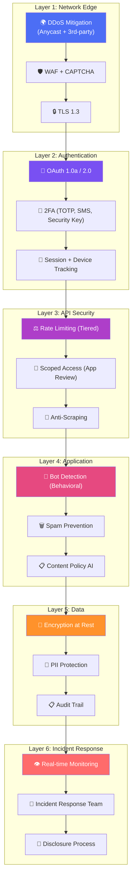
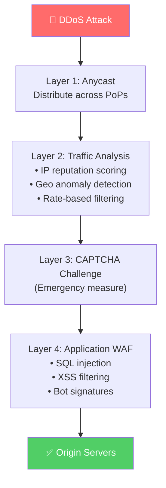
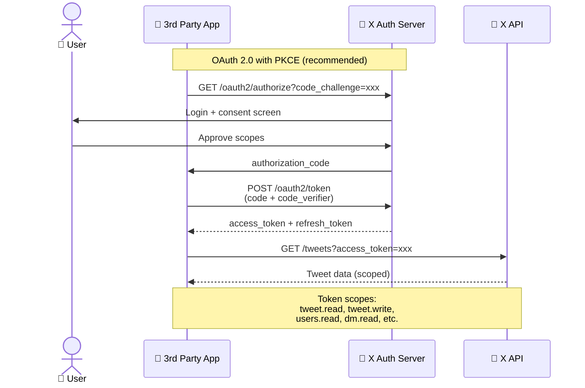
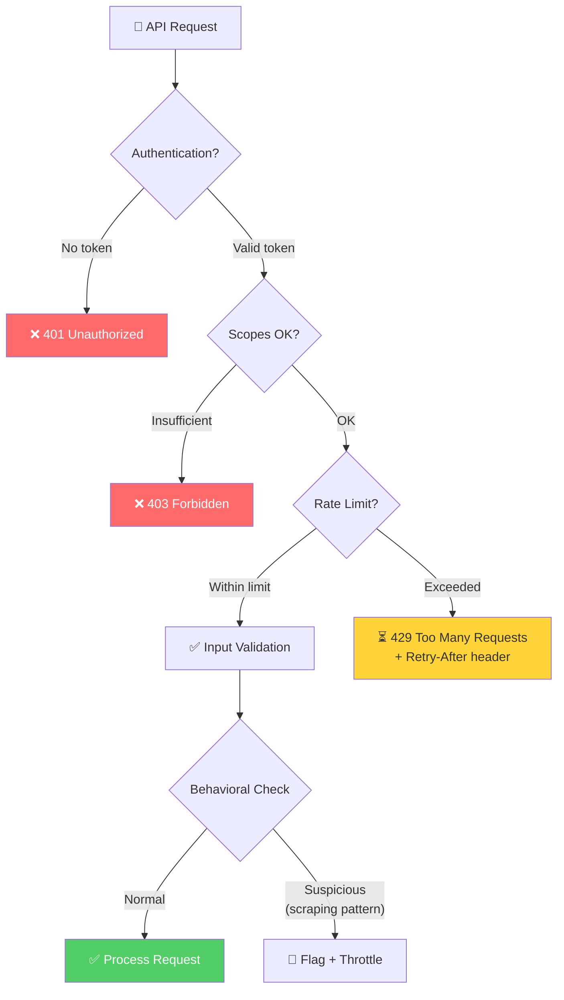
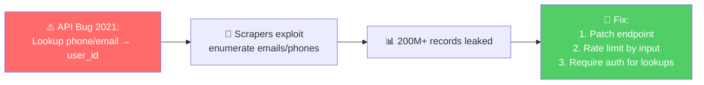
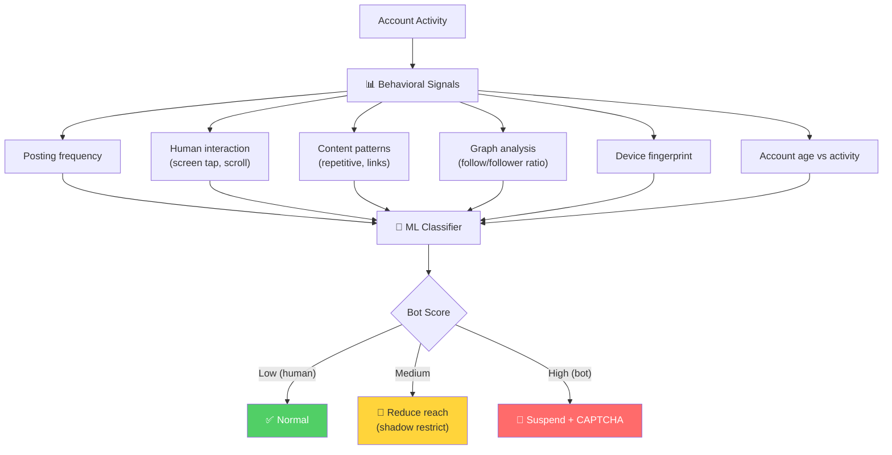
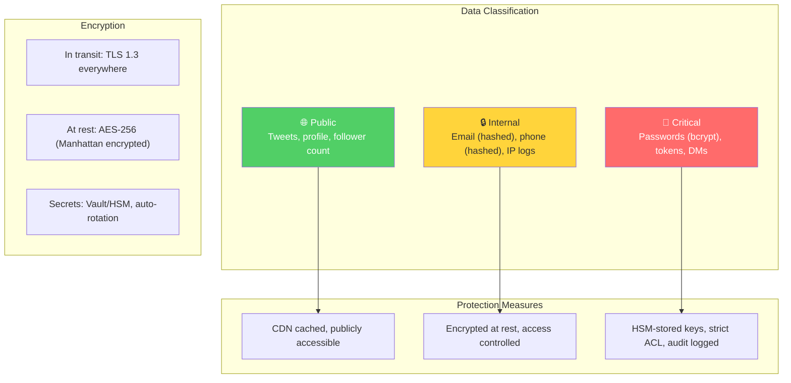
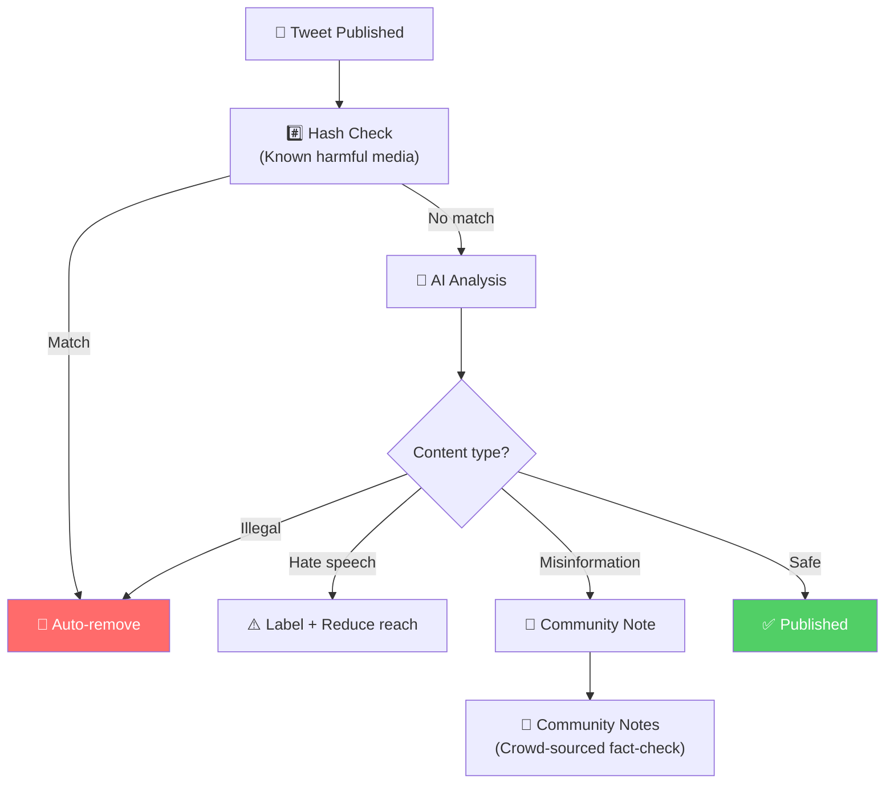

# Twitter/X - Security Analysis

> Phân tích 8 lớp bảo mật của Twitter/X và các bài học từ security incidents thực tế.

---

## Tổng Quan: Defense in Depth

---

## 1. Network Security & DDoS Protection

### DDoS Incidents (Bài Học Thực Tế)

| Năm | Incident | Impact | Response |
|---|---|---|---|
| 2016 | Mirai botnet → Dyn DNS | Twitter down toàn cầu | Diversify DNS providers |
| 2024 | Hacktivist DDoS campaigns | Intermittent outages | 3rd-party DDoS protection |
| 2025 | Large-scale volumetric attack | Service degradation | CAPTCHA + emergency rate limits |

**Bài học:** Không chỉ protect origin, phải protect cả DNS và CDN layer.

---

## 2. Authentication — OAuth 1.0a & 2.0

### Access Tiers

| Tier | Rate Limit | Cost | Use Case |
|---|---|---|---|
| **Free** | 1,500 tweets/month read | Free | Hobby projects |
| **Basic** | 10K tweets/month | $100/month | Small apps |
| **Pro** | 1M tweets/month | $5,000/month | Business apps |
| **Enterprise** | Custom | Custom | Data partners |

### 2FA Options

| Method | Security Level | Availability |
|---|---|---|
| **Security Key (FIDO2)** | ⭐⭐⭐⭐⭐ | All users |
| **Auth App (TOTP)** | ⭐⭐⭐⭐ | All users |
| **SMS** | ⭐⭐ | X Premium only (since 2023) |

---

## 3. API Security & Anti-Scraping

### Anti-Scraping Measures

| Measure | Mô tả |
|---|---|
| **API-only access** | Chỉ cho phép access qua official API |
| **Tiered rate limits** | Free tier rất hạn chế, ngăn mass scraping |
| **Behavioral detection** | ML phát hiện patterns scraping (sequential reads, no engagement) |
| **Token revocation** | Tự động revoke tokens vi phạm TOS |
| **IP reputation** | Block known scraping infrastructure |

### Bài Học Từ API Vulnerability (2021)

**Bài học:** Mọi endpoint trả về user data phải có rate limiting VÀ authentication, kể cả lookup endpoints.

---

## 4. Bot Detection & Spam Prevention

### Spam Prevention Pipeline

| Stage | Action | Examples |
|---|---|---|
| **Pre-publish** | Content filter | Spam links, known malware URLs |
| **Post-publish** | ML analysis | Repetitive tweets, engagement manipulation |
| **Reactive** | User reports + review | Mass report → human review |
| **Proactive** | Batch purge | Millions of bot accounts removed periodically |

---

## 5. Data Protection

---

## 6. Content Moderation

**Community Notes** — Unique Twitter feature: crowd-sourced fact-checking thay vì chỉ dựa vào AI.

---

## 7. Security Monitoring

| Metric | SLI | Alert Threshold |
|---|---|---|
| Login failure rate | % failed logins | > 5% per minute |
| API error rate | 5xx responses | > 1% per endpoint |
| Scraping detection | Sequential reads without engagement | > 1000 reads/min/token |
| Bot creation rate | New accounts with bot signals | > baseline × 2 |
| DDoS traffic | Requests per second | > baseline × 10 |

---

## 8. So Sánh Security: Twitter vs Instagram

| Layer | Twitter/X | Instagram |
|---|---|---|
| **Auth protocol** | OAuth 1.0a + 2.0 (PKCE) | OAuth 2.0 |
| **2FA** | FIDO2, TOTP, SMS(paid) | TOTP, SMS, WhatsApp |
| **API access** | Paid tiers ($100-$5K/month) | Free (with review) |
| **Bot detection** | Human-tap behavioral | AI behavioral analysis |
| **Content moderation** | AI + Community Notes | AI + human reviewers |
| **DDoS** | 3rd-party + internal | Meta own infrastructure |
| **Unique risk** | API scraping (2021 breach) | Thundering herd on celebrity |
| **Open-source** | More transparent (formerly) | Less public |

---

## Mapping → NestJS

| Pattern | Twitter/X | NestJS Implementation |
|---|---|---|
| **OAuth 2.0 PKCE** | Native for API access | `@nestjs/passport` + `passport-oauth2` |
| **Tiered Rate Limit** | Free/Basic/Pro/Enterprise | `@nestjs/throttler` + Redis + user tier check |
| **Bot Detection** | Behavioral ML scoring | Custom middleware + `device-detector` |
| **Anti-Scraping** | Sequential read detection | Rate limit per-user + anomaly detection |
| **Content Hash** | Known harmful content DB | `crypto.createHash` + external DB (PhotoDNA) |
| **Community Notes** | Crowd-sourced moderation | Custom voting system + reputation score |
| **API Tiers** | Paid access levels | `@nestjs/passport` + Stripe subscription check |

> [!CAUTION]
> **Bài học #1 từ Twitter:** API endpoint nào trả về user data đều phải có rate limiting + authentication, kể cả lookup/search endpoints. Vulnerability 2021 là do thiếu rate limit trên lookup endpoint.
