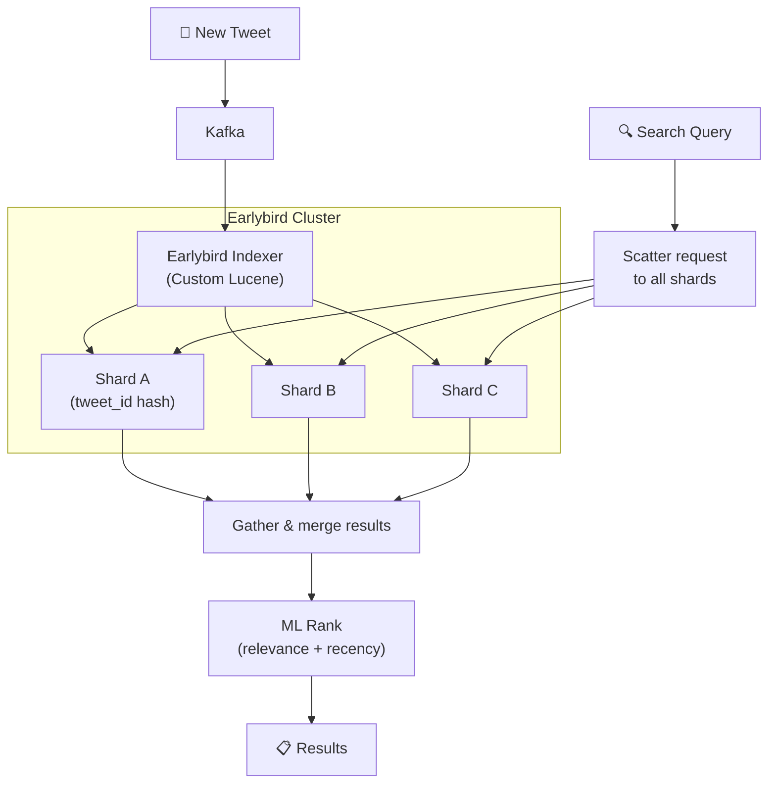
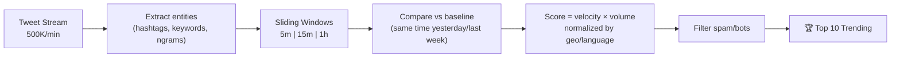
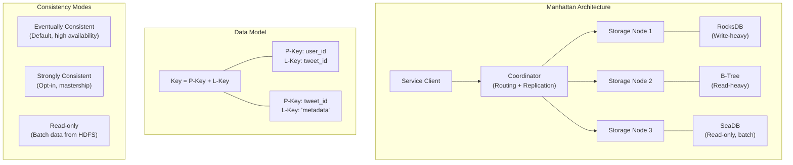
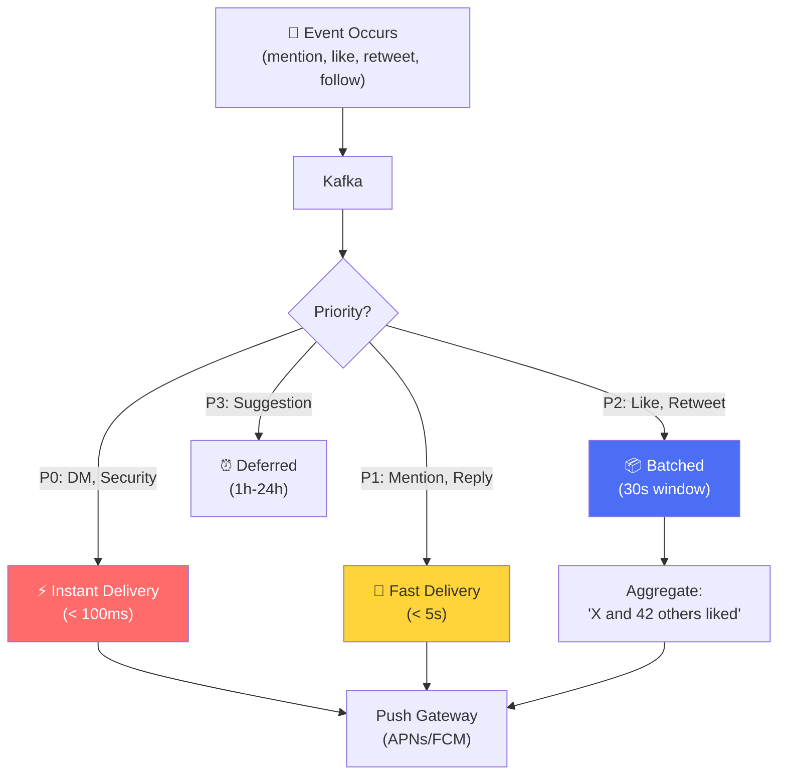
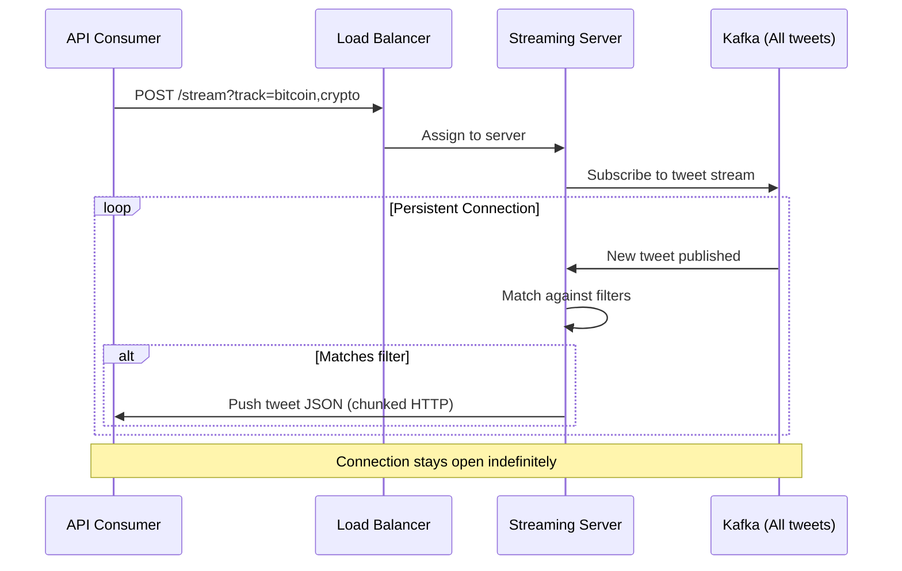
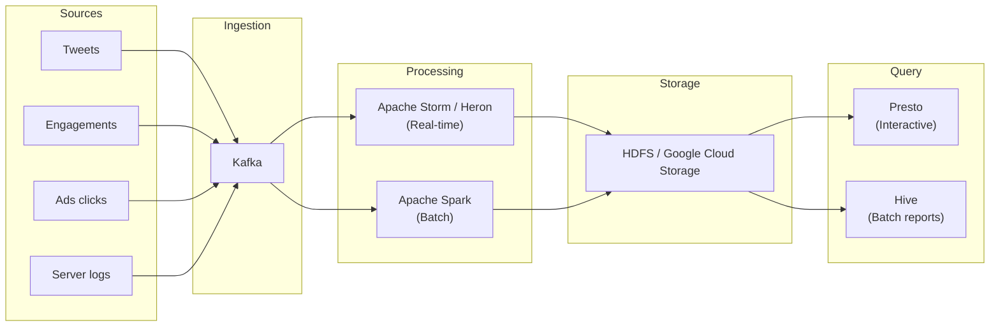
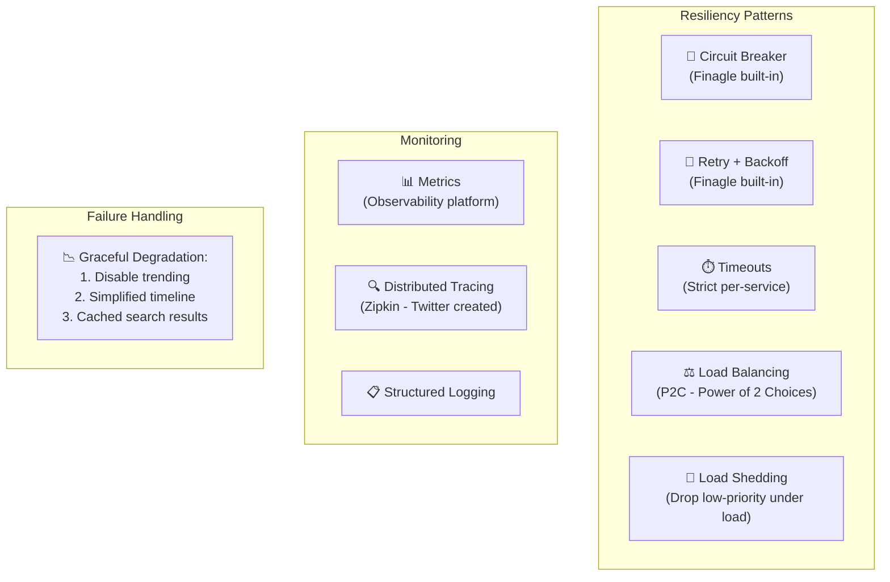

# Twitter/X - Subsystems Analysis

> Search, Storage, Real-time, Data Pipeline, Reliability.

---

## 1. Search — Earlybird + Elasticsearch

### 1.1 Real-time Tweet Search (Earlybird)

| Feature | Earlybird | Elasticsearch |
|---|---|---|
| **Use** | Real-time tweet search | Users, DMs, secondary |
| **Indexing** | Lock-free, single-writer | Standard Lucene |
| **Latency** | < 50ms (in-memory) | < 100ms |
| **Tweets** | Index trong vài giây | Batch/near-real-time |

### 1.2 Trending Topics Detection

**Key:** Trending = **tốc độ tăng bất thường**, không phải tổng count cao nhất.

---

## 2. Storage — Manhattan

### Manhattan vs Instagram PostgreSQL

| Aspect | Manhattan (Twitter) | PostgreSQL (Instagram) |
|---|---|---|
| **Type** | Distributed KV store | Relational (sharded) |
| **Query** | Key-based lookups | SQL (joins, aggregates) |
| **Consistency** | Eventually consistent (default) | Strong (ACID) |
| **Sharding** | Built-in consistent hashing | Application-level by user_id |
| **Use case** | Tweets, DMs, user data | Profiles, relationships, metadata |

---

## 3. Real-time — Streaming & Notifications

### 3.1 Notification Priority System

### 3.2 Streaming API (Firehose)

| API Tier | Data | Use Case |
|---|---|---|
| **Firehose** | 100% public tweets | Data partners, research |
| **Filter stream** | Filtered by keyword/user/geo | App developers |
| **Sample stream** | ~1% random sample | Analytics, trend detection |

---

## 4. Data Pipeline

**Twitter → Heron:** Twitter từng dùng Apache Storm nhưng sau đó build **Heron** (open-source) để thay thế vì performance và debugging tốt hơn.

---

## 5. Reliability & SRE

**Fun fact:** Twitter created **Zipkin** — hệ thống distributed tracing open-source phổ biến nhất, dựa trên Google Dapper paper.

### Twitter/X Unique Innovations

| Innovation | Mô tả | Impact |
|---|---|---|
| **Snowflake** | Distributed ID generator | Industry standard (Discord, Instagram dùng variant) |
| **Finagle** | Async RPC framework (Scala) | Foundation cho microservices |
| **Zipkin** | Distributed tracing | De-facto standard, integrated vào Spring |
| **Heron** | Stream processing (Storm replacement) | 10x throughput vs Storm |
| **Manhattan** | Multi-tenant KV store | Replace Cassandra, MySQL cho many use cases |
| **Earlybird** | Real-time search engine | Sub-second tweet indexing |

---

## So Sánh Tổng Hợp: Twitter vs Instagram

| Dimension | Twitter/X | Instagram |
|---|---|---|
| **Language** | Scala/Java (JVM) | Python (Django) |
| **RPC** | Finagle (custom) | Thrift / internal |
| **Primary DB** | Manhattan (KV) | PostgreSQL (relational) |
| **Timeline cache** | Redis Sorted Sets | Redis + Cassandra |
| **Search** | Earlybird (custom Lucene) | Unicorn → Vector search |
| **ID system** | Snowflake (custom 64-bit) | PostgreSQL sequences |
| **Orchestration** | Kubernetes (GKE) | Tupperware (Meta internal) |
| **Cloud** | Google Cloud | Meta own DCs |
| **Tracing** | Zipkin (created by Twitter) | Internal tools |
| **Stream processing** | Heron / Storm | Flink |
