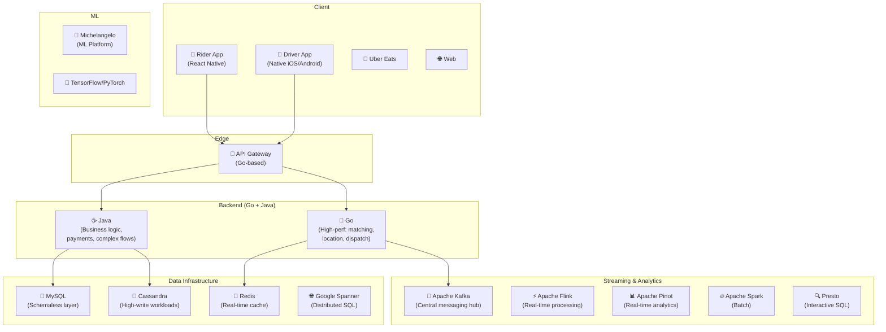
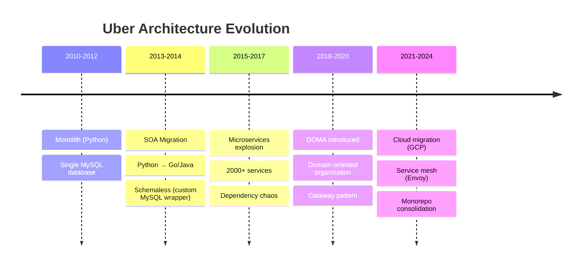
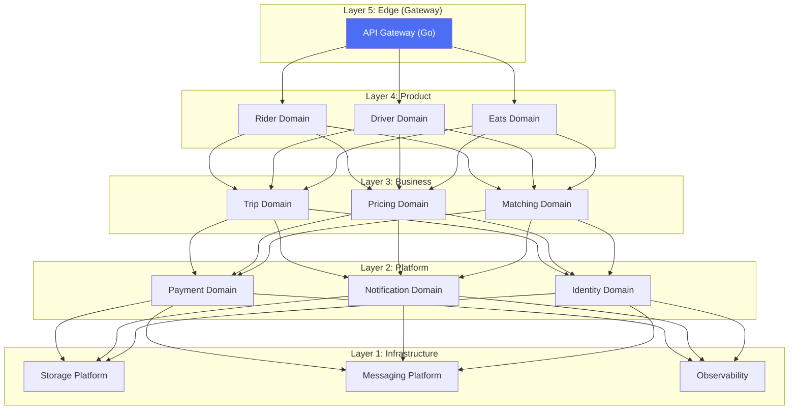
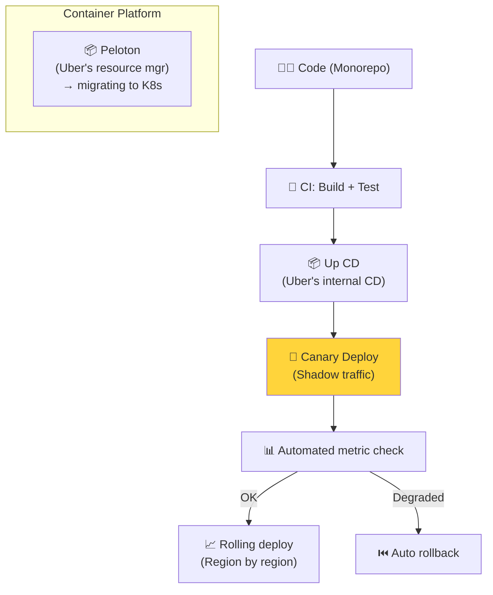

# Uber - Deployment & Architecture

> Uber phục vụ **130M+ monthly users**, **6.9B+ trips/năm** tại 10,000+ cities, 70+ countries.

---

## 1. Quy Mô

| Metric | Giá trị |
|---|---|
| Monthly Active Users | 130M+ |
| Trips per year | 6.9B+ |
| Cities | 10,000+ |
| Countries | 70+ |
| Microservices | 4,000+ |
| Location updates/sec | Millions |
| Revenue (2024) | $40B+ |

---

## 2. Technology Stack

---

## 3. Architecture Evolution

---

## 4. DOMA — Domain-Oriented Microservice Architecture

### DOMA Principles

| Principle | Description |
|---|---|
| **Domains** | Group related services (e.g., Payment Domain has 30+ microservices) |
| **Layers** | Upper can depend on lower, NEVER reverse |
| **Gateways** | Single entry point per domain — hide internal complexity |
| **Extensions** | Customize domains without modifying core |

---

## 5. Deployment

---

## Mapping → NestJS

| Uber | NestJS Implementation |
|---|---|
| **DOMA (Domains)** | NestJS Modules with gateway pattern |
| **Go API Gateway** | `@nestjs/microservices` + Kong |
| **Kafka** | `@nestjs/microservices` Kafka transport |
| **Schemaless** | TypeORM + PostgreSQL |
| **Redis cache** | `@nestjs/cache-manager` + ioredis |
| **Flink** | BullMQ workers (simplified) |
| **Michelangelo (ML)** | Python service via gRPC |
| **Peloton/K8s** | Kubernetes + Helm |
