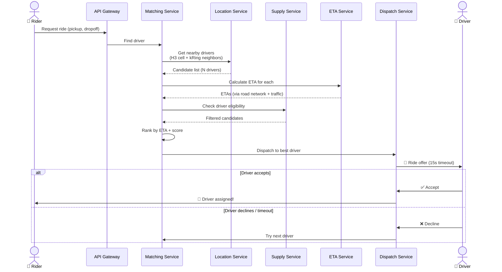
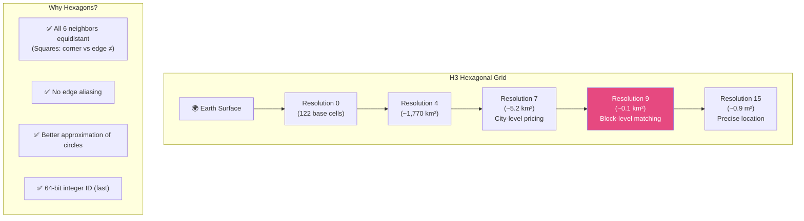
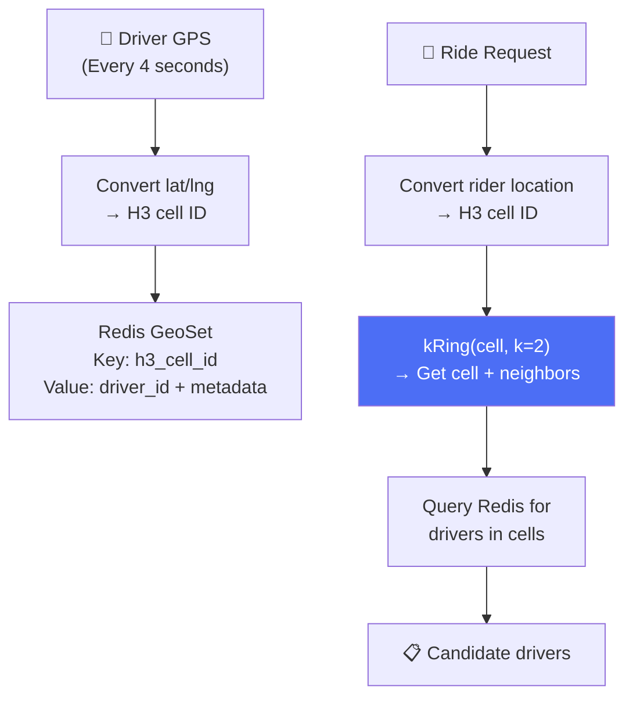
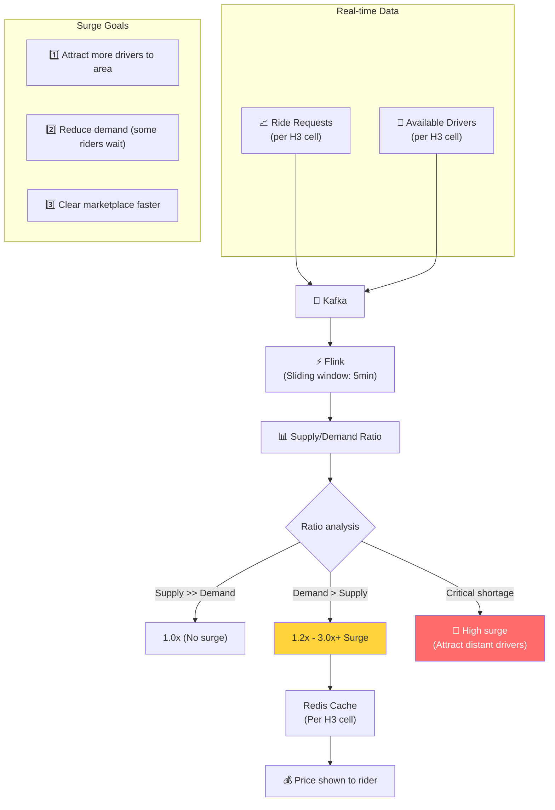
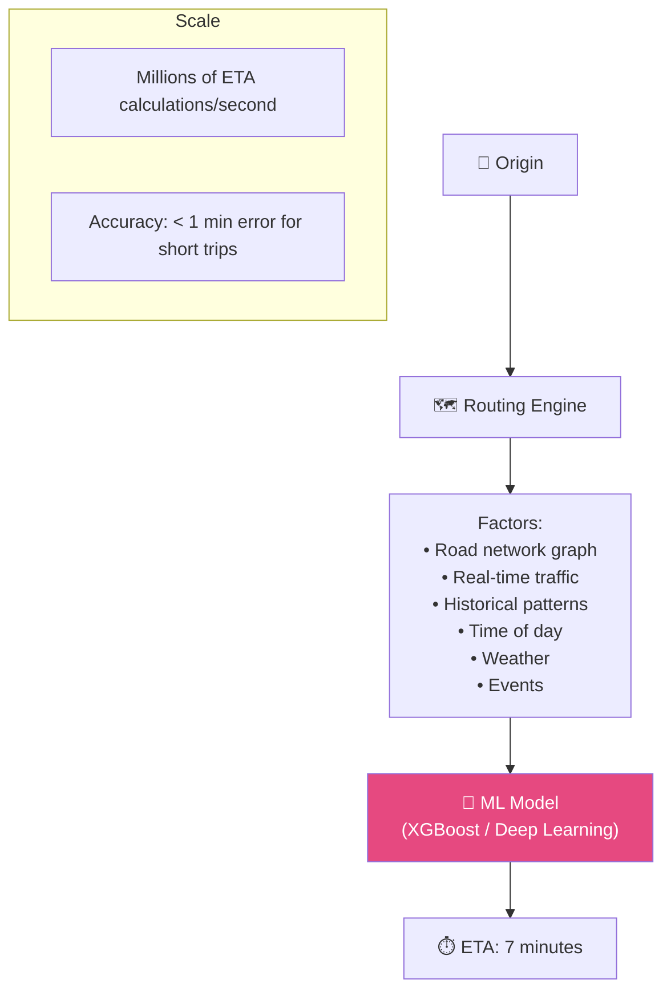
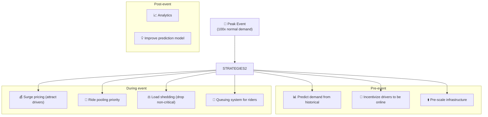

# Uber - Xử Lý Đồng Thời Cao & Geospatial

> Millions location updates/giây, real-time matching, surge pricing trên 10,000+ cities.

---

## 1. Ride Matching — The Core Problem

---

## 2. H3 — Hexagonal Spatial Index

### Driver Location Index

---

## 3. Surge Pricing — Dynamic Marketplace

---

## 4. ETA Prediction

---

## 5. Handling Peak Events (New Year's, Concert Endings)

---

## 6. So Sánh Concurrency: Uber vs Others

| Aspect | Uber | YouTube | Netflix | WhatsApp |
|---|---|---|---|---|
| **Challenge** | Geospatial real-time matching | Video processing | Bandwidth | Connection count |
| **Data model** | Location streams | Video uploads | Content catalog | Messages |
| **Peak metric** | Millions GPS/sec | 500+ hrs uploaded/min | 500M+ hrs/day | 100B+ msgs/day |
| **Key tech** | H3 + Redis + Flink | Vitess + CDN | Open Connect | BEAM actors |
| **Latency** | < 3s (match) | < 1s (start play) | < 1s (start play) | < 100ms (delivery) |

---

## Mapping → NestJS

| Pattern | Uber | NestJS Implementation |
|---|---|---|
| **H3 geospatial** | H3 hex grid | `h3-js` npm package |
| **Driver location** | Redis GeoSet | Redis `GEOADD` + `GEORADIUS` |
| **Ride matching** | Scoring + dispatch | Custom service + BullMQ |
| **Surge pricing** | Flink streaming | Kafka consumer + sliding window in Redis |
| **ETA calculation** | ML + graph routing | OSRM (Open Source Routing) + `@nestjs/microservices` |
| **Real-time tracking** | WebSocket push | `@nestjs/websockets` + Socket.IO |
