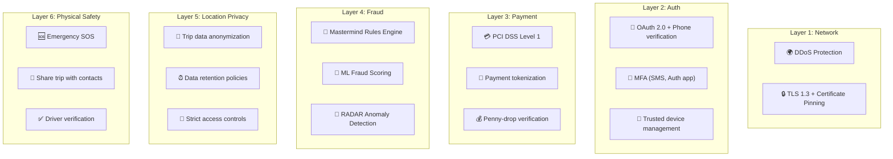
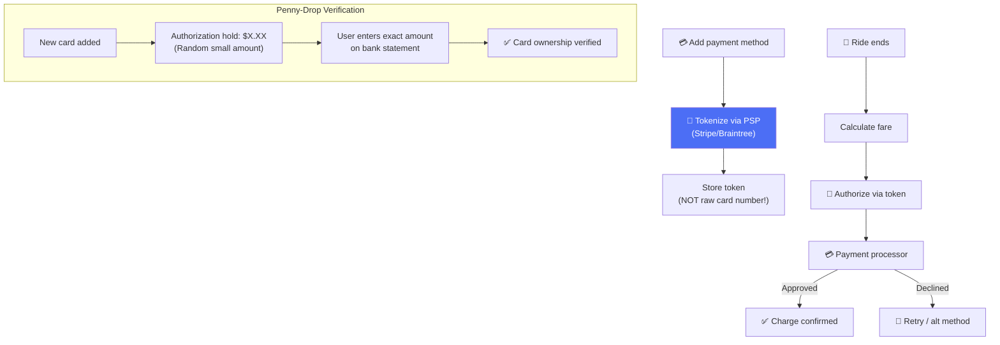
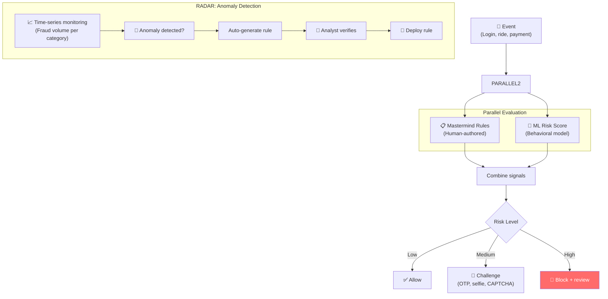
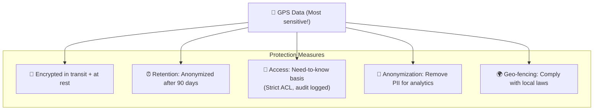

# Uber - Security Analysis

> Uber bảo vệ 130M+ accounts, xử lý $40B+ giao dịch/năm, và dữ liệu vị trí nhạy cảm.

---

## Tổng Quan

---

## 1. Payment Security

---

## 2. Fraud Detection — Mastermind + RADAR

### Common Fraud Patterns

| Pattern | Detection | Action |
|---|---|---|
| **Stolen credit card** | TC40/SAFE early signals | Block card + refund |
| **Promo abuse** | Device fingerprint + account linking | Ban linked accounts |
| **GPS spoofing** | Accelerometer + network signals | Flag + manual review |
| **Driver-rider collusion** | Trip pattern analysis | Both accounts suspended |
| **Account takeover** | New device + location change | Force re-verification |

---

## 3. Location Privacy

### 2016 Data Breach — Bài Học

| Facts | Details |
|---|---|
| **What** | 57M rider + driver records exposed |
| **How** | Attackers found AWS credentials in GitHub repo |
| **Impact** | $148M settlement, CISO hired |
| **Lessons** | 1) Never commit secrets to git |
|  | 2) Rotate credentials regularly |
|  | 3) Encrypt all PII at rest |
|  | 4) Bug bounty program expanded |

---

## 4. Physical Safety Features

| Feature | Description |
|---|---|
| **Emergency SOS** | One-tap call to emergency services + share location |
| **Trip sharing** | Share real-time trip with trusted contacts |
| **Driver verification** | Background check + photo verification |
| **PIN verification** | Rider gives PIN to correct driver |
| **Audio recording** | Opt-in trip audio recording |
| **RideCheck** | AI detects unusual stops → proactive check-in |

---

## 5. So Sánh Security: Uber vs Others

| Layer | Uber | Netflix | YouTube | WhatsApp |
|---|---|---|---|---|
| **Focus** | Payment fraud + safety | Content piracy | Copyright | Message privacy |
| **Unique** | Mastermind rules engine | DRM watermark | Content ID | Signal E2EE |
| **Threat** | Financial fraud + GPS spoof | Piracy | View fraud | Surveillance |
| **Breach notable** | 2016 (57M records) | Minimal | Minimal | Minimal |
| **Physical safety** | SOS, trip sharing | N/A | N/A | N/A |

---

## Mapping → NestJS

| Pattern | Uber | NestJS Implementation |
|---|---|---|
| **Payment tokenization** | PSP tokens | Stripe SDK + `@nestjs/config` |
| **Rules engine** | Mastermind | `json-rules-engine` npm |
| **ML fraud scoring** | Real-time inference | TensorFlow.js / Python gRPC |
| **Penny-drop** | Random hold verification | Stripe auth holds |
| **Location encryption** | TLS + at-rest | `crypto` module + PostgreSQL pgcrypto |
| **Data retention** | Auto-anonymize | Scheduled BullMQ job |
