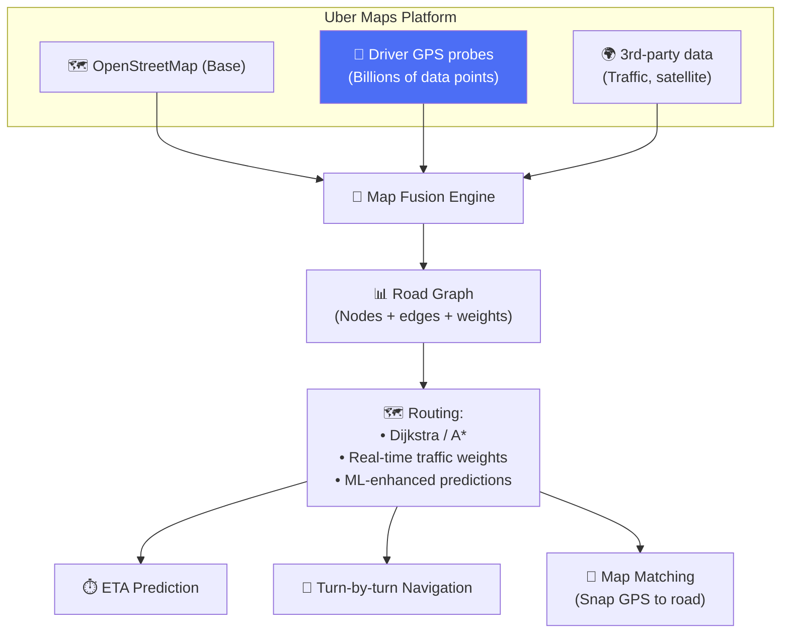
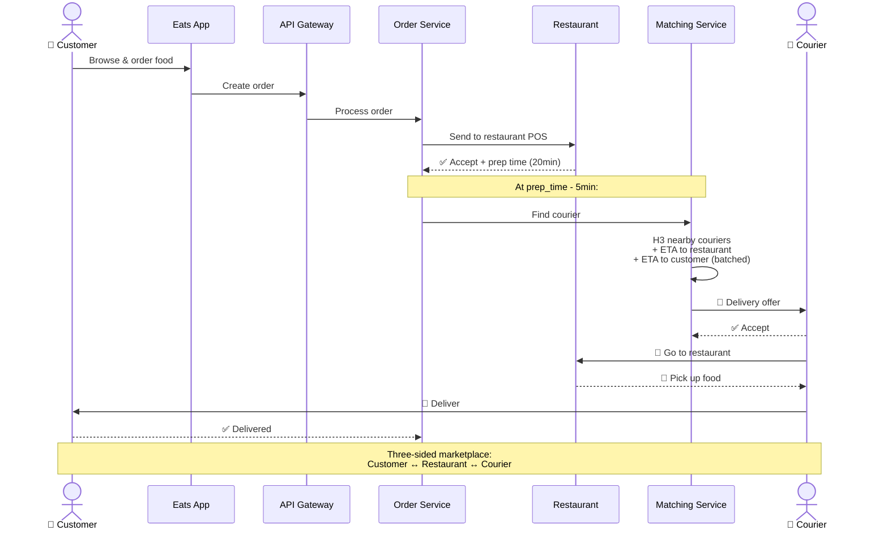
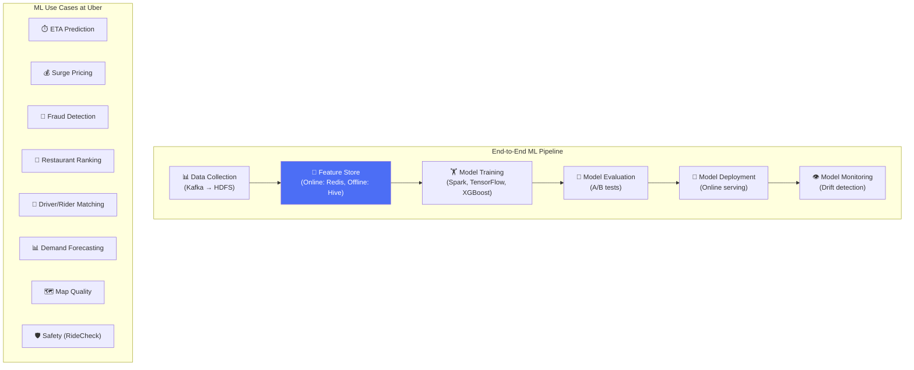
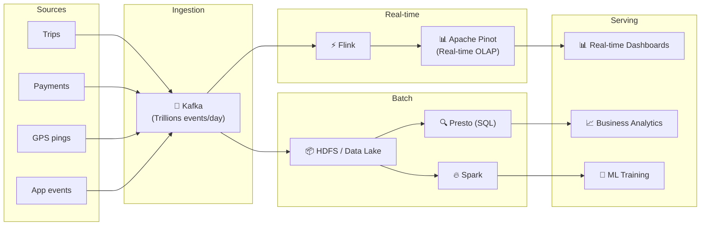
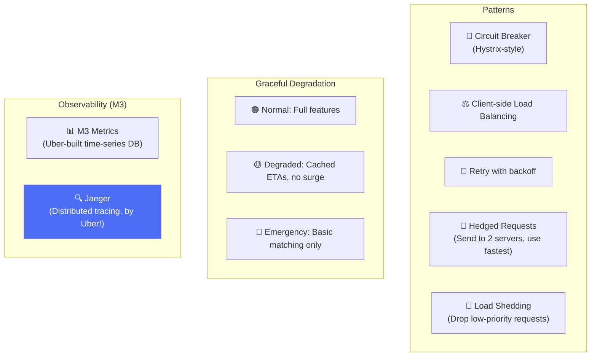

# Uber - Subsystems Analysis

> Maps, Uber Eats, Payments, Data Platform, ML (Michelangelo), Reliability.

---

## 1. Maps & Routing

**Key insight:** Uber uses **driver GPS probes** to build and continuously improve their own maps — billions of GPS points create highly accurate real-time traffic data.

---

## 2. Uber Eats Architecture

### Eats-specific Challenges

| Challenge | Solution |
|---|---|
| **Prep time prediction** | ML model per restaurant |
| **Batched deliveries** | 2 orders to same area = 1 courier |
| **Cold food** | Match courier timing with prep completion |
| **Restaurant ranking** | Personalized by cuisine preference + distance |

---

## 3. Michelangelo — ML Platform

---

## 4. Data Platform

**Apache Pinot** — Created by LinkedIn, heavily used by Uber for real-time analytics with sub-second query latency on massive datasets.

---

## 5. Reliability

**Fun fact:** Uber created **Jaeger** — open-source distributed tracing (like Twitter's Zipkin).

---

## 6. So Sánh Tổng Hợp: 6 Systems

| Dimension | Uber | YouTube | Netflix | Instagram | Twitter | WhatsApp |
|---|---|---|---|---|---|---|
| **Primary** | Ride-hailing | Video UGC | Streaming | Photo social | Microblog | Messaging |
| **Language** | Go / Java | Python/C++/Go | Java (Spring) | Python | Scala/Java | Erlang |
| **Database** | MySQL+Cassandra | Vitess+Bigtable | Cassandra+Aurora | PostgreSQL | Manhattan | Mnesia+MySQL |
| **Unique tech** | H3, DOMA | Vitess, VP9 | Open Connect | TAO | Snowflake | BEAM hot swap |
| **ML Platform** | Michelangelo | TensorFlow internal | Internal | Internal | Internal | Minimal |
| **Tracing** | Jaeger (created) | Internal | Internal | Internal | Zipkin (created) | Internal |
| **Architecture** | DOMA | Google infra | Microservices | Monolith+services | JVM microservices | Erlang cluster |

---

## Uber Unique Innovations

| Innovation | Impact |
|---|---|
| **H3** | Open-source hex grid → used by Foursquare, Databricks, DoorDash |
| **DOMA** | Domain-oriented architecture → influenced microservice design |
| **Jaeger** | Open-source distributed tracing → CNCF project |
| **Michelangelo** | End-to-end ML platform → influenced MLOps industry |
| **Apache Pinot** | Real-time analytics → used by LinkedIn, Stripe, WePay |
| **Schemaless** | MySQL wrapper for schemaless data → influenced CockroachDB |

---

## Mapping → NestJS

| Subsystem | Uber | NestJS Implementation |
|---|---|---|
| **Maps/Routing** | GPS probes + graph routing | OSRM + `h3-js` + Redis |
| **Eats ordering** | Three-sided marketplace | `@nestjs/microservices` + state machine |
| **ML Platform** | Michelangelo | MLflow + Python gRPC service |
| **Real-time analytics** | Pinot | ClickHouse + Grafana |
| **Tracing** | Jaeger | `nestjs-otel` + Jaeger backend |
| **Hedged requests** | Dual-send, use fastest | Custom interceptor with `Promise.race` |
