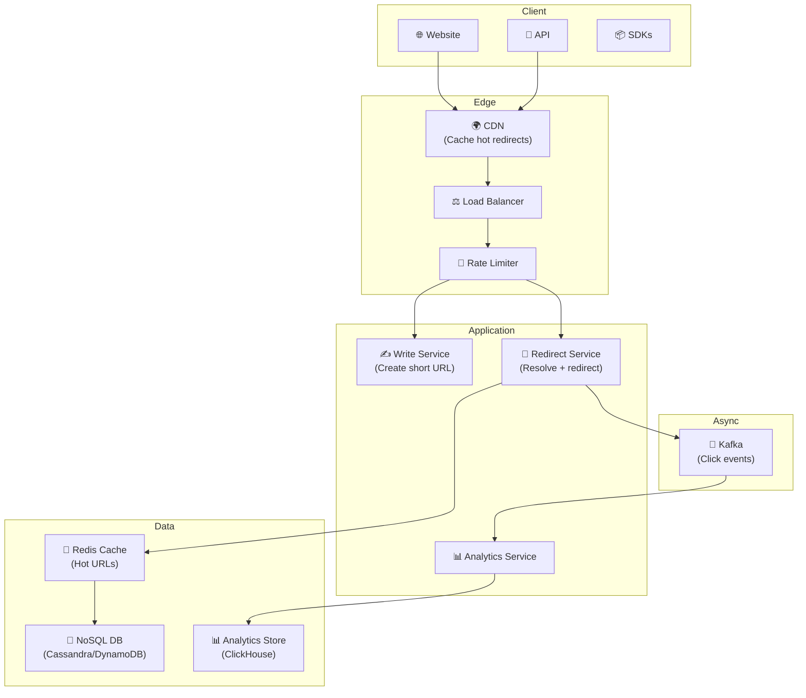
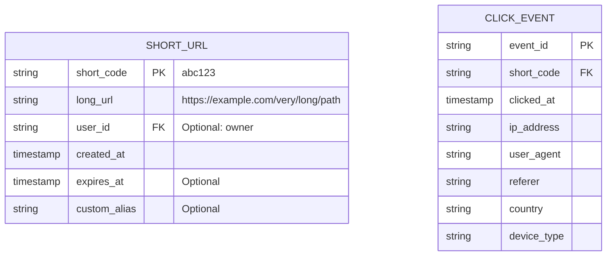
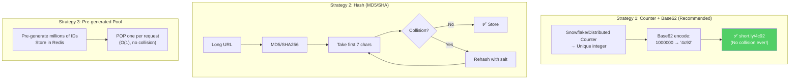
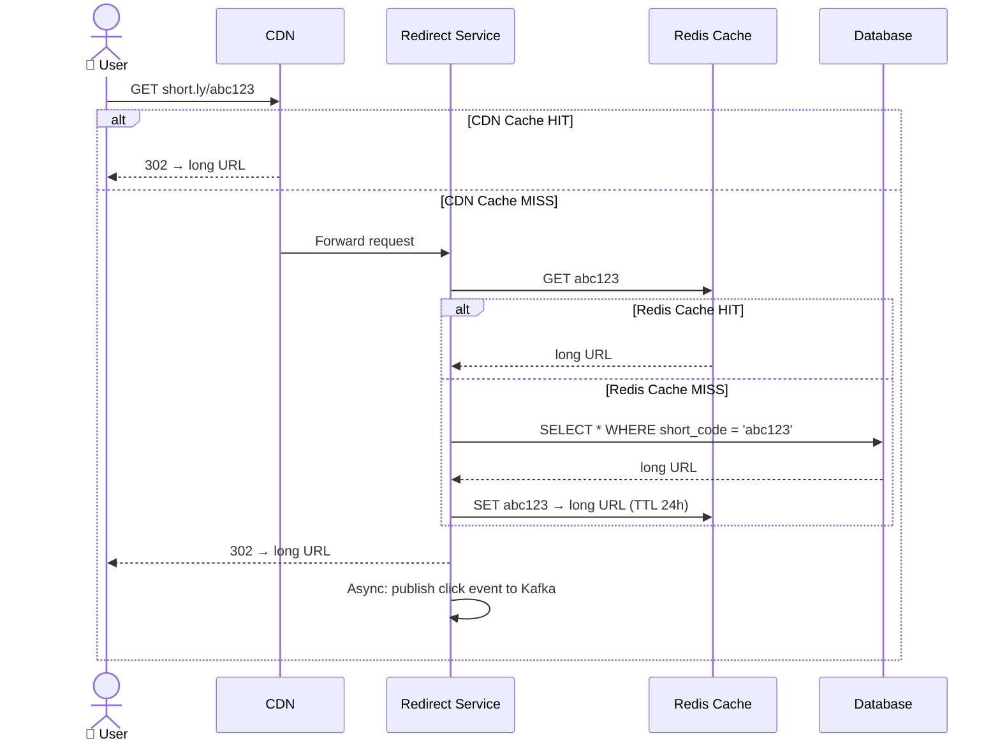

# URL Shortener - Deployment & Architecture

> Bitly xử lý **28B+ clicks/tháng**, TinyURL phục vụ **1B+ links** — classic system design.

---

## 1. Quy Mô (Bitly Reference)

| Metric | Giá trị |
|---|---|
| Links created | Billions |
| Clicks/month | 28B+ |
| Read:Write ratio | 100:1 (read-heavy) |
| Redirect latency | < 10ms (target) |
| Data per link | ~500 bytes metadata |
| Retention | Permanent (never expire) |

---

## 2. Core Architecture

---

## 3. Data Model

---

## 4. ID Generation Strategies

### Base62 Capacity

| Length | Possible URLs | Example |
|---|---|---|
| 6 chars | 62⁶ = 56.8 billion | `abc123` |
| 7 chars | 62⁷ = 3.5 trillion | `abc1234` |
| 8 chars | 62⁸ = 218 trillion | `abc12345` |

**7 characters** is the sweet spot — 3.5 trillion unique URLs.

---

## 5. Read Path — Redirect Flow

---

## Mapping → NestJS

| Component | NestJS Implementation |
|---|---|
| **Write service** | `POST /api/shorten` controller |
| **Redirect service** | `GET /:code` controller → 302 redirect |
| **ID generation** | Snowflake → `snowflake-id` npm + Base62 |
| **Cache** | `@nestjs/cache-manager` + ioredis |
| **Database** | DynamoDB / PostgreSQL / Cassandra |
| **Rate limiting** | `@nestjs/throttler` |
| **Click events** | `@nestjs/microservices` Kafka producer |
