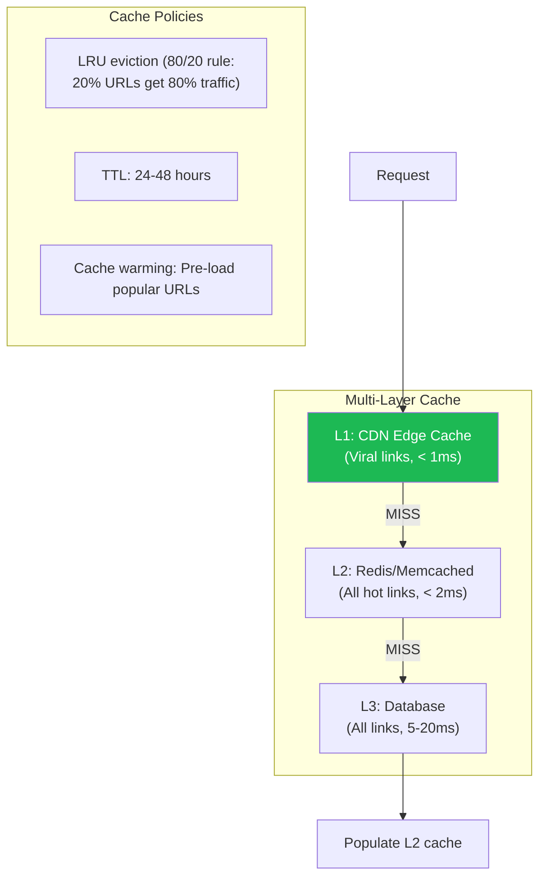
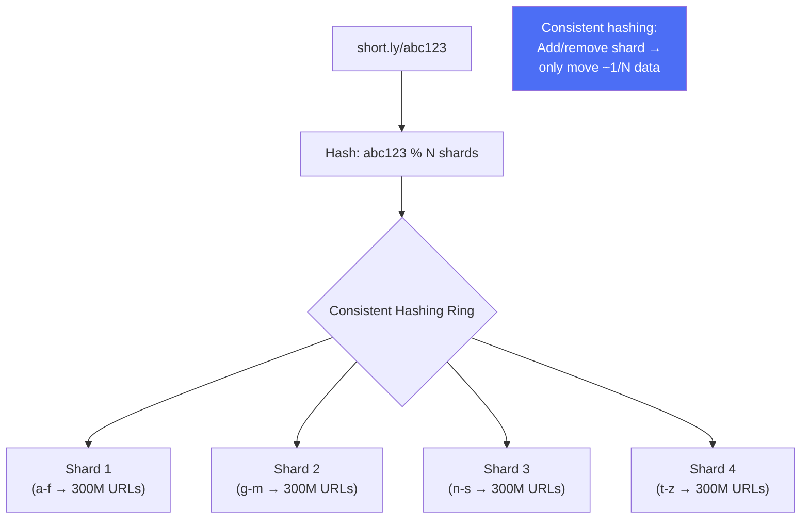
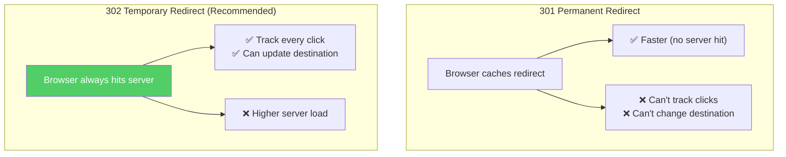
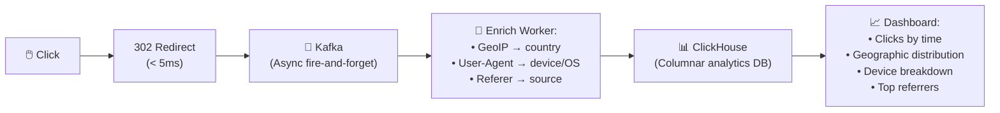
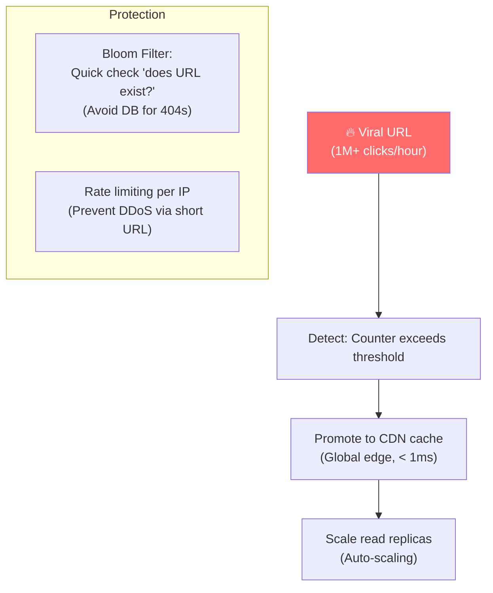
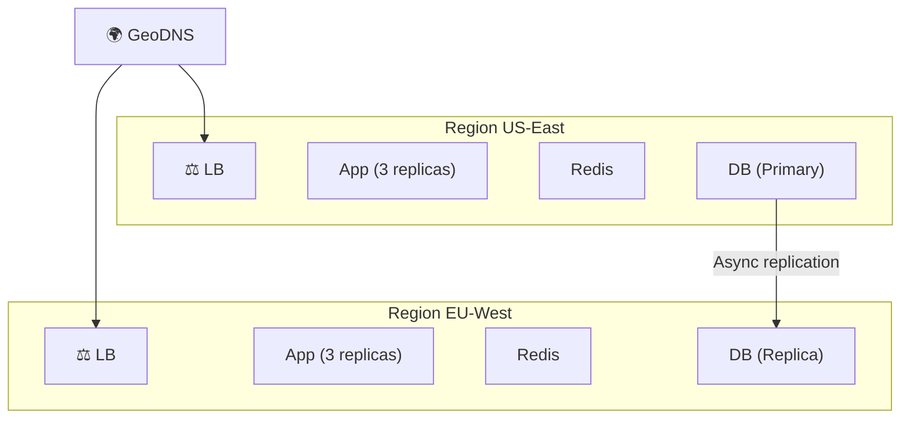

# URL Shortener - Xử Lý Đồng Thời Cao & Scalability

> 100:1 read-write ratio, < 10ms redirect latency, billions of URLs.

---

## 1. Caching Strategy — Core to Performance

### Cache Hit Rate Impact

| Cache Hit Rate | DB Queries/s (at 100K req/s) | Latency |
|---|---|---|
| **0% (no cache)** | 100,000 | 10-20ms |
| **80%** | 20,000 | ~3ms avg |
| **95%** | 5,000 | ~2ms avg |
| **99%** | 1,000 | ~1ms avg |

---

## 2. Database Sharding

### Sharding Strategies

| Strategy | Pros | Cons |
|---|---|---|
| **Hash-based** | Even distribution | Cross-shard queries hard |
| **Range-based** | Easy range queries | Hot spots possible |
| **Consistent hashing** | Minimal data movement | More complex |

---

## 3. 301 vs 302 Redirect

---

## 4. Analytics Pipeline

---

## 5. Handling Viral/Hot URLs

---

## 6. Availability — Multi-Region

---

## Mapping → NestJS

| Pattern | NestJS Implementation |
|---|---|
| **Multi-layer cache** | CDN (CloudFront) + `@nestjs/cache-manager` + Redis |
| **Sharding** | Consistent hash ring + multiple DB connections |
| **Bloom filter** | `bloom-filters` npm in Redis |
| **Analytics pipeline** | Kafka producer (async) → ClickHouse |
| **Hot URL detection** | Redis counter + threshold alert |
| **Rate limiting** | `@nestjs/throttler` per IP |
| **302 redirect** | `@Redirect()` decorator or `res.redirect(302)` |
