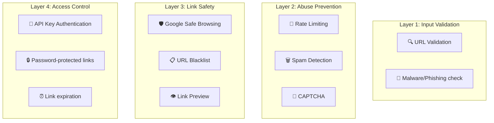
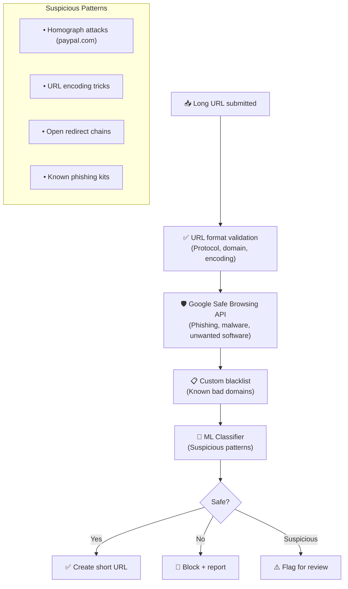
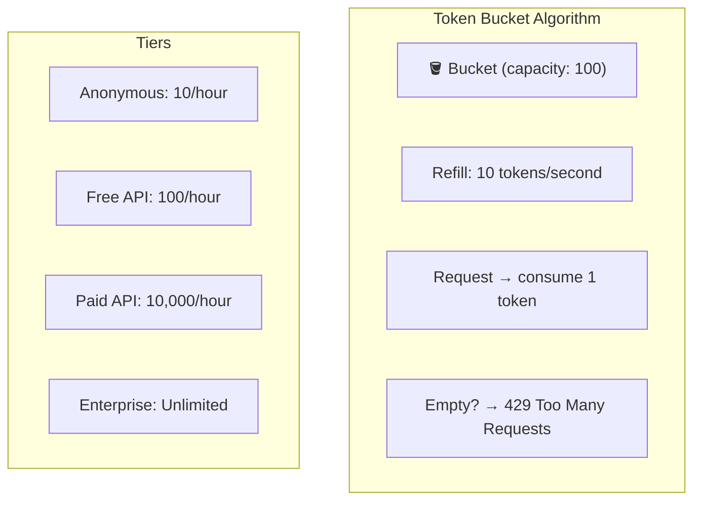
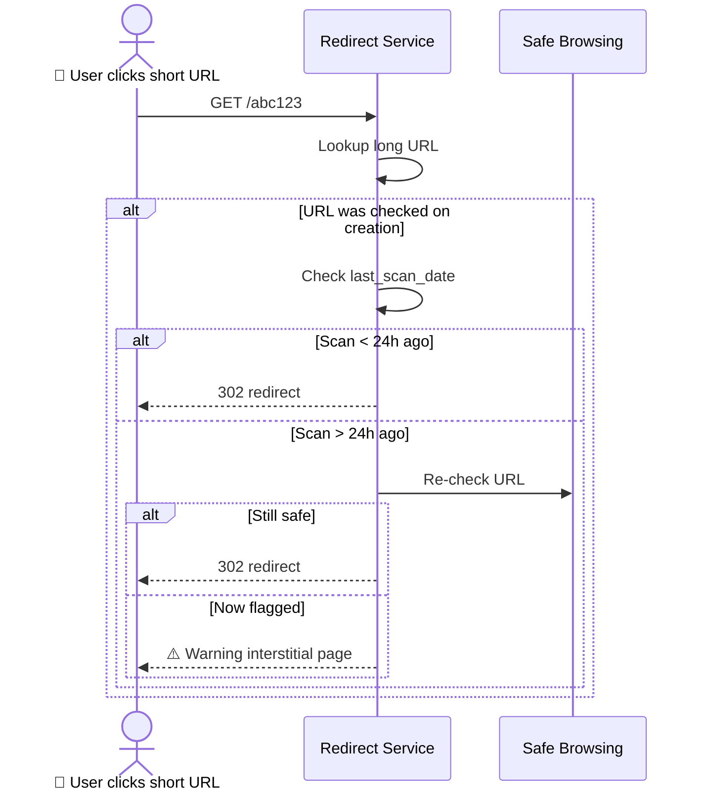

# URL Shortener - Security Analysis

> URL shorteners are prime targets for phishing, spam, malware distribution.

---

## Tổng Quan

---

## 1. Malicious URL Detection

---

## 2. Rate Limiting

---

## 3. Click-time Safety

---

## 4. So Sánh Security: URL Shortener vs Others

| Layer | URL Shortener | Stripe | Amazon | WhatsApp |
|---|---|---|---|---|
| **Primary threat** | Phishing/malware | Payment fraud | Marketplace fraud | Surveillance |
| **Detection** | Safe Browsing + ML | Radar network ML | A-to-Z + seller verification | E2EE |
| **Rate limiting** | Per-IP / per-key | Per-API-key | Per-account | Connection-level |
| **Unique** | Interstitial warnings | Idempotency keys | Chaotic storage | Signal Protocol |

---

## Mapping → NestJS

| Pattern | NestJS Implementation |
|---|---|
| **Safe Browsing** | Google Safe Browsing API v4 |
| **URL validation** | `class-validator` + custom pipe |
| **Rate limiting** | `@nestjs/throttler` (per IP + per key) |
| **Blacklist** | Redis SET + `SISMEMBER` |
| **ML classifier** | Python microservice via gRPC |
| **Link expiration** | PostgreSQL TTL + Redis TTL |
| **Password links** | `bcrypt` hash in DB |
