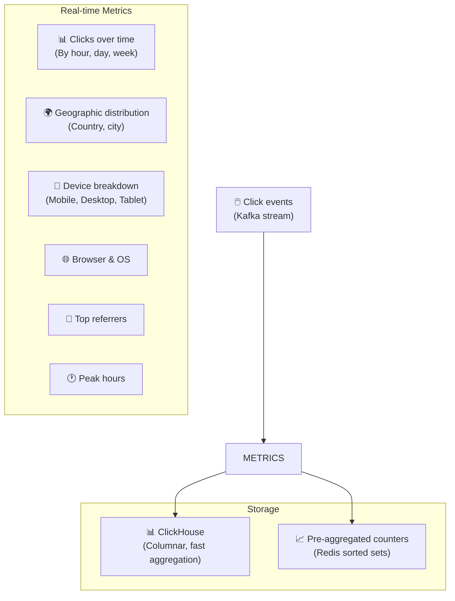
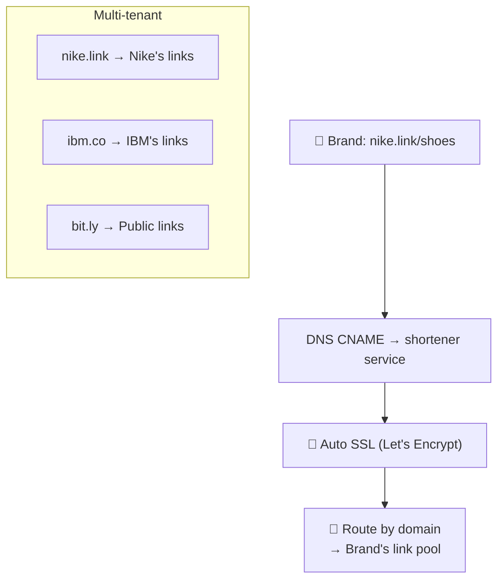
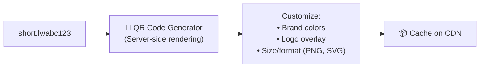
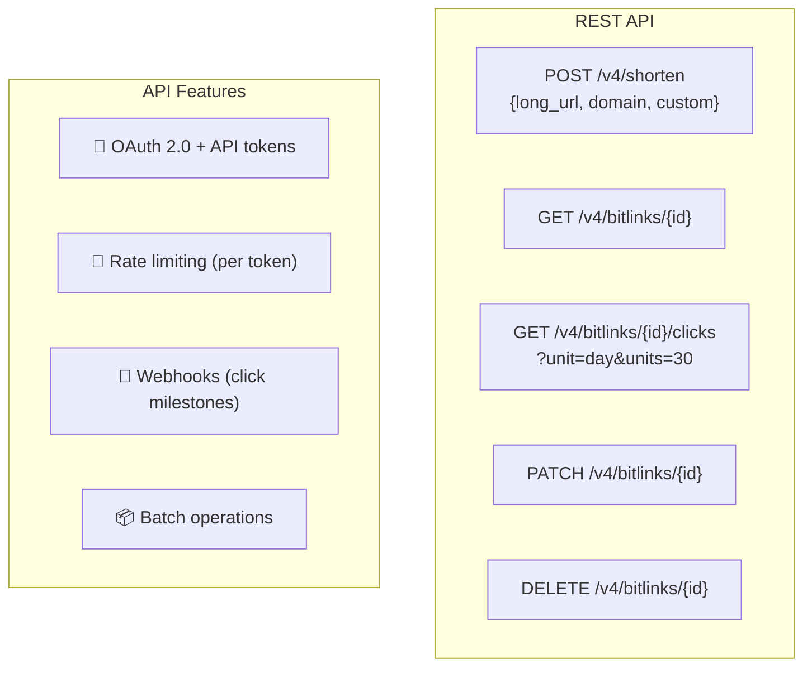

# URL Shortener - Subsystems Analysis

> Analytics, Custom Domains, QR Codes, Link Management, API Design.

---

## 1. Analytics Dashboard

---

## 2. Custom Short Domains

---

## 3. QR Code Generation

---

## 4. Link Management Features

| Feature | Description |
|---|---|
| **Custom aliases** | `short.ly/my-brand-campaign` |
| **Link expiration** | Auto-expire after date or N clicks |
| **Link editing** | Change destination URL after creation |
| **UTM builder** | Auto-append UTM parameters |
| **A/B testing** | Split traffic between destinations |
| **Deep links** | Mobile app deep linking |
| **Bulk operations** | CSV import/export |
| **Tags & folders** | Organize links by campaign |

---

## 5. API Design (Bitly-style)

---

## 6. Key Design Decisions Summary

| Decision | Choice | Rationale |
|---|---|---|
| **ID generation** | Snowflake → Base62 | Collision-free, distributed |
| **Database** | Cassandra / DynamoDB | Key-value, horizontal scale |
| **Cache** | Redis (LRU) | 80/20 rule, sub-ms lookups |
| **Redirect type** | 302 (Temporary) | Click tracking required |
| **Analytics** | Async (Kafka → ClickHouse) | Don't slow down redirects |
| **Availability** | Multi-region active-active | Global users, low latency |
| **API style** | REST + versioned | Developer-friendly |

---

## So Sánh: URL Shortener Design Patterns Applied

| Pattern | URL Shortener | Also Used In |
|---|---|---|
| **Base62/Snowflake** | ID generation | Twitter (Snowflake), Instagram |
| **Consistent hashing** | DB sharding | Cassandra, DynamoDB, Discord |
| **Bloom filter** | Existence check | Google Bigtable, Medium |
| **CDN caching** | Hot URL redirect | Netflix, YouTube, Spotify |
| **Async analytics** | Kafka → ClickHouse | Uber, Spotify, Instagram |
| **Rate limiting** | Token bucket | Stripe, GitHub, All APIs |
| **302 redirect** | Trackable redirect | All URL shorteners |

---

## Mapping → NestJS (Full Implementation)

| Component | NestJS Implementation |
|---|---|
| **Shorten API** | `@Post('shorten')` + DTO validation |
| **Redirect** | `@Get(':code')` + `@Redirect()` |
| **ID generation** | `snowflake-id` + custom Base62 |
| **Cache** | `CacheModule` + Redis |
| **Database** | TypeORM + PostgreSQL (or DynamoDB) |
| **Analytics** | Kafka producer → consumer → ClickHouse |
| **Rate limiting** | `@nestjs/throttler` |
| **Auth** | `@nestjs/passport` + API key strategy |
| **QR codes** | `qrcode` npm package |
| **Custom domains** | Multi-tenant guard + domain lookup |
