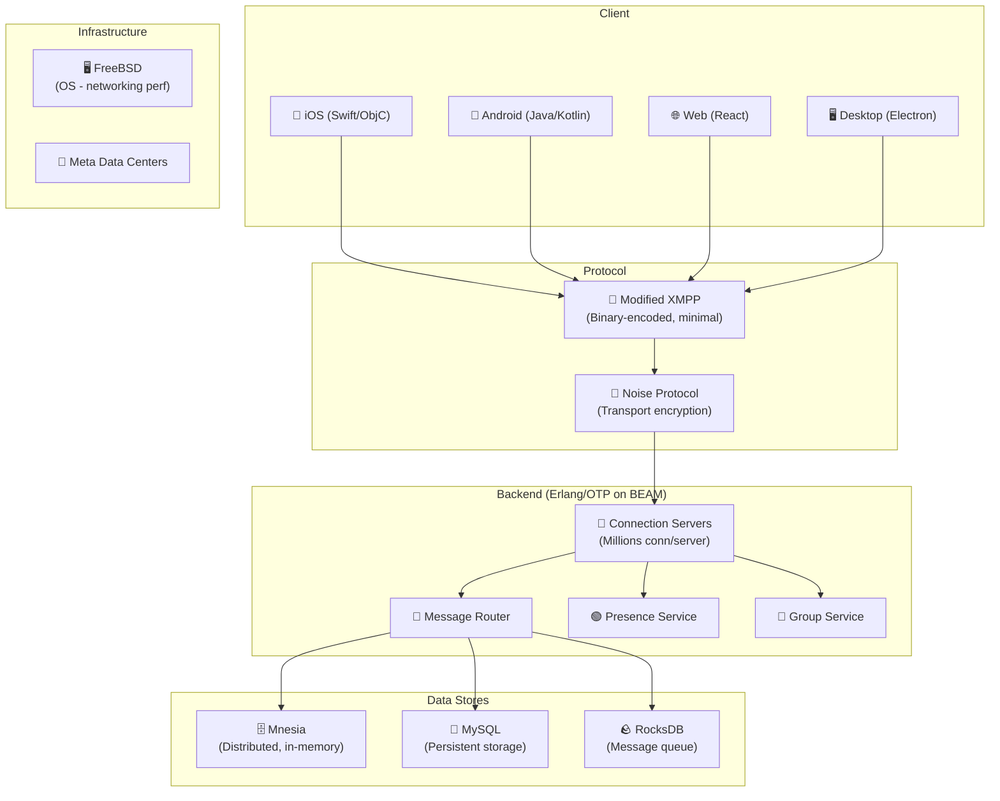
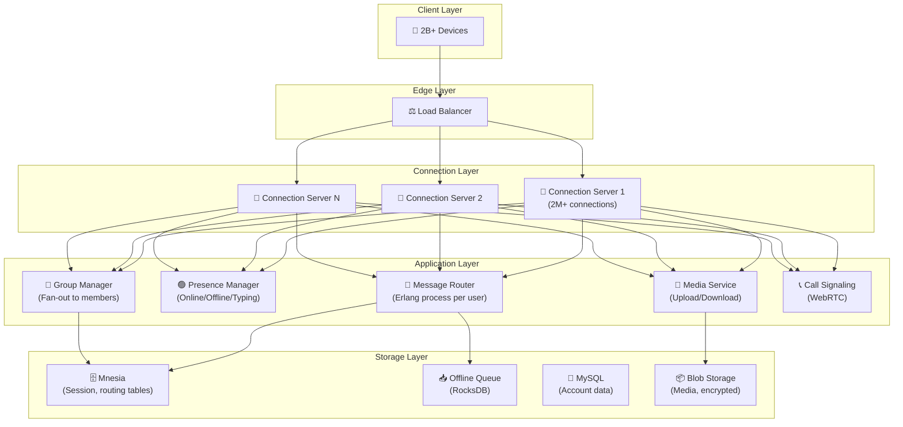
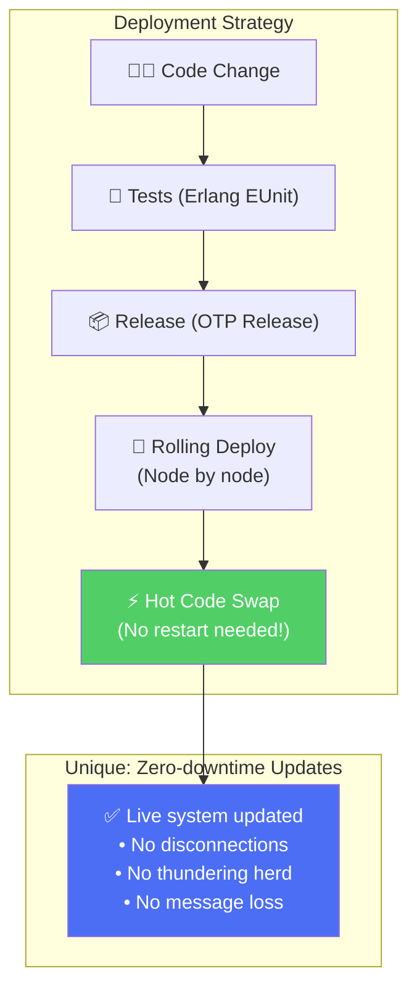

# WhatsApp - Deployment & Architecture

> WhatsApp phục vụ **2B+ users** với team nhỏ nhờ Erlang/BEAM — xử lý **100B+ messages/ngày**.

---

## 1. Quy Mô

| Metric | Giá trị |
|---|---|
| Monthly Active Users | 2+ tỷ |
| Messages per day | 100+ tỷ |
| Concurrent connections | 1+ tỷ |
| Media shared/day | 7+ tỷ (ảnh, video, audio) |
| Voice/Video calls/day | 2+ tỷ phút |
| Engineers (early days) | ~50 engineers cho 900M users |

---

## 2. Technology Stack

### Tại Sao Erlang?

| Feature | Lợi ích cho WhatsApp |
|---|---|
| **Lightweight processes** | 1 process per connection, millions/server |
| **"Let it crash"** | 1 user crash không ảnh hưởng others |
| **Hot code swap** | Update code KHÔNG cần restart server |
| **OTP Supervision** | Auto-restart crashed processes |
| **Pattern matching** | Xử lý messages routing cực nhanh |
| **Distributed** | Built-in clustering across nodes |

### Tại Sao FreeBSD?

- Networking stack performance vượt trội Linux cho concurrent TCP connections
- Tuned kernel cho millions simultaneous connections per server
- WhatsApp custom-patched cả BEAM VM lẫn FreeBSD kernel

---

## 3. System Architecture

---

## 4. Deployment & Operations

**Key insight:** Nhờ Erlang hot code swap, WhatsApp update code mà KHÔNG cần restart servers → không có hiện tượng millions users reconnect cùng lúc (thundering herd).

---

## So Sánh Stack: WhatsApp vs Instagram vs Twitter

| Aspect | WhatsApp | Instagram | Twitter/X |
|---|---|---|---|
| **Language** | Erlang/OTP | Python (Django) | Scala/Java (JVM) |
| **VM/Runtime** | BEAM | CPython | JVM |
| **OS** | FreeBSD | Linux | Linux |
| **Concurrency model** | Actor (1 process/user) | Async (Celery) | Finagle (Futures) |
| **Protocol** | Modified XMPP | HTTP/REST | HTTP/REST |
| **Primary DB** | Mnesia + MySQL | PostgreSQL | Manhattan |
| **Deployment** | Hot code swap | Rolling restart | K8s rolling |
