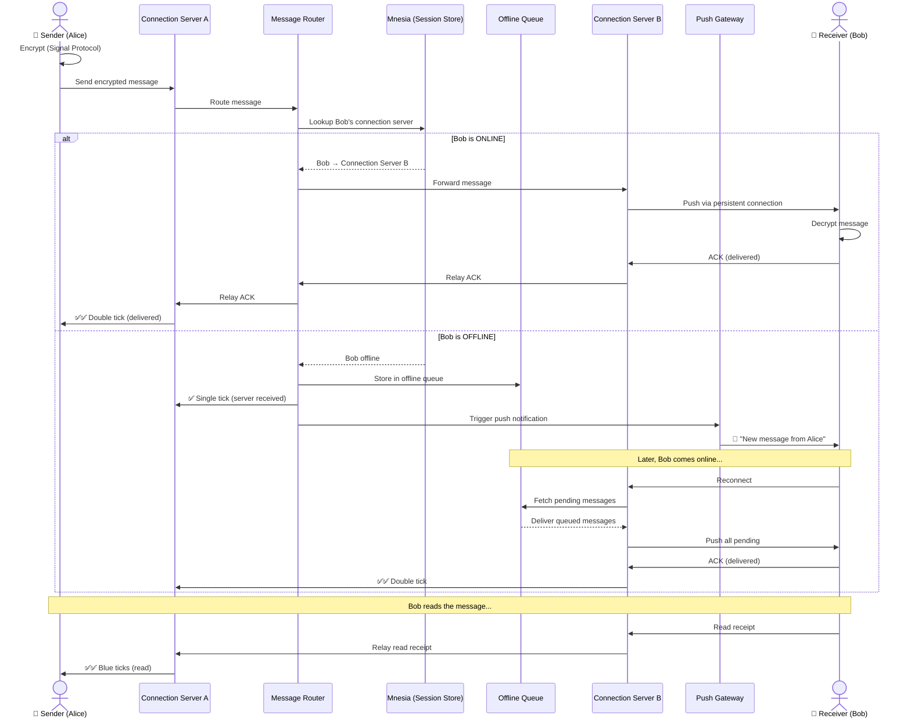
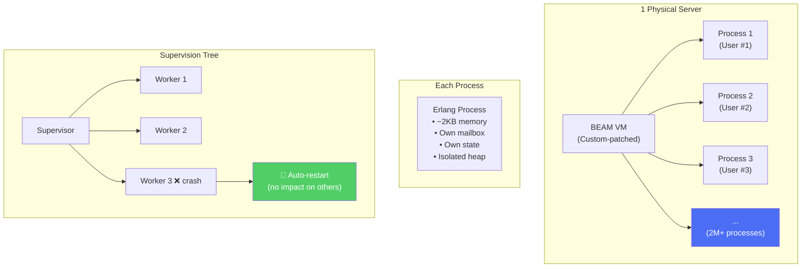
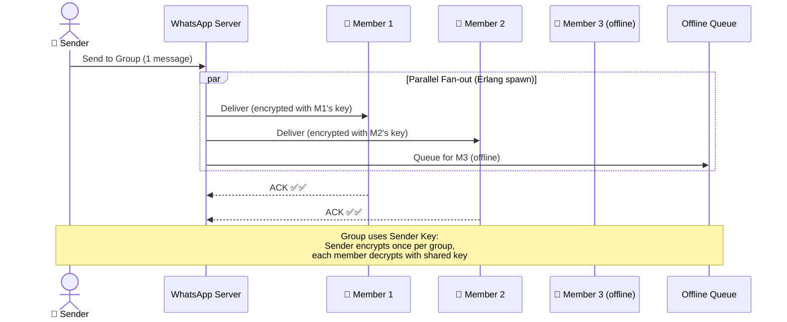
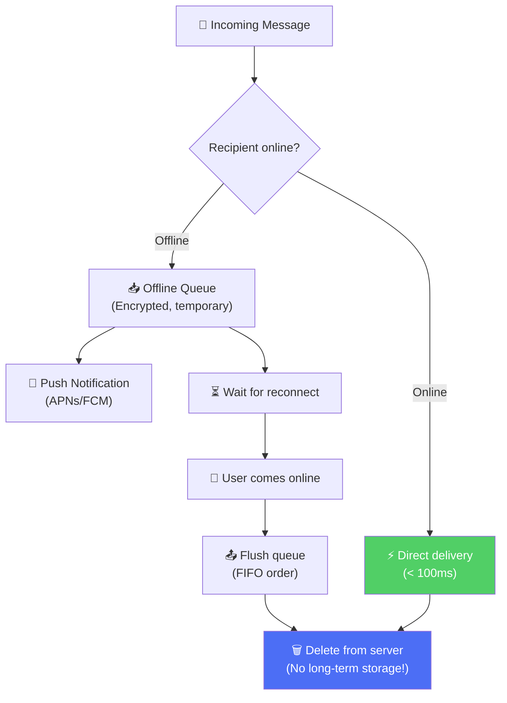
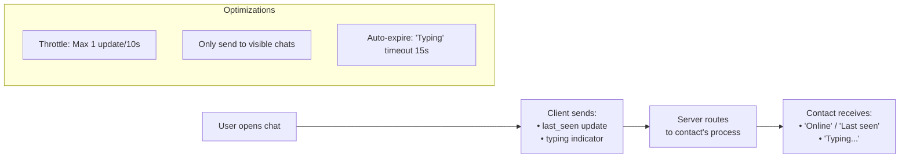
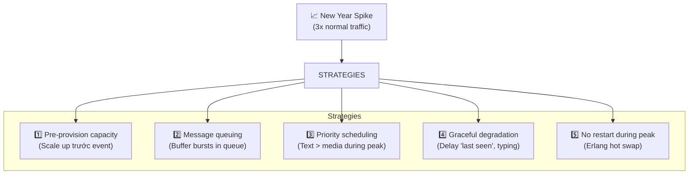

# WhatsApp - Xử Lý Đồng Thời Cao & Message Delivery

> 100B+ messages/ngày, 2M+ connections per server, guaranteed delivery.

---

## 1. Message Delivery Flow

### Delivery Guarantees — The Checkmark System

| Status | Symbol | Meaning | Trigger |
|---|---|---|---|
| **Sent** | ✅ | Server received & queued | Server ACK |
| **Delivered** | ✅✅ | Recipient device received | Client ACK |
| **Read** | 🔵🔵 | Recipient opened chat | Client read event |

---

## 2. Connection Management — Millions Per Server

| Metric | Value |
|---|---|
| Memory per process | ~2-4 KB |
| Processes per server | 2M+ |
| Message latency | < 100ms (same region) |
| Context switch cost | Microseconds (not OS threads!) |

---

## 3. Group Messaging Fan-out

**Sender Key optimization:** Thay vì encrypt N lần cho N members, sender encrypt 1 lần với group key → tất cả members decrypt bằng shared key → giảm compute N lần.

---

## 4. Store-and-Forward Architecture

> **Key principle:** Messages are **NOT stored permanently** on WhatsApp servers. Server chỉ là transit point. Sau khi delivered → xóa khỏi server.

---

## 5. Presence & Typing Indicators

---

## 6. Handling Traffic Spikes (New Year's Eve)

WhatsApp xử lý **75B+ messages** vào đêm giao thừa — peak gấp 2-3x ngày thường.

---

## Mapping → NestJS

| Pattern | WhatsApp | NestJS Implementation |
|---|---|---|
| **Persistent connections** | XMPP over TCP | `@nestjs/websockets` + Socket.IO |
| **1 process per user** | Erlang process | Worker pool + Redis session store |
| **Offline queue** | Mnesia/RocksDB | Bull queue + Redis |
| **ACK system** | Custom protocol | Socket.IO `acknowledgements` |
| **Presence** | Erlang distributed | Redis pub/sub + `SET` with TTL |
| **Group fan-out** | Erlang spawn parallel | BullMQ fan-out job |
| **Push notifications** | APNs/FCM | `firebase-admin` + `node-apn` |
