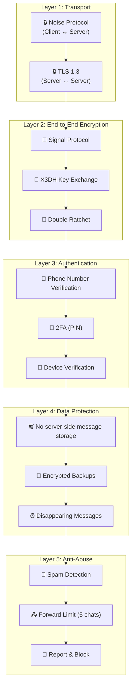
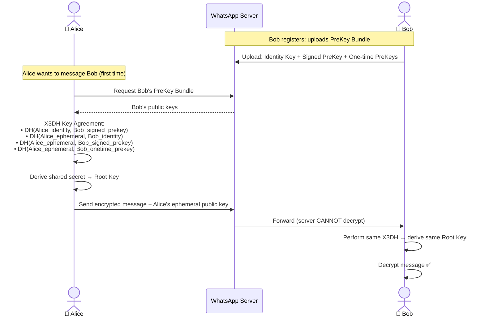
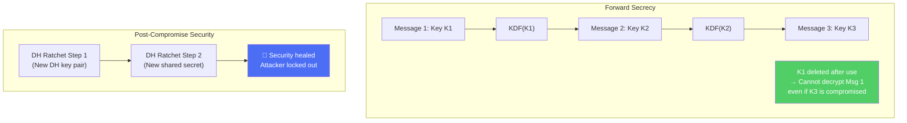
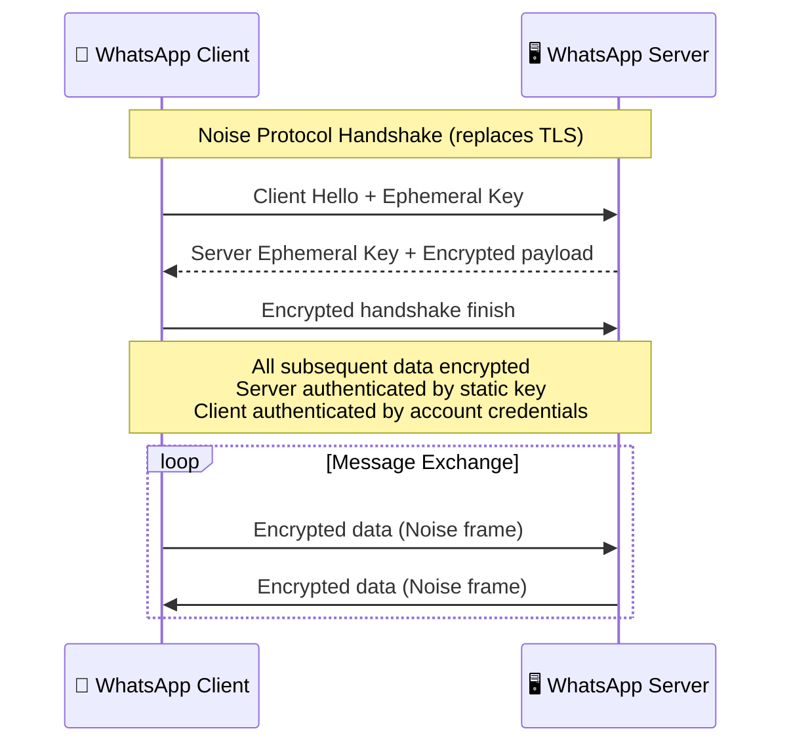
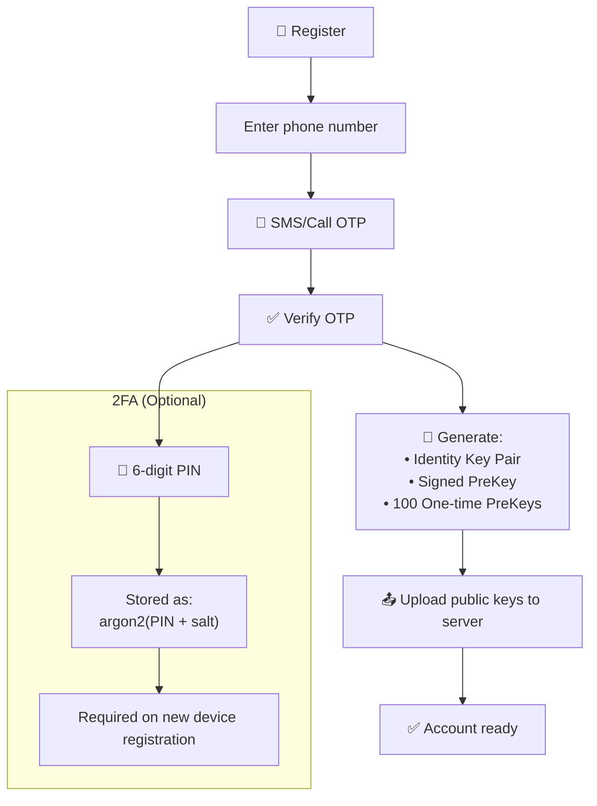
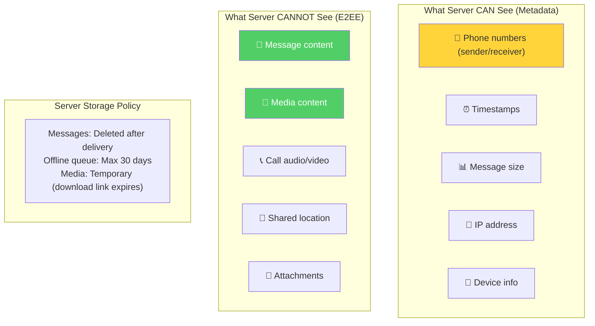
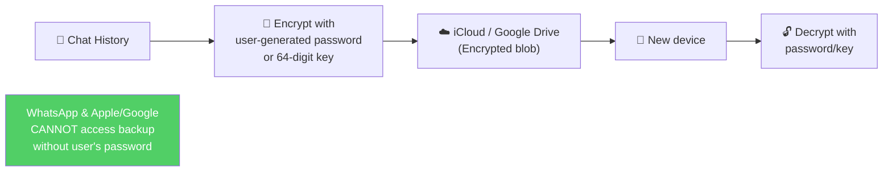
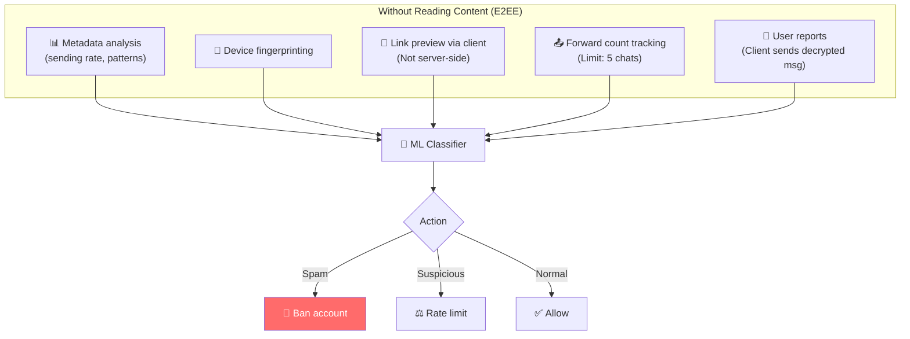

# WhatsApp - Security Analysis

> WhatsApp là benchmark cho E2EE messaging — Signal Protocol bảo vệ 100B+ messages/ngày.

---

## Tổng Quan: Defense in Depth

---

## 1. Signal Protocol — E2E Encryption

### 1.1 Key Exchange (X3DH)

### 1.2 Double Ratchet Algorithm

| Property | Giải thích |
|---|---|
| **Forward Secrecy** | Compromise key hiện tại → KHÔNG decrypt được messages cũ |
| **Post-Compromise Security** | Sau khi attacker mất access → encryption tự heal |
| **Per-message keys** | Mỗi message một key riêng → compromise 1 ≠ compromise all |
| **AES-256-CBC** | Symmetric encryption cho message content |
| **HMAC-SHA256** | Authentication/integrity check |

---

## 2. Transport Security — Noise Protocol

**Tại sao Noise thay vì TLS?** Noise nhẹ hơn, ít round-trips hơn, tối ưu cho mobile (tiết kiệm battery + bandwidth).

---

## 3. Authentication & Registration

---

## 4. Data Protection — Zero Knowledge

### Encrypted Backups

---

## 5. Anti-Abuse & Spam Prevention

**Challenge:** Vì E2EE, WhatsApp KHÔNG đọc được nội dung → chỉ detect spam qua metadata + user reports.

---

## 6. So Sánh Security: WhatsApp vs Instagram vs Twitter

| Layer | WhatsApp | Instagram | Twitter/X |
|---|---|---|---|
| **E2E Encryption** | ✅ Signal Protocol (default) | ❌ Removed (May 2026) | ❌ None |
| **Transport** | Noise Protocol | TLS 1.3 | TLS 1.3 |
| **Server storage** | Temp only (delete after delivery) | Permanent | Permanent |
| **Auth** | Phone + OTP + 2FA PIN | OAuth 2.0 + 2FA | OAuth 2.0 + 2FA |
| **Metadata** | Collected by Meta | Collected by Meta | Collected by X |
| **Content moderation** | Client-side reports only | Server-side AI | Server-side AI + Community Notes |
| **Forward secrecy** | ✅ Per-message keys | ❌ | ❌ |
| **Backup encryption** | ✅ User-controlled | ❌ | ❌ |

---

## Mapping → NestJS

| Pattern | WhatsApp | NestJS Implementation |
|---|---|---|
| **E2E Encryption** | Signal Protocol | `libsignal-protocol-javascript` |
| **Key Exchange** | X3DH | `@noble/curves` (Curve25519) |
| **Symmetric Encryption** | AES-256-CBC | `crypto` module (Node.js built-in) |
| **Transport** | Noise Protocol | TLS + `@nestjs/websockets` |
| **OTP Auth** | SMS/Call verification | Twilio + `speakeasy` (TOTP) |
| **2FA PIN** | Argon2 hashed | `argon2` npm package |
| **Forward Limit** | Track forward count | Redis counter per message_id |
| **Encrypted Backup** | User-key encrypted | `crypto.createCipher` + user passphrase |

> [!IMPORTANT]
> **Bài học #1 từ WhatsApp:** E2EE messaging có thể hoạt động ở quy mô 2B+ users. Trade-off: server KHÔNG THỂ moderate content → phải dựa vào metadata analysis + user reports.
