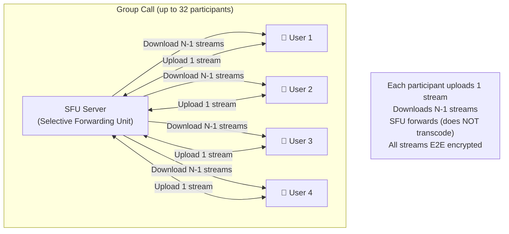
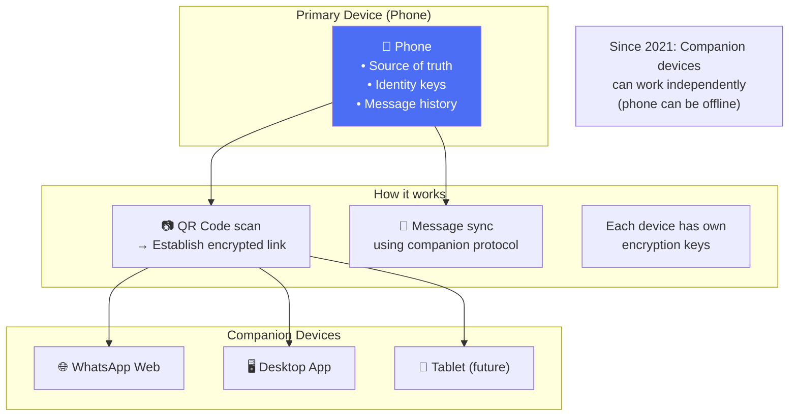
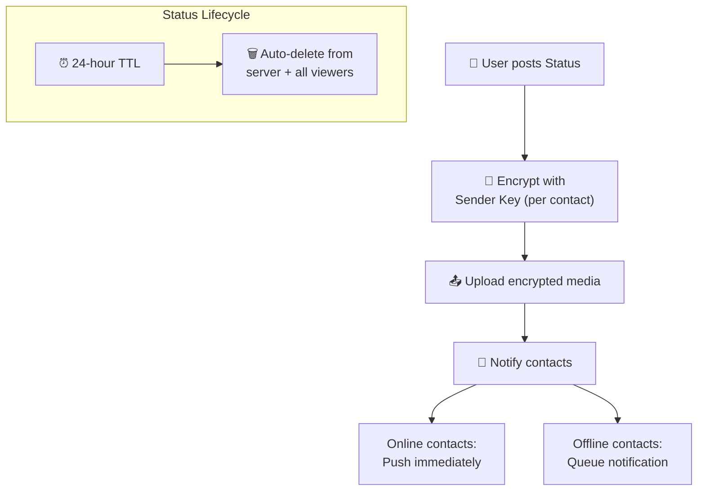
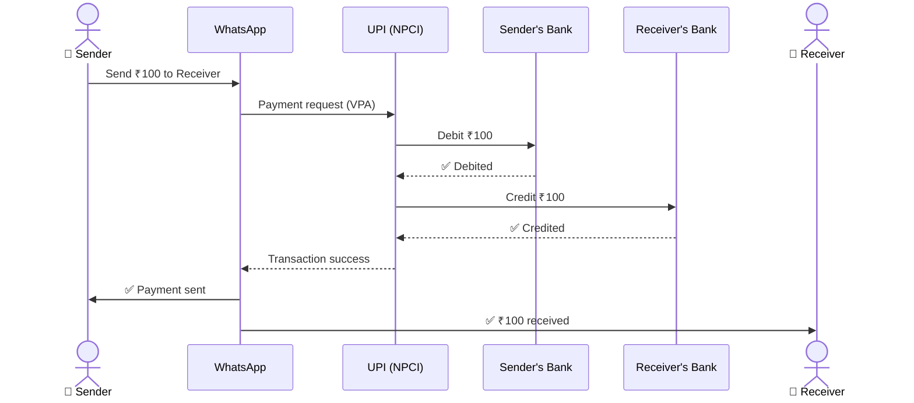

# WhatsApp - Subsystems Analysis

> Voice/Video calls, Status/Stories, Multi-device, Payments, Reliability.

---

## 1. Voice & Video Calls (WebRTC)

```mermaid
sequenceDiagram
    actor Alice as 👤 Alice
    participant Server as Signaling Server
    participant TURN as TURN/STUN Server
    actor Bob as 👤 Bob

    Alice->>Server: Call request (encrypted signaling)
    Server->>Bob: Incoming call notification

    Bob->>Server: Accept call
    
    par ICE Candidate Exchange
        Alice->>Server: ICE candidates (network info)
        Server->>Bob: Forward candidates
        Bob->>Server: ICE candidates
        Server->>Alice: Forward candidates
    end

    alt Direct P2P possible
        Alice<-->Bob: Direct P2P connection<br/>(E2E encrypted, lowest latency)
    else NAT/Firewall blocks P2P
        Alice<-->TURN: Relay through TURN server
        TURN<-->Bob: Relay through TURN server
        Note over TURN: TURN relays encrypted packets<br/>(Cannot see content)
    end
```

### Group Calls



---

## 2. Multi-Device Architecture



**Key change (2021+):** Trước đây Web phải proxy qua Phone. Giờ mỗi device có own encryption keys → hoạt động độc lập.

---

## 3. Status/Stories System



---

## 4. WhatsApp Payments (India)



---

## 5. Reliability & SRE

```mermaid
flowchart TB
    subgraph "Erlang Fault Tolerance"
        crash["❌ Process crash"] --> supervisor["Supervisor detects"]
        supervisor --> restart["🔄 Restart process<br/>(microseconds)"]
        restart --> resume["✅ User reconnects<br/>(transparent)"]
    end

    subgraph "Zero-downtime Deployment"
        update["📦 Code update"] --> hot_swap["⚡ Hot code swap"]
        hot_swap --> no_restart["✅ No server restart<br/>No user disconnection"]
    end

    subgraph "Data Durability"
        msg_in["Message received"] --> replicate["Replicate to N nodes"]
        replicate --> ack_server["ACK only after replication"]
        ack_server --> durable["✅ Message won't be lost"]
    end
```



### Uptime & SLAs

| Metric | Target |
|---|---|
| Availability | 99.99% (< 53 min downtime/year) |
| Message delivery | < 200ms (same region) |
| Offline delivery | Within seconds of reconnect |
| Call setup | < 3 seconds |

---

## 6. So Sánh Tổng Hợp: WhatsApp vs Instagram vs Twitter

| Dimension | WhatsApp | Instagram | Twitter/X |
|---|---|---|---|
| **Primary** | Messaging | Photo/Video sharing | Microblogging |
| **Language** | Erlang/OTP | Python/Django | Scala/Java |
| **Concurrency** | Actor model (BEAM) | Async (Celery) | Futures (Finagle) |
| **Encryption** | E2EE (Signal) | TLS only | TLS only |
| **Server storage** | Temporary (transit) | Permanent | Permanent |
| **Protocol** | XMPP (modified) | HTTP/REST | HTTP/REST |
| **Fan-out** | Group fan-out (< 1024) | Hybrid push/pull | Hybrid push/pull |
| **Unique tech** | BEAM hot swap | TAO social graph | Snowflake IDs |
| **Key innovation** | E2EE at 2B scale | Media pipeline | Real-time search |

---

## Mapping → NestJS

| Subsystem | WhatsApp | NestJS Implementation |
|---|---|---|
| **Voice/Video** | WebRTC + TURN | `mediasoup` or `livekit` + `@nestjs/websockets` |
| **Multi-device** | Companion protocol | Device registry in Redis + per-device keys |
| **Status/Stories** | 24h TTL + E2E | Redis `SET` with TTL + Bull delayed job for cleanup |
| **Payments** | UPI integration | Stripe/payment gateway + `@nestjs/microservices` |
| **Fault tolerance** | Erlang supervisor | PM2 cluster + K8s liveness probes |
| **Hot deploy** | BEAM hot swap | K8s rolling update (closest equivalent) |
