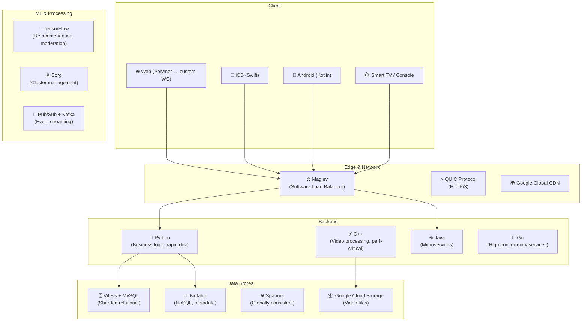
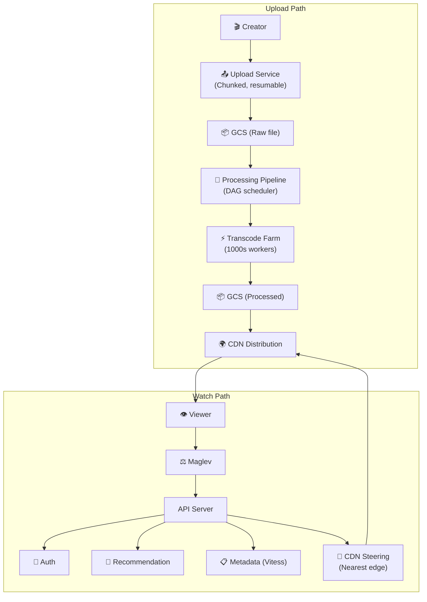
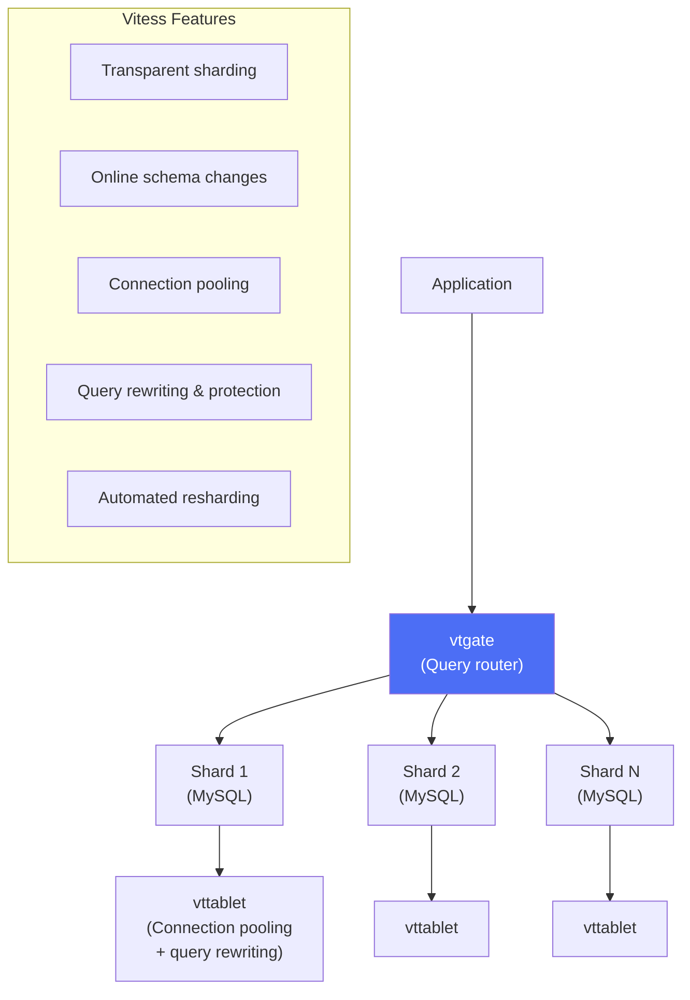
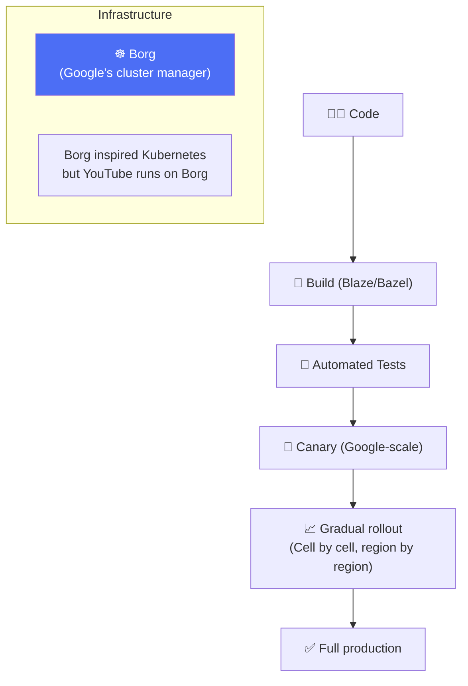

# YouTube - Deployment & Architecture

> YouTube phục vụ **2.5B+ monthly users**, **800M+ videos**, **1B+ giờ xem/ngày**.

---

## 1. Quy Mô

| Metric | Giá trị |
|---|---|
| Monthly Active Users | 2.5B+ |
| Videos in catalog | 800M+ |
| Watch hours/day | 1B+ |
| Uploads/minute | 500+ giờ video |
| Bandwidth | ~11% internet traffic toàn cầu |
| Revenue (2024) | $36B+ (ads) |
| Employees | 3,000+ |

---

## 2. Technology Stack

### Unique Google Infrastructure

| Component | Description |
|---|---|
| **Vitess** | MySQL sharding middleware — created by YouTube, now CNCF |
| **Bigtable** | Distributed NoSQL (wide-column) — billions of rows |
| **Spanner** | Globally consistent SQL — TrueTime atomic clocks |
| **Borg** | Cluster manager (predecessor to Kubernetes) |
| **Maglev** | Software load balancer — millions req/s per machine |
| **QUIC** | Transport protocol — faster than TCP (now HTTP/3) |
| **Colossus** | Distributed filesystem (successor to GFS) |

---

## 3. System Architecture

---

## 4. Vitess — MySQL Sharding at YouTube Scale

**Why Vitess?** YouTube needed MySQL's reliability but at Google scale (billions of rows). Vitess adds sharding, connection pooling, and online DDL without changing app code.

---

## 5. Deployment

---

## Mapping → NestJS

| YouTube | NestJS Implementation |
|---|---|
| **Vitess + MySQL** | TypeORM + PostgreSQL (sharded) |
| **Bigtable** | Cassandra / ScyllaDB |
| **QUIC/HTTP3** | Node.js HTTP/2 + Caddy proxy |
| **Maglev** | Nginx / HAProxy / K8s Ingress |
| **Borg** | Kubernetes (K8s was inspired by Borg) |
| **Pub/Sub** | `@nestjs/microservices` Kafka |
| **TensorFlow** | TensorFlow.js / Python ML via gRPC |
