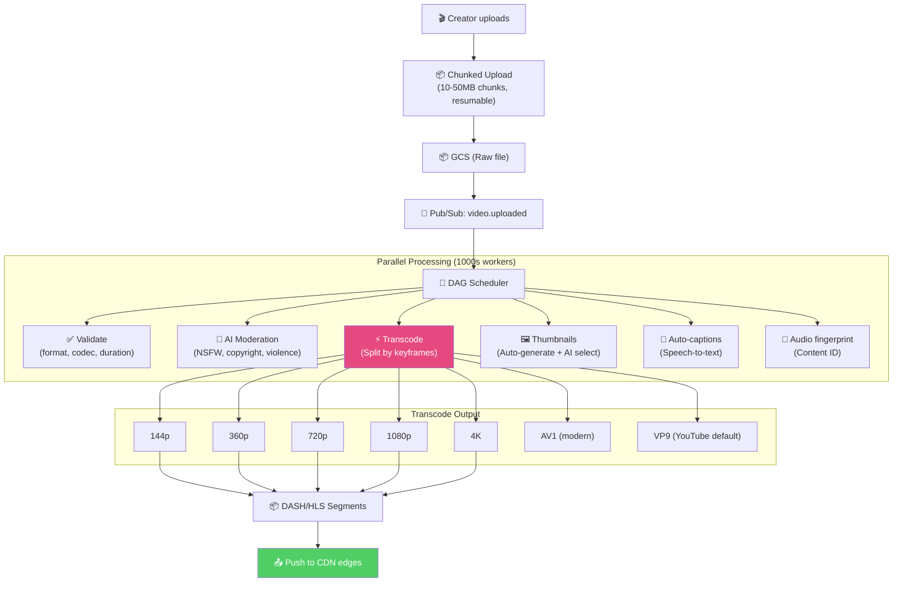
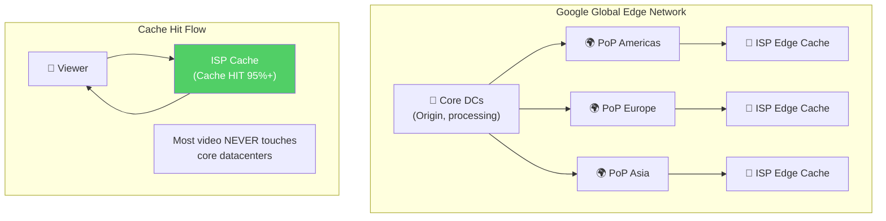
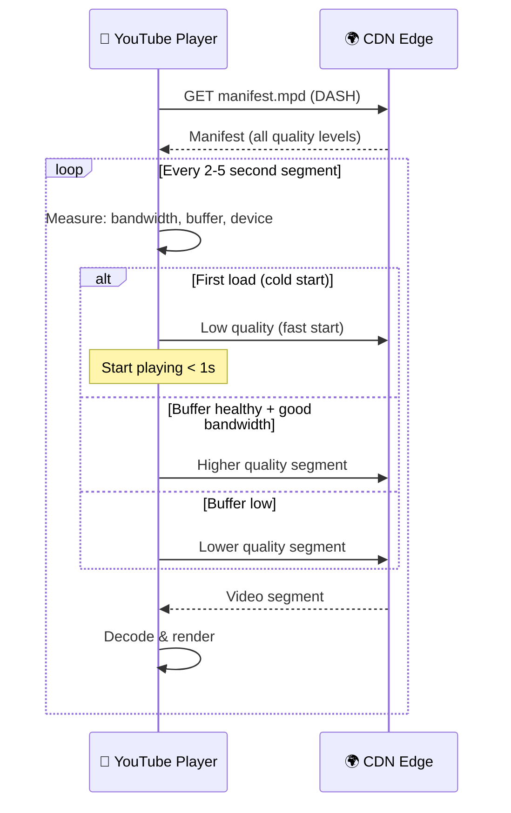
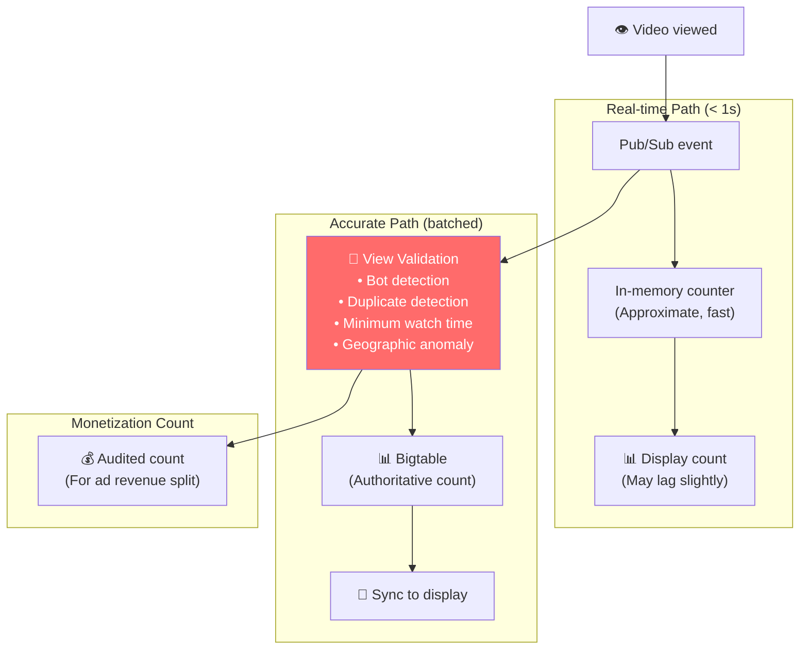
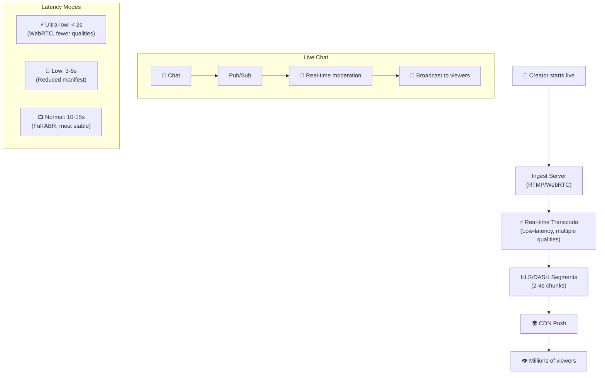

# YouTube - Xử Lý Đồng Thời Cao & Video Pipeline

> 500+ giờ video uploaded/phút, 1B+ giờ xem/ngày.

---

## 1. Video Upload & Processing Pipeline

### Codec Strategy

| Codec | Quality/Efficiency | Support | Use |
|---|---|---|---|
| **H.264** | Baseline | Universal | Legacy devices |
| **VP9** | 30-50% smaller than H.264 | Most browsers | YouTube default |
| **AV1** | 30% smaller than VP9 | Growing | Premium 4K, Shorts |
| **H.265** | Good compression | Limited (patents) | Apple devices |

**Progressive processing:** SD xong trước → HD later → 4K last. User có thể xem ngay ở 360p trong khi 4K đang encode.

---

## 2. CDN & Global Distribution

### YouTube CDN vs Netflix Open Connect

| Aspect | YouTube (Google CDN) | Netflix (Open Connect) |
|---|---|---|
| **Ownership** | Google-owned edge network | Custom appliances in ISPs |
| **Model** | Google-operated PoPs | ISP-hosted, Netflix-managed |
| **Content** | UGC (unpredictable popularity) | Licensed (predictable) |
| **Caching** | Reactive + predictive | Proactive (fill off-peak) |
| **Scale** | billions of unique videos | ~15K titles |
| **Challenge** | Long tail (rare videos) | High bitrate (4K, Dolby) |

---

## 3. Adaptive Bitrate Streaming

---

## 4. View Count & Engagement at Scale

**View validation:** YouTube does NOT count every "view". Bot views, too-short views, duplicate views are filtered → accurate count essential for **ad revenue sharing** with creators.

---

## 5. Live Streaming Architecture

---

## Mapping → NestJS

| Pattern | YouTube | NestJS Implementation |
|---|---|---|
| **Chunked upload** | GCS resumable upload | `multer` + S3 multipart upload |
| **DAG pipeline** | Custom scheduler | BullMQ job dependencies |
| **Transcode** | FFmpeg on C++ workers | `fluent-ffmpeg` + BullMQ workers |
| **View counting** | Pub/Sub → validation → Bigtable | Kafka → validation service → ClickHouse |
| **ABR streaming** | DASH/HLS | `hls.js` + nginx-rtmp-module |
| **Live streaming** | RTMP → HLS | mediasoup / LiveKit |
| **Content ID** | Audio fingerprint ML | `chromaprint` + custom matching |
